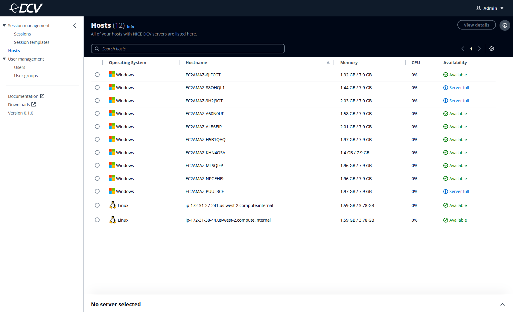
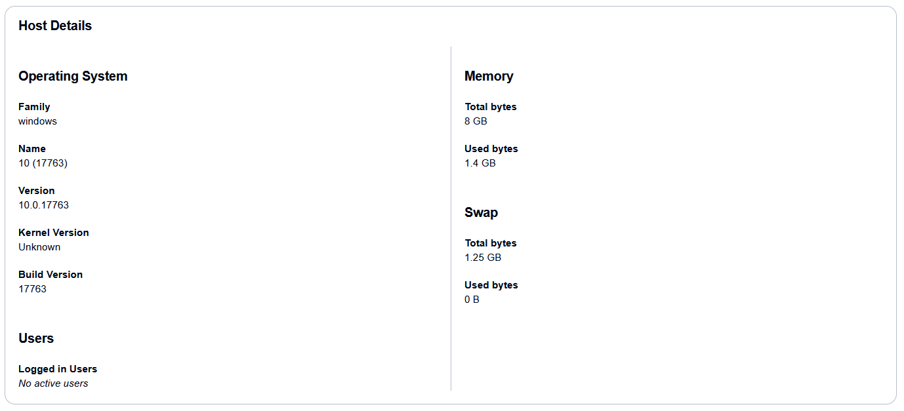
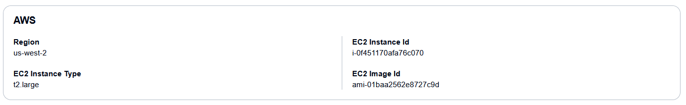
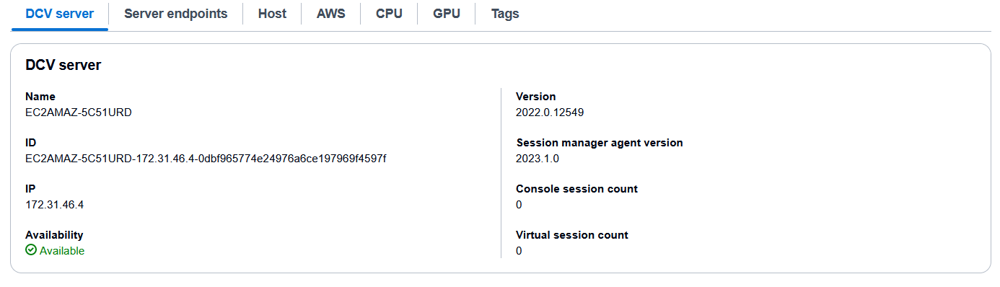
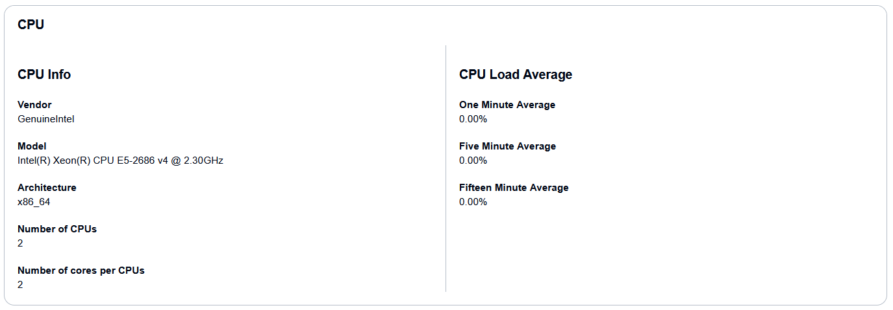
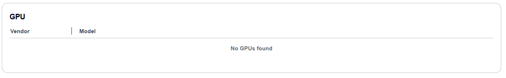
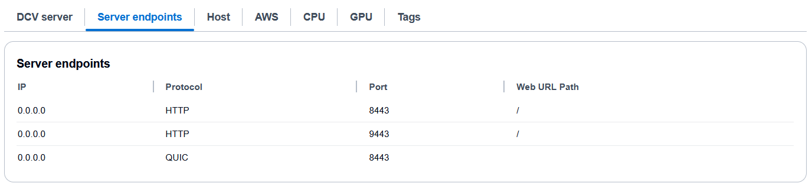

# Hosts

On the **Hosts** page, you can view a list of host
machines (either cloud or on-premises) you have installed Amazon DCV servers configured with
Amazon DCV Session Manager.

Before your users can connect to a Amazon DCV session, you must have hosts available for
users to create sessions on. You can't spin up hosts, install Amazon DCV servers on hosts, or
configure them with the Amazon DCV Session Manager from the console. For more information
about installing Amazon DCV servers, see [Installing the Amazon DCV server](../adminguide/setting-up-installing.md "../adminguide/setting-up-installing.md").

You can configure the visible fields in the top navigation bar by selecting the gear
icon. To view more details in a split panel view, select a session and then click the
caret (**^**) icon at the bottom-right corner of the page.

## Host information

For more information about the requirements and details of the Amazon DCV servers, see
Amazon DCV Servers and DescribeServers.

### Host Details

| Property                | Description                                                                                                                                                                                                                                                  |
| ----------------------- | ------------------------------------------------------------------------------------------------------------------------------------------------------------------------------------------------------------------------------------------------------------ |
| Family                  | The host operating system family that the Amazon DCV server is running on, such as Windows, Linux or macOS (`Host.OS.Family` in the [DescribeServers API](../sm-dev/DescribeServers.md "../sm-dev/DescribeServers.md") API).                        |
| Hostname                | The hostname of the host server that the Amazon DCV server is running on (`Servers.Hostname` in the [DescribeServers API](../sm-dev/DescribeServers.md "../sm-dev/DescribeServers.md") API).                                                           |
| Name                    | The name of the host server operating system that the Amazon DCV server is running on (`Host.OS.Name` in the [DescribeServers API](../sm-dev/DescribeServers.md "../sm-dev/DescribeServers.md") API).                                                  |
| Version                 | The version of the host server operating system that the Amazon DCV server is running on (`Host.OS.Version` in the [DescribeServers API](../sm-dev/DescribeServers.md "../sm-dev/DescribeServers.md") API).                                            |
| Kernel version          | (Linux only) The kernel version of the host server operating system that the Amazon DCV server is running on (`Host.OS.KernelVersion` in the [DescribeServers API](../sm-dev/DescribeServers.md "../sm-dev/DescribeServers.md") API).               |
| Build number            | (Windows only) The build number of the host server operating system that the Amazon DCV server is running on (`Host.OS.BuildNumber` in the [DescribeServers API](../sm-dev/DescribeServers.md "../sm-dev/DescribeServers.md") API).                 |
| LoggedInUsers           | The usernames of the users that are currently logged into the host server (`Host.OS.LoggedInUsers` in the [DescribeServers API](../sm-dev/DescribeServers.md "../sm-dev/DescribeServers.md") API).                                                     |
| Memory                  | Information about the host server’s memory, in gigabytes. This information is displayed as [Used GB/Total GB] (`Memory.UsedBytes` / `Memory/TotalBytes` in the [DescribeServers API](../sm-dev/DescribeServers.md "../sm-dev/DescribeServers.md")). |
| Memory • Total bytes | The total memory, in bytes, on the host server that the Amazon DCV server is running on (`Memory.TotalBytes` in the [DescribeServers API](../sm-dev/DescribeServers.md "../sm-dev/DescribeServers.md") API).                                           |
| Memory • Used bytes  | The used memory, in bytes, on the host server that the Amazon DCV server is running on (`Memory.UsedBytes` in the [DescribeServers API](../sm-dev/DescribeServers.md "../sm-dev/DescribeServers.md") API).                                             |
| Swap • Total bytes   | The total swap file size, in bytes, on the host server that the Amazon DCV server is running on (`Swap.TotalBytes` in the [DescribeServers API](../sm-dev/DescribeServers.md "../sm-dev/DescribeServers.md") API).                                  |
| Swap • Used bytes    | The used swap file size, in bytes, on the host server that the Amazon DCV server is running on (`Swap.UsedBytes` in the [DescribeServers API](../sm-dev/DescribeServers.md "../sm-dev/DescribeServers.md") API).                                       |

### AWS information

| Property          | Description                                                                                                                                                                                                             |
| ----------------- | ----------------------------------------------------------------------------------------------------------------------------------------------------------------------------------------------------------------------- |
| Region            | The Region of the Amazon EC2. This parameter only applies for customers hosting on AWS, and will not be shown to customers hosting on-premise (`Host.Aws.Region` in the `DescribeServers` API).                |
| EC2 Instance Type | The type of Amazon EC2 instance. This parameter only applies for customers hosting on AWS, and will not be shown to customers hosting on-premise (`Host.Aws.Ec2InstanceType` in the `DescribeServers` API). |
| EC2 Image ID      | The ID of the Amazon EC2 image. This parameter only applies for customers hosting on AWS, and will not be shown to customers hosting on-premise (`Host.Aws.Ec2IMAGEId` in the `DescribeServers` API).       |

### Amazon DCV server

| Property                      | Description                                                                                                                                                                                                                                                                                         |
| ----------------------------- | --------------------------------------------------------------------------------------------------------------------------------------------------------------------------------------------------------------------------------------------------------------------------------------------------- |
| ID                            | The unique ID of the Amazon DCV server (`Servers.Id` in the `DescribeServers` API).                                                                                                                                                                                                              |
| Availability                  | The availability of the Amazon DCV server (`Servers.Availability` in the `DescribeServers` API). Possible values include: • AVAILABLE — The server is available and ready for session placement. • UNAVAILABLE — The server is unavailable and can't accept session placement. |
| Version                       | The version of the Amazon DCV server (`Servers.Version` in the `DescribeServers` API).                                                                                                                                                                                                        |
| Session Manager agent version | The version Session Manager agent running on the Amazon DCV server (`Servers.SessionManagerAgentVersion` in the `DescribeServers` API).                                                                                                                                                       |
| Console session count         | The number of console sessions on the Amazon DCV server (`Servers.ConsoleSessionCount` in the `DescribeServers` API).                                                                                                                                                                         |
| Virtual session count         | The number of virtual sessions on the Amazon DCV server (`Servers.ConsoleSessionCount` in the `DescribeServers` API).                                                                                                                                                                         |

### CPU

| Property                         | Description                                                                                                                                       |
| -------------------------------- | ------------------------------------------------------------------------------------------------------------------------------------------------- |
| Vendor                           | The vendor of the host server's CPU (`Host.CpuInfo.Vendor` in the `DescribeServers` API).                                                   |
| Model                            | The model name of the host server's CPU (`Host.CpuInfo.ModelName` in the `DescribeServers` API).                                            |
| Architecture                     | The architecture of the host server's CPU (`Host.CpuInfo.Architecture` in the `DescribeServers` API).                                       |
| Number of vCPUs                  | The number of virtual CPUs on the host server (`Host.CpuInfo.NumberOfCpus` in the `DescribeServers` API).                                   |
| Number of physical cores per CPU | The number of physical CPUs on the host server.                                                                                                   |
| One minute average               | The average CPU load over the last 1 minute period of the host server (`Host.CpuLoadAverage.OneMinute` in the `DescribeServers` API).       |
| Five minute average              | The average CPU load over the last 5 minute period of the host server (`Host.CpuLoadAverage.FiveMinutes` in the `DescribeServers` API).     |
| Fifteen minute average           | The average CPU load over the last 15 minute period of the host server (`Host.CpuLoadAverage.FifteenMinutes` in the `DescribeServers` API). |

### GPU

| Property | Description                                                                                         |
| -------- | --------------------------------------------------------------------------------------------------- |
| Vendor   | The vendor of the host server's GPU (`Host.Gpus.Vendor` in the `DescribeServers` API).        |
| Model    | The model name of the host server's GPU (`Host.Gpus.ModelName` in the `DescribeServers` API). |

### Server endpoints

| Property     | Description                                                                                                                                                                                                                                                                 |
| ------------ | --------------------------------------------------------------------------------------------------------------------------------------------------------------------------------------------------------------------------------------------------------------------------- |
| IP           | The IP address of the Amazon DCV server endpoint (`Servers.Endpoints.IpAddress` in the `DescribeServers` API).                                                                                                                                                        |
| Protocol     | The protocol used by the Amazon DCV server endpoint (`Servers.Endpoints.Protocol` in the `DescribeServers` API). Possible values include: • HTTP — The endpoint uses the WebSocket (TCP) protocol. • QUIC — The endpoint uses the QUIC (UDP) protocol. |
| Port         | The port of the Amazon DCV server endpoint (`Servers.Endpoints.Port` in the `DescribeServers` API).                                                                                                                                                                   |
| Web URL path | The web URL path of the Amazon DCV server endpoint. Available for the HTTP protocol only (`Servers.Endpoints.WebUrlPath` in the `DescribeServers` API).                                                                                                            |
| Tags         | The tags assigned to the host server that the Amazon DCV server is running on (`Host.Tags` in the `DescribeServers` API).                                                                                                                                             |
