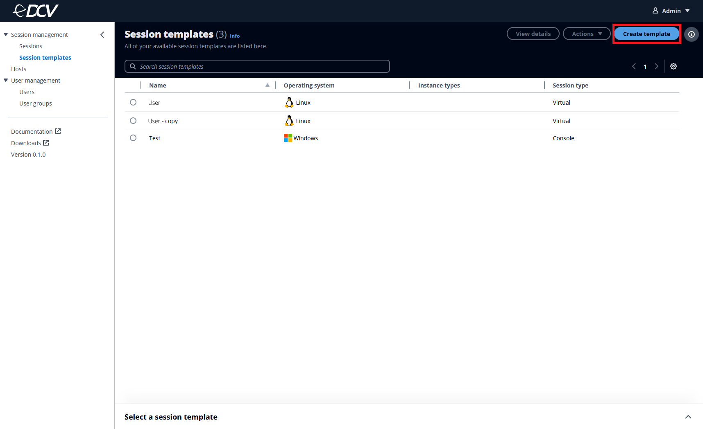
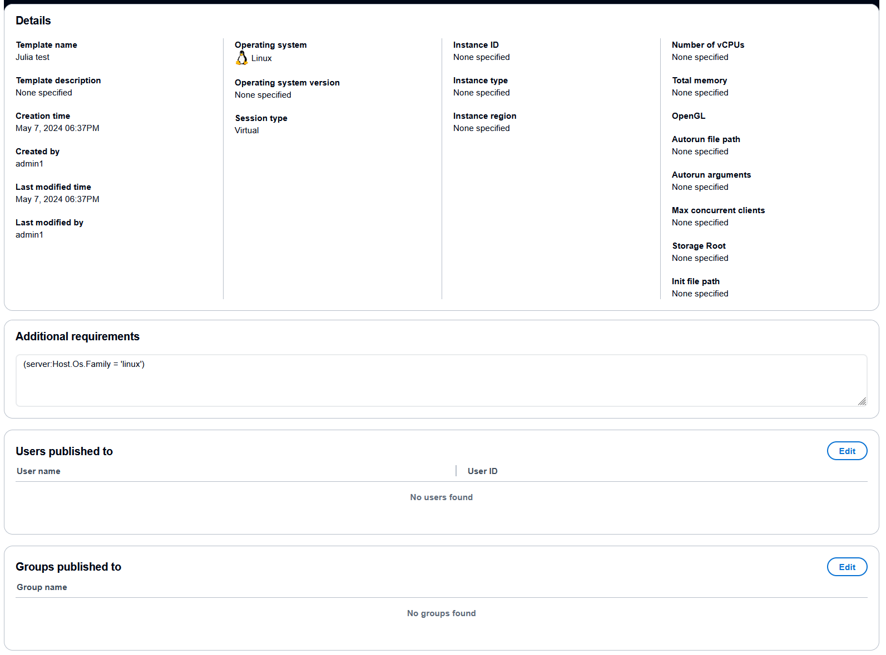

# Session templates

A Amazon DCV session template is created by admins to define the details of the session to
be created.

To create a session, you must first have an existing session template that you will
use to create a session from.

On the **Session templates** page, you can view session templates
that you created, and their detailed information.

You can configure the visible fields in the top navigation bar by selecting the gear
icon. To view more details in a split panel view, use the picker to select a template,
and then select the caret (^) icon at the bottom-right corner of the page.

## Session template

details

For more information see [Creating a session](creating-session.md "creating-session.md").

| Property                                           | Description                                                                                                                                                                                                                                                                                                                                                                                                                                                                                                                                                                                                                                                                                                                                                                                                                                                                                                                                                                                                                                                                                                                                                                                                                                                           |
| -------------------------------------------------- | --------------------------------------------------------------------------------------------------------------------------------------------------------------------------------------------------------------------------------------------------------------------------------------------------------------------------------------------------------------------------------------------------------------------------------------------------------------------------------------------------------------------------------------------------------------------------------------------------------------------------------------------------------------------------------------------------------------------------------------------------------------------------------------------------------------------------------------------------------------------------------------------------------------------------------------------------------------------------------------------------------------------------------------------------------------------------------------------------------------------------------------------------------------------------------------------------------------------------------------------------------------------- |
| Template name (required)                           | The descriptive name that's shown to users.                                                                                                                                                                                                                                                                                                                                                                                                                                                                                                                                                                                                                                                                                                                                                                                                                                                                                                                                                                                                                                                                                                                                                                                                                           |
| Template description                               | The session template description. This is to describe the intended use case for the template, and help users choose the appropriate template.                                                                                                                                                                                                                                                                                                                                                                                                                                                                                                                                                                                                                                                                                                                                                                                                                                                                                                                                                                                                                                                                                                                   |
| Operation system (required)                        | The operating system family of the host server that the Amazon DCV server runs on. This must be either a Linux or Windows operating system (`Host.OS.Family` in the `DescribeServers` API).                                                                                                                                                                                                                                                                                                                                                                                                                                                                                                                                                                                                                                                                                                                                                                                                                                                                                                                                                                                                                                                                  |
| Operating system version                           | The version of the operating system of the host server that the Amazon DCV server is running on (`Host.Os.Version` in the `DescribeServers` API).                                                                                                                                                                                                                                                                                                                                                                                                                                                                                                                                                                                                                                                                                                                                                                                                                                                                                                                                                                                                                                                                                                               |
| Session type (required)                            | The session type, which must either be a console or a virtual session. A **console session\* • is supported on both Linux and Windows servers, and will be the only session on the specified server. A **virtual session* • is supported only on Linux servers, and allows multiple sessions on the specified server (Type in the `CreateSessions API`). For more information about the types of sessions, see [Introduction to Amazon DCV Sessions](../adminguide/managing-sessions.md#managing-sessions-intro "../adminguide/managing-sessions.md#managing-sessions-intro") in the *Amazon DCV Administrator Guide\*.                                                                                                                                                                                                                                                                                                                                                                                                                                                                                                                                                                                                                 |
| OpenGL (Linux virtual only)                        | Indicates whether the virtual session is configured to use the hardware-based OpenGL. OpenGL stands for Open Graphics Library, and is a set of standard APIs used to interface with graphics processing hardware, allowing hardware acceleration through the GPU. OpenGL is supported with virtual sessions only. This parameter isn't supported with Windows Amazon DCV servers (`DcvGlEnabled` in the `CreateSessions` API).                                                                                                                                                                                                                                                                                                                                                                                                                                                                                                                                                                                                                                                                                                                                                                                                                   |
| Instance ID                                        | The ID of the Amazon EC2 instance. This parameter only applies for customers hosting on AWS, and will not be shown to customers hosting on-premises (`Host.Aws.Ec2InstanceId` in the `DescribeServers` API).                                                                                                                                                                                                                                                                                                                                                                                                                                                                                                                                                                                                                                                                                                                                                                                                                                                                                                                                                                                                                                                 |
| Instance type                                      | The type of Amazon EC2 instance. This parameter only applies for customers hosting on AWS, and will not be shown to customers hosting on-premise (`Host.Aws.Ec2InstanceType` in the `DescribeServers` API).                                                                                                                                                                                                                                                                                                                                                                                                                                                                                                                                                                                                                                                                                                                                                                                                                                                                                                                                                                                                                                                  |
| Instance Region                                    | The AWS Region of the Amazon EC2 host. This parameter only applies for customers hosting on AWS, and will not be shown to customers hosting on-premises (`Host.Aws.Region` in the `DescribeServers` API).                                                                                                                                                                                                                                                                                                                                                                                                                                                                                                                                                                                                                                                                                                                                                                                                                                                                                                                                                                                                                                                    |
| Host vCPU                                          | The number of virtual CPUs on the host server (`Host.CpuInfo.NumberOfCpus` in the `DescribeServers` API).                                                                                                                                                                                                                                                                                                                                                                                                                                                                                                                                                                                                                                                                                                                                                                                                                                                                                                                                                                                                                                                                                                                                                       |
| Host memory in bytes                               | The total memory, in bytes, on the host server that the Amazon DCV server is running on (`Host.Memory.TotalBytes` in the `DescribeServers` API).                                                                                                                                                                                                                                                                                                                                                                                                                                                                                                                                                                                                                                                                                                                                                                                                                                                                                                                                                                                                                                                                                                                |
| Autorun file path (Windows and Linux virtual only) | The path to a file on the host server that runs inside the session. The file path is relative to the autorun directory specified for the `agent.autorun_folder` Agent configuration parameter. If the file is in the specified autorun directory, specify the file name only. If the file isn't in the specified autorun directory, specify the relative path. For more information, see [Agent configuration file](../sm-admin/agent-file.md "../sm-admin/agent-file.md") in the _Amazon DCV Session Manager Administrator Guide_. The file is run on behalf of the specified **owner**. The specified owner must have permission to run the file on the server. On Windows Amazon DCV servers, the file is run when the owner logs in to the session. On Linux Amazon DCV servers, the file is run when the session is created. Console sessions on Windows Amazon DCV servers and virtual sessions on Linux Amazon DCV servers are supported. Console sessions on Linux Amazon DCV servers are not supported. (`AutorunFile` in the `CreateSessions` API).                                                                                                                                                         |
| Autorun arguments (Linux virtual only)             | Command line arguments passed to \*_AutorunFile_ • upon its execution inside the session. Arguments are passed in the order that they appear into the given array. Maximum allowed number of arguments and maximum allowed length of each argument can be configured. For more information, see [Broker configuration file](../sm-admin/broker-file.md "../sm-admin/broker-file.md") in the _Amazon DCV Session Manager Administrator Guide_. Virtual sessions on Linux Amazon DCV servers are supported. Console sessions on Windows and Linux Amazon DCV servers are not supported (`AutorunFileArguments` in the `CreateSessions` API).                                                                                                                                                                                                                                                                                                                                                                                                                                                                                                                                                                                           |
| Max concurrent clients                             | The maximum number of concurrent Amazon DCV clients allowed to connect to the session at a given time. To specify that there is no maximum, enter 0. (`AutorunFileArguments` in the `CreateSessions` API).                                                                                                                                                                                                                                                                                                                                                                                                                                                                                                                                                                                                                                                                                                                                                                                                                                                                                                                                                                                                                                                   |
| Init file path (Linux virtual only)                | The path to a folder on the host server used to store custom scripts allowed to initialize Amazon DCV server sessions when they are created. The file path is relative to the init directory specified for the `agent.init_folder` Agent configuration parameter. If the file is in the specified init directory, specify the file name only. If the file isn't in the specified init directory, specify the relative path. The folder must be accessible and the files must be executable by users who use the **InitFile\* • request parameter of the **CreateSessions* • API. For more information, see [Create Sessions](../sm-dev/CreateSessions.md#:~:text=Required%3A%20Yes-,InitFile,-Supported%20with%20virtual "../sm-dev/CreateSessions.md#:~:text=Required%3A%20Yes-,InitFile,-Supported%20with%20virtual") in the *Amazon DCV Session Manager Developer Guide • or [Agent configuration](../sm-admin/agent-file.md "../sm-admin/agent-file.md") file in the _Amazon DCV Session Manager Administrator Guide_. Virtual sessions on Linux Amazon DCV servers are suppoprted. Console sessions on Windows and Linux Amazon DCV servers are not supported (`InitFile` in the `CreateSessions` API). |
| Storage root                                       | Specifies the path to the folder used for session storage. Session storage is a folder on the Amazon DCV server that clients can access when they're connected to a specific Amazon DCV session. When you enable session storage for a session, clients can download files from, and upload files to, the specified folder. This feature enables clients to share files while connected to a session. For more information, see [Create Sessions](../sm-dev/CreateSessions.md#:~:text=Required%3A%20No-,StorageRoot,-Specifies%20the%20path "../sm-dev/CreateSessions.md#:~:text=Required%3A%20No-,StorageRoot,-Specifies%20the%20path") in the *Amazon DCV Session Manager Developer Guide • or [Enabling Session Storage](../adminguide/manage-storage.md "../adminguide/manage-storage.md") in the *Amazon DCV Administrator Guide • (`StorageRoot` in the `CreateSessions` API).                                                                                                                                                                                                                                                                                                                                                 |
| Additional host server requirements                | Use this text box to set the requirements that the server must satisfy to place the session. The requirements can include server tags and/or server properties, both server tags and server properties are retrieved by calling the \*_DescribeServers_ • API. Requirements support both condition and Boolean expressions.                                                                                                                                                                                                                                                                                                                                                                                                                                                                                                                                                                                                                                                                                                                                                                                                                                                                                                                         |

Some of these settings you’ve already specified elsewhere in the **Configure** step (like Operating System). Those settings
are pre-populated in the additional requirements box, and are immutable from the
text box itself. To change those settings, you must change them from the specified
UI elements. You can also add and modify additional requirements using the syntax
provided in the Create Session documentation. For a complete list of supported
server properties, see [Create Session](../sm-dev/CreateSessions.md#:~:text=Required%3A%20No-,Requirements,-The%20requirements%20that "../sm-dev/CreateSessions.md#:~:text=Required%3A%20No-,Requirements,-The%20requirements%20that") in the _Amazon DCV Session Manager Developer
Guide_.

###### Topics

- [Creating a session
  template](creating-session-template.md "creating-session-template.md")
- [Assigning a session
  template to users or groups](assigning-session-template.md "assigning-session-template.md")
- [Duplicating a session
  template](duplicating-session-template.md "duplicating-session-template.md")
- [Editing a session
  template](editing-session-template.md "editing-session-template.md")
- [Deleting a session
  template](deleting-session-template.md "deleting-session-template.md")
