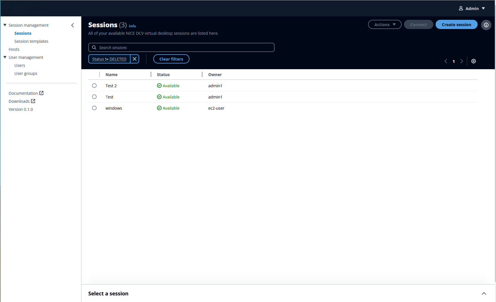
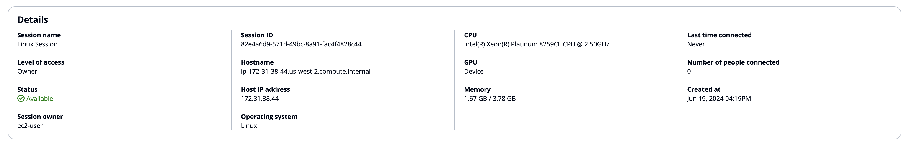

# Sessions

A session is a span of time when the Amazon DCV server is able to accept connections from a
client. Each session has a specified owner and set of permissions.

Before your clients can connect to a Amazon DCV session, you must create a Amazon DCV session
on the Amazon DCV server. When you create a Amazon DCV session, you change the state of the server
to accept connections from a client. Amazon DCV supports both console and virtual
sessions.

On the **Sessions** page, you can view sessions that you created
yourself, and the detailed session information. If there are no available sessions, you
must choose **Create session** to begin.

###### Note

If you experience issues accessing the sessions created outside of the console,
you may need to debug that or delete that session.

You can configure the visible fields in the top navigation bar by selecting the gear
icon. To view more details in a split panel view, use the picker to select a session.
Then select the caret (^) icon at the bottom-right corner of the page.

By default, sessions that have been closed are hidden with a filter. You can remove
the filter to see previously closed sessions.

## Session details

This includes the session parameters themselves. For more information, see [DescribeSessions](../sm-dev/DescribeSessions.md "../sm-dev/DescribeSessions.md"). The details also include the Amazon DCV server information
that the session is placed on. For more information, see [DescribeServers](../sm-dev/DescribeServers.md "../sm-dev/DescribeServers.md").

| Property                   | Description                                                                                                                                                                                                                                                                                                                                                                                                                                                                                                                                                                                                                                                                                                                                                                                                               |
| -------------------------- | ------------------------------------------------------------------------------------------------------------------------------------------------------------------------------------------------------------------------------------------------------------------------------------------------------------------------------------------------------------------------------------------------------------------------------------------------------------------------------------------------------------------------------------------------------------------------------------------------------------------------------------------------------------------------------------------------------------------------------------------------------------------------------------------------------------------------- | ------------------------------------------------------------------------------------------------------------------------------------------------------------------------------------------------------------------------------------- |
| Session name               | The session name. This field can't be changed after creation (`Name` in the [DescribeSessions](../sm-dev/DescribeSessions.md "../sm-dev/DescribeSessions.md") API).                                                                                                                                                                                                                                                                                                                                                                                                                                                                                                                                                                                                                                                       |
| Level of access            | The level of access for a particular session.                                                                                                                                                                                                                                                                                                                                                                                                                                                                                                                                                                                                                                                                                                                                                                             |
| Status                     | A session has four states associated with it.  • **Creating** – The Broker is in the process of creating the session.  • **Available** – The session is ready to accept client connections (maps to “READY” in the [DescribeSessions](../sm-dev/DescribeSessions.md "../sm-dev/DescribeSessions.md") API).  • **Closing** – The session is being closed (maps to “DELETING” in the [DescribeSessions](../sm-dev/DescribeSessions.md "../sm-dev/DescribeSessions.md") API).  • **Closed** – The session is closed (maps to “DELETED” in the [DescribeSessions](../sm-dev/DescribeSessions.md "../sm-dev/DescribeSessions.md") API).  • **Unknown** – Unable to determine the session's state. The Broker and the Agent might be unable to communicate. Contact your administrator for help troubleshooting. |
| Session owner              | The name of the session owner (`Owner` is in the [DescribeSessions API](../sm-dev/DescribeSessions.md "../sm-dev/DescribeSessions.md")).                                                                                                                                                                                                                                                                                                                                                                                                                                                                                                                                                                                                                                                                                  |
| Session ID                 | The unique ID of the session (`Id` is in the [DescribeSessions API](../sm-dev/DescribeSessions.md "../sm-dev/DescribeSessions.md")).                                                                                                                                                                                                                                                                                                                                                                                                                                                                                                                                                                                                                                                                                      |
| Hostname                   | The hostname of the host server that the Amazon DCV server is running on (`Servers.Hostname` in the [DescribeServers API](../sm-dev/DescribeServers.md "../sm-dev/DescribeServers.md")).                                                                                                                                                                                                                                                                                                                                                                                                                                                                                                                                                                                                                                  |
| Host IP address            | The unique IP of the Amazon DCV server (`Servers.ID` in the [DescribeServers API](../sm-dev/DescribeServers.md "../sm-dev/DescribeServers.md")).                                                                                                                                                                                                                                                                                                                                                                                                                                                                                                                                                                                                                                                                          |
| Operating systems          | The name of the host server operating system that the Amazon DCV server is running on (`Host.OS.Family` in the [DescribeServers](../sm-dev/DescribeServers.md "../sm-dev/DescribeServers.md") API).                                                                                                                                                                                                                                                                                                                                                                                                                                                                                                                                                                                                                       |
| CPU                        | Information about the host server’s CPU that the Amazon DCV server is running on (`Host.CpuInfo.ModelName` in the [DescribeServers](../sm-dev/DescribeServers.md "../sm-dev/DescribeServers.md") API).                                                                                                                                                                                                                                                                                                                                                                                                                                                                                                                                                                                                                    |
| GPU                        | Information about the host server’s GPU that the Amazon DCV server is running on (`ModelName` in the [DescribeServers](../sm-dev/DescribeServers.md "../sm-dev/DescribeServers.md") API).                                                                                                                                                                                                                                                                                                                                                                                                                                                                                                                                                                                                                                 |
| Memory                     | Information about the host server’s memory, in gigabytes. This information is displayed as [Used GB/Total GB] (`Memory.UsedBytes/Memory/TotalBytes` in the [DescribeServers](../sm-dev/DescribeServers.md "../sm-dev/DescribeServers.md") API).                                                                                                                                                                                                                                                                                                                                                                                                                                                                                                                                                                           |
| Last time connected        | The last time a user connected to this session (`LastDisconnectionTime` in the [DescribeSessions](../sm-dev/DescribeSessions.md "../sm-dev/DescribeSessions.md") API).                                                                                                                                                                                                                                                                                                                                                                                                                                                                                                                                                                                                                                                    |
| Number of people connected | The number of people currently connected to this session (`NumOfConnections` in the [DescribeSessions](../sm-dev/DescribeSessions.md "../sm-dev/DescribeSessions.md") API).                                                                                                                                                                                                                                                                                                                                                                                                                                                                                                                                                                                                                                               |
| Created at                 | The time that the session was created at (`CreationTime` in the [DescribeSessions](../sm-dev/DescribeSessions.md "../sm-dev/DescribeSessions.md") API).                                                                                                                                                                                                                                                                                                                                                                                                                                                                                                                                                                                                                                                                   | ###### Topics  • [Creating a session](creating-session.md "creating-session.md")  • [Connecting to a session](connecting-session.md "connecting-session.md")  • [Closing a session](closing-session.md "closing-session.md") |
