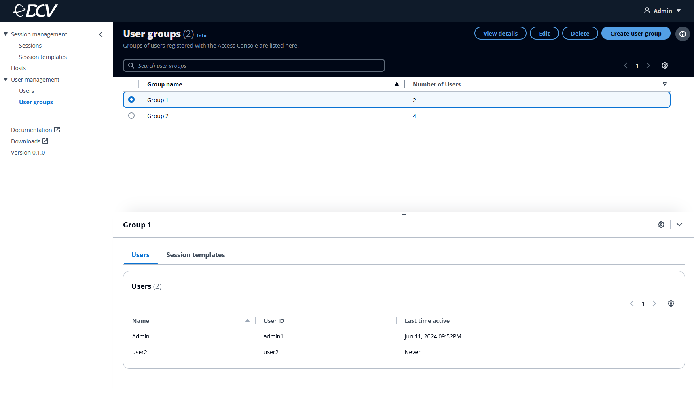

# User groups

The Amazon DCV Access Console allows admins to manage user groups and their assigned
templates. You can import user groups, or create and manage them from the Access Console
itself.

On the **User groups** page, you can view the user groups you created
or imported, and their detailed information. User groups can only include users that are
saved in your datastore. For more information on how to import user groups, see Import
users and groups.

## User group details

| Property          | Description                                         |
| ----------------- | --------------------------------------------------- |
| Group name        | The display name of the group.                      |
| Group ID          | The unique ID of the group. This cannot be changed. |
| Number of users   | The number of users assigned to the group.          |
| Users             | The users assigned to the group.                    |
| Session templates | The session templates assigned to the group.        |
