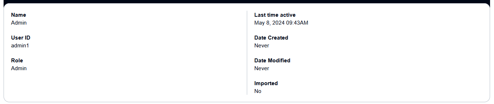
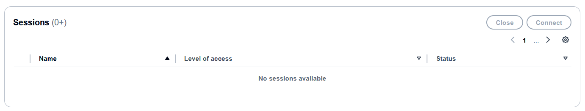
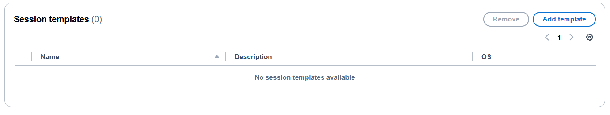

# Users

The Amazon DCV Access Console allows admins to manage users, their roles and their access
to the Console. You cannot edit a user’s name or any of their parameters or delete a
user directly from the Console.

On the **Users** page, you can view the users saved in your datastore
and their detailed information. Users appear here if they have been directly imported
from the Access Console, or have already logged in. For a complete list of users that
are authorized to log into the Access Console, you must refer to your externally
configured users datastore. For more information on how to configure your datastore, see
[Datastore](datastore.md "datastore.md").

Before your users can connect to the Access Console, you must configure either
Pluggable Authenticate Modules (PAM) Authentication, or HTTP Header authentication. See
[Authentication
Methods](console-authentication.md "console-authentication.md") for more information.

## User details

On the bottom part of the screen, the details for the selected user is displayed.
This graphic shows which details are displayed.

| Property         | Description                                                                       |
| ---------------- | --------------------------------------------------------------------------------- |
| Name             | The display name of the user.                                                     |
| User ID          | The unique ID of the user.                                                        |
| Role             | The role a user can have when using the Access Console • admin or user.     |
| Last time active | The last time the user connected to the Access Console.                           |
| Date created     | The date the user was created in the Access Console.                              |
| Date modified    | The last date that the user was modified in the Access Console.                |
| Imported         | Indicates whether or not the user was manually imported to the Access Console. |

### Session

These are the active sessions that the user has created. Its parameters are
listed below.

| Property        | Description                                       |
| --------------- | ------------------------------------------------- |
| Name            | The display name of the user.                     |
| Level of access | Whether the user is set to Administrator or User. |
| Status          | The current status of the user.                   |

### Session

template

These are the session templates that are available for the user. Its
parameters are listed below.

| Property    | Description                                   |
| ----------- | --------------------------------------------- |
| Name        | The name of the session template.             |
| Description | The description of the session template.      |
| OS          | The operating system of the session template. |
