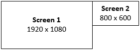
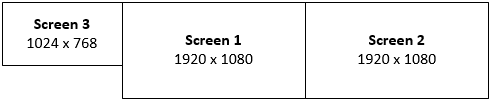

# Managing the Amazon DCV Session display layout

You can set the display layout for a running Amazon DCV session. The display layout specifies the default configuration that's used when
clients connect to the session. However, clients can manually override the layout using the Amazon DCV client settings or the native operating
system display settings.

If the host server's hardware and software configuration doesn't support the specified resolution or the number of screens, the
Amazon DCV server doesn't apply the specified display layout.

Amazon DCV can configure a resolution according to the settings and the server system configuration.

- Web client resolution is limited by default to 1920x1080 (from web-client-max-head-resolution server setting).
- Native clients are limited by default to 4096x2160 (from max-head-resolution).
  Note that the available resolutions and number of monitors depend on the configuration of the server, make sure to follow the
  [prerequisites guide](setting-up-installing.md "setting-up-installing.md") to properly
  setup the system environment and drivers for best performance.

###### Note

For native clients, up to a maximum of four monitors can be used.

For web clients, up to a maximum of two monitors can be used.

Higher resolutions or more than the maximum number of monitors are not supported in any configuration.

###### Topics

- [Accessing the display layout](#display-restrict "#display-restrict")
- [Setting the display layout](#dislay-set "#dislay-set")
- [Viewing the display layout](#dislay-view "#dislay-view")

## Accessing the display layout

You can configure the Amazon DCV server to prevent clients from requesting display layouts that are outside of a specified range. To
restrict display layout changes, configure the following Amazon DCV server parameters.

- [enable-client-resize](config-param-ref.md#paramref.display.enable-client-resize "config-param-ref.md#paramref.display.enable-client-resize")—To prevent clients
  from changing the display layout, set this parameter to `false`.
- [min-head-resolution](config-param-ref.md#paramref.display.min-head-resolution "config-param-ref.md#paramref.display.min-head-resolution") and [max-head-resolution](config-param-ref.md#paramref.display.max-head-resolution "config-param-ref.md#paramref.display.max-head-resolution")—Specifies the minimum
  and maximum allowed resolutions respectively.
- [web-client-max-head-resolution](config-param-ref.md#paramref.display.web-client-max-head-resolution "config-param-ref.md#paramref.display.web-client-max-head-resolution")—Specifies the maximum allowed resolution for web browser
  clients. The `max-head-resolution` limitation is applied on top of `web-client-max-head-resolution`
  limitation. By default, the maximum resolution for web browser clients is 1920x1080. Specifying a higher resolution might
  cause performance issues, depending on the web browser and specifications of the client computer.
- [max-num-heads](config-param-ref.md#paramref.display.max-num-heads "config-param-ref.md#paramref.display.max-num-heads")—Specifies the maximum number of
  displays.
- `max-layout-area`— Specifies the maximum
  number of pixels allowed for the screen area. Requests with the total screen area (expressed in pixels) exceeds the
  specified value are ignored.

For more information about these parameters, see [display Parameters](config-param-ref.md#display "config-param-ref.md#display") in the Parameter
Reference.

## Setting the display layout

###### To configure the display layout for a running Amazon DCV session

Use the `dcv set-display-layout` command and specify the session to set the display layout and the display layout
descriptor for.

```
dcv set-display-layout --session `session-id` `display-layout-descriptor`
```

The display layout descriptor specifies the number of displays and the resolution and position offset for each display. The
description must be specified in the following format:

```
`width`x`height`+|-`x-position-offset`+|-`y-position-offset`
```

If you specify more than one screen, separate the screen descriptors by a comma. The screen position offsets specify the
position of the top-left corner of the screen relative to screen 1. If you don't specify a position offset for a screen, it
defaults to x=0 and y=0.

###### Important

If you're specifying more than one screen, ensure that you properly set the position offset for each screen to avoid screen
overlaps.

For example, the following display layout descriptor specifies two screens:

- Screen 1: 1920x1080 resolution offset to x=0, y=0
- Screen 2: 800x600 resolution offset to x=1920, y=0 so that it appears to the right of screen 1.



```
1920x1080+0+0,800x600+1920+0
```

The following display layout descriptor specifies three screens.

- Screen 1: 1920x1080 resolution offset to x=0, y=0
- Screen 2: 1920x1080 resolution offset to x=1920, y=0 so that it appears to the right of screen 1.
- Screen 3: 1024x768 resolution offset to x=-1024, y=0 so that it appears to the left of screen 1.



```
1920x1080+0+0,1920x1080+1920+0,1024x768-1024+0
```

## Viewing the display layout

###### To view the display layout for a session

Use the `dcv describe-session` command and review the `display layout` element in the output. For more
information, see [Viewing Amazon DCV sessions](managing-sessions-lifecycle-view.md "managing-sessions-lifecycle-view.md").
