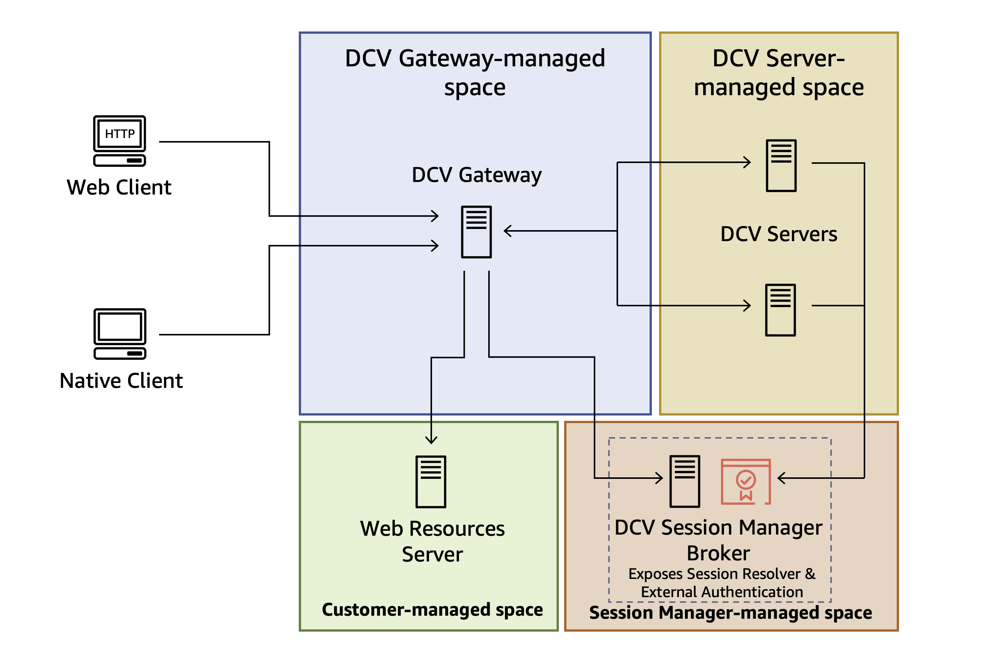

# Integrating Connection Gateway with Session Manager

Amazon DCV Connection Gateway can be used in conjunction with Amazon DCV Session Manager, which manages Amazon DCV server hosts
and provides a Session Resolver end-point. The simplified [high-level overview](what-is-gw.md#how-gw-works "what-is-gw.md#how-gw-works")
becomes:

Refer to the [Amazon DCV Session Manager documentation](../sm-admin/configure-gateway-integration.md "../sm-admin/configure-gateway-integration.md") for more information
about configuring the Session Resolver in Amazon DCV Session Manager.
