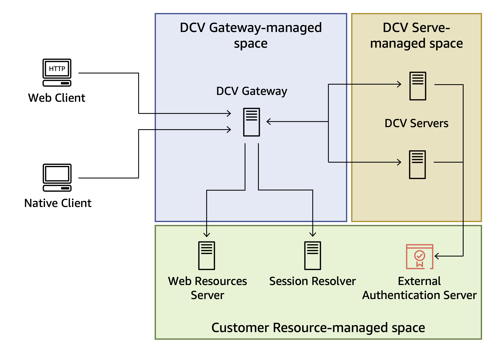

# What is Amazon DCV Connection Gateway?

###### Note

Amazon DCV was previously known as NICE DCV.

The Amazon DCV Connection Gateway is an installable software package that enables users to
access a fleet of Amazon DCV servers through a single access point to a LAN or VPC. This
access point is a secure and efficient platform that enables seamless remote access to
virtual desktops and applications. Centralizing access management, the Amazon DCV Connection Gateway
streamlines enterprise-wide remote work capabilities while maintaining robust security controls.

This guide explains how to install and configure the Amazon DCV Connection Gateway.

###### Topics

- [How the Amazon DCV Connection Gateway works](#how-gw-works "#how-gw-works")
- [Limitations](#limitations "#limitations")
- [Pricing](#pricing "#pricing")
- [System requirements](system-requirements.md "system-requirements.md")
- [Network Requirements](network-requirements.md "network-requirements.md")

## How the Amazon DCV Connection Gateway works

The following diagram shows the high-level view of how the Amazon DCV Connection Gateway routes traffic to a fleet
of Amazon DCV servers.

When using the Amazon DCV Connection Gateway, clients connect to the gateway rather than connecting directly to a Amazon DCV server.
Clients specify a _session ID_, which uniquely identifies the server they want to connect to.
The Connection Gateway in turn consults a _Session Resolver_ to map the session ID received by the client
to a specific server and then forwards the connection to the correct destination.

Customers can define how session IDs map to their resources by implementing their [Session Resolver](session-resolver.md "session-resolver.md")
API end-point. Customers using the [Amazon DCV Session Manager](../sm-admin/what-is-sm.md "../sm-admin/what-is-sm.md")
can [leverage](sm-integration.md "sm-integration.md") its built-in session resolver.

The Amazon DCV Connection Gateway can also forward HTTP requests to a web server. This feature allows the customer to host the
Amazon DCV Web Client or a custom Web application based on the Amazon DCV Web Client SDK on a dedicated web server. When
a browser connects to the Connection Gateway, its request to retrieve the web page of the Amazon DCV Web Client is forwarded
to the _Web Resources Server_ configured in the Connection Gateway; once the browser has retrieved
and displayed that page, the Web Client will connect again to the Connection Gateway to connect to the Amazon DCV session and
the Connection Gateway will forward that connection to the corresponding Amazon DCV server.

## Limitations

The Amazon DCV Connection Gateway requires a Amazon DCV version greater than or equal to
[2021.2](../adminguide/doc-history-release-notes.md#dcv-2021-2-11048 "../adminguide/doc-history-release-notes.md#dcv-2021-2-11048")
if you want to enable support for QUIC.

The Amazon DCV Connection Gateway requires that Amazon DCV is configured to use the
[External Authentication](../adminguide/external-authentication.md "../adminguide/external-authentication.md").

## Pricing

The Amazon DCV Gateway is available at no cost for customers who are using Amazon DCV.
