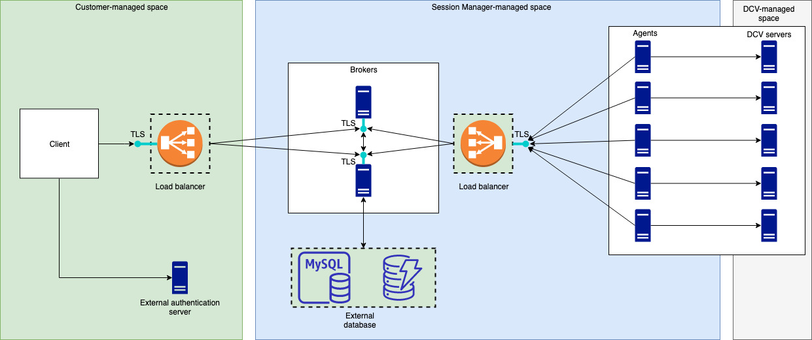

# Amazon DCV Session Manager requirements

The Amazon DCV Session Manager Agent and Broker have the following requirements.

|                             | Broker                                                                                                                                                                                      | Agent                                                                                                                                                                                                                                                                                                                                      |
| --------------------------- | ------------------------------------------------------------------------------------------------------------------------------------------------------------------------------------------- | ------------------------------------------------------------------------------------------------------------------------------------------------------------------------------------------------------------------------------------------------------------------------------------------------------------------------------------------ | ----------------------------------------------------------------------------------------------------------------------------------------------------------------------------------------------------------------------------------------------------------------------------------------------------------------------------------------------------------------------------------------------------------------------------------------------------------------------------------------------------------------------------------------------------------------------------------------------------------------------------------------------------------------------------------------------------------------------------------------------------------------------------------------------------------------------------------------------------------------------------------------------------------------------------------------------------------------------------------------------------------------------------------------------------------------------------------------------------------------------------------------------------------------------------------------------------------------------------------------------------------------------------------------------------------------------------------------------------------------------------------------------------------------------------------------------------------------------------------------------------------------------------------------------------------------------------------------------------------------------------------------------- |
| **Operating system**        |  • Amazon Linux 2  • Amazon Linux 2023  • CentOS Stream 9  • RHEL 8.x  • RHEL 9.x  • Rocky Linux 8.5 or later  • Rocky Linux 9.x  • Ubuntu 22.04  • Ubuntu 24.04 |  • Windows + Windows 11 + Windows Server 2025 + Windows Server 2022 + Windows Server 2019 + Windows Server 2016  • Linux server + Amazon Linux 2 + Amazon Linux 2023 + CentOS Stream 9 + RHEL 8.x + RHEL 9.x + Rocky Linux 8.5 or later + Rocky Linux 9.x + Ubuntu 22.04 + Ubuntu 24.04 + SUSE Linux Enterprise 15 with SP6 or later |
| **Architecture**            |  • 64-bit x86  • 64-bit ARM                                                                                                                                                           |  • 64-bit x86  • 64-bit ARM (Amazon Linux 2, Amazon Linux 2023, CentOS 9.x, RHEL 8.x/9.x and Rocky 8.x/9.x only)  • 64-bit ARM (Ubuntu 22.04 and 24.04)                                                                                                                                                                           |
| **Memory**                  | 8 GB                                                                                                                                                                                        | 4 GB                                                                                                                                                                                                                                                                                                                                       |
| **Amazon DCV version**      | Amazon DCV 2020.2 and later                                                                                                                                                                 | Amazon DCV 2020.2 and later                                                                                                                                                                                                                                                                                                                |
| **Additional requirements** | Java 11                                                                                                                                                                                     | -                                                                                                                                                                                                                                                                                                                                          | ## Networking and connectivity requirements The following diagram provides a high-level overview of the Session Manager networking and connectivity requirements.  The **Broker** must be installed on a separate host, but it must have network connectivity with the Agents on the Amazon DCV servers. If you choose to have multiple Brokers to improve availability, then you must install and configure each broker on a separate host, and use one or more load balancers to manage the traffic between the client and the Brokers, and the Brokers and the Agents. The Brokers should also be able to communicate with each other in order to exchange information about the Amazon DCV servers and sessions. The Brokers can store their keys and status data on an external database and have this information available after reboot or termination. This helps mitigate the risk of losing important Broker information by persisting it on the external database. You can retrieve it later. If you choose to have it, then you must set up the external database and configure the brokers. DynamoDB, MariaDB, and MySQL are supported. You can find configuration parameters are listed on the [Broker Configuration File](broker-file.md "broker-file.md"). The **Agents** must be able to initiate secure, persistent, bi-directional HTTPs connections with the Broker. Your **client**, or frontend application, must be able to access the Broker in order to call the APIs. The client should also be able to access your authentication server. |
