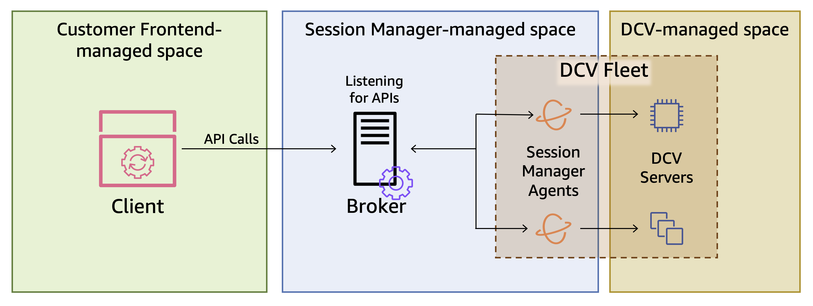

# What is Amazon DCV Session Manager?

###### Note

Amazon DCV was previously known as NICE DCV.

Amazon DCV Session Manager is set of installable software packages (an Agent and a Broker) and an application
programming interface (API) that makes it easy for developers and independent software vendors
(ISVs) to build front-end applications that programmatically create and manage the lifecycle of
Amazon DCV sessions across a fleet of Amazon DCV servers.

This guide explains how to install and configure the Session Manager Agent and Broker. For more information
about using the Session Manager APIs, see the _Amazon DCV Session Manager Developer Guide_.

###### Topics

- [How Session Manager works](#how "#how")
- [Features](#features "#features")
- [Limitations](#limitations "#limitations")
- [Pricing](#pricing "#pricing")
- [Requirements](requirements.md "requirements.md")

## How Session Manager works

The following diagram shows the high-level components of Session Manager.

\***\*Broker\*\***

The Broker is a web server that hosts and exposes the Session Manager APIs. It receives
and processes _API_ requests to manage Amazon DCV
sessions from the _client_, and then passes the
instructions to the relevant _Agents_. The Broker
must be installed on a host that is separate from your Amazon DCV servers, but it
must be accessible to the client, and it must be able to access the Agents.

\***\*Agent\*\***

The Agent is installed on each Amazon DCV server in the fleet. The Agents receive
instructions from the _Broker_ and run them on
their respective Amazon DCV servers. The Agents also monitor the state of the Amazon DCV
servers, and send periodic status updates back to the Broker.

\***\*APIs\*\***

Session Manager exposes a set of REST application programming interfaces (APIs) that can
be used to manage Amazon DCV sessions on a fleet of Amazon DCV servers. The APIs are
hosted on and exposed by the _Broker_. Developers
can build custom session management _clients_ that call
the APIs.

\***\*Client\*\***

The client is the front-end application or portal that you develop to call the Session Manager
_APIs_ that are exposed by the _Broker_.
End users use the client to manage the sessions hosted on the Amazon DCV servers in
the fleet.

\***\*Access token\*\***

In order to make an API request, you must provide an access token. Tokens can be
requested from the Broker, or an external authorization server, by registered client APIs. To
request and access token, the client API must provide valid credentials.

\***\*Client API\*\***

The client API is generated from the Session Manager API definition YAML file, using Swagger
Codegen. The client API is used to make API requests.

\***\*Amazon DCV session\*\***

An Amazon DCV session is a span of time when the Amazon DCV server is able to accept connections
from a client. Before your clients can connect to an Amazon DCV session, you must create an Amazon DCV
session on the Amazon DCV server. Amazon DCV supports both console and virtual sessions, and
each session has a specified owner and set of permissions. You use the Session Manager
APIs to manage the lifecycle of Amazon DCV sessions. Amazon DCV sessions can be in one of the following states:

- `CREATING`—the Broker is in the process
  of creating the session.
- `READY`—the session is ready to accept
  client connections.
- `DELETING`—the session is being deleted.
- `DELETED`—the session has been deleted.
- `UNKNOWN`—unable to determine the
  session's state. The Broker and the Agent might be unable to
  communicate.

## Features

DCV Session Manager offers the following features:

- **Provides Amazon DCV session information**—get information
  about the sessions running on multiple Amazon DCV servers.
- **Manage the lifecycle for multiple Amazon DCV sessions**—create or
  delete multiple sessions for multiple users across multiple Amazon DCV servers with one API request.
- **Supports tags**—use custom tags to target a group of
  Amazon DCV servers when creating sessions.
- **Manages permissions for multiple Amazon DCV sessions**—modify
  user permissions for multiple sessions with one API request.
- **Provides connection information**—retrieve client
  connection information for Amazon DCV sessions.
- **Supports for cloud and on-premises**—use Session Manager on
  AWS, on-premises, or with alternative cloud-based servers.

## Limitations

Session Manager does not provide resource provisioning capabilities. If you are running Amazon DCV on
Amazon EC2 instances, you might need to use additional AWS services, such as Amazon EC2 Auto Scaling to
manage the scaling of your infrastructure.

## Pricing

Session Manager is available at no cost for AWS customers running EC2 instances.

On-premises customers require a Amazon DCV Plus or Amazon DCV Professional Plus license. For
information about how to purchase a Amazon DCV Plus or Amazon DCV Professional Plus license, see
[How to Buy](https://www.nice-software.com/index.html#buy "https://www.nice-software.com/index.html#buy") on the
Amazon DCV website and find a Amazon DCV distributor or reseller in your region. To allow all on-premises customers
to experiment with the Amazon DCV Session Manager, the licensing requirements will only be enforced
starting with Amazon DCV version 2021.0.

For more information, see [Licensing the Amazon DCV Server](../adminguide/setting-up-license.md "../adminguide/setting-up-license.md") in the _Amazon DCV Administrator Guide_.
