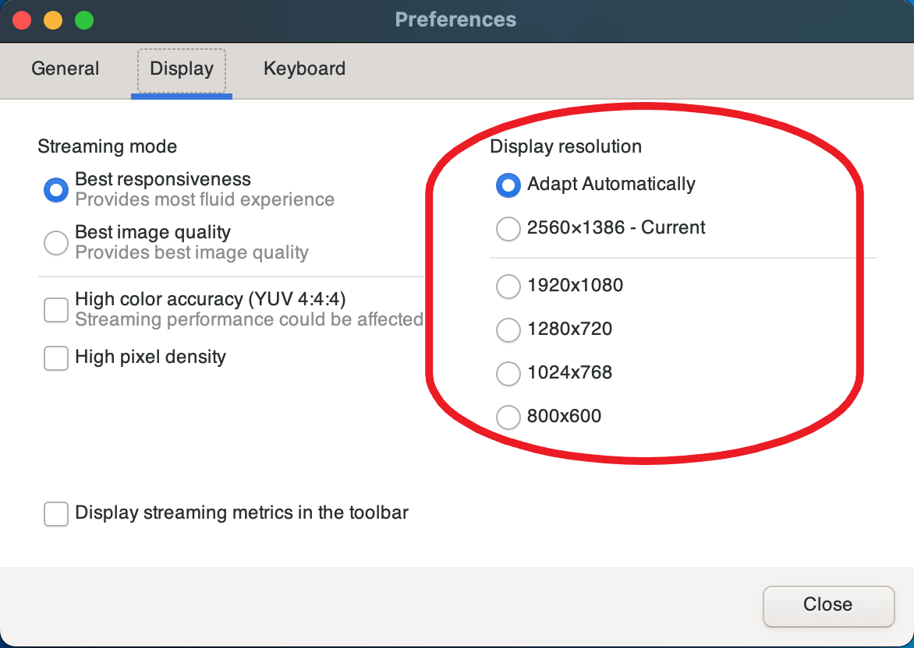
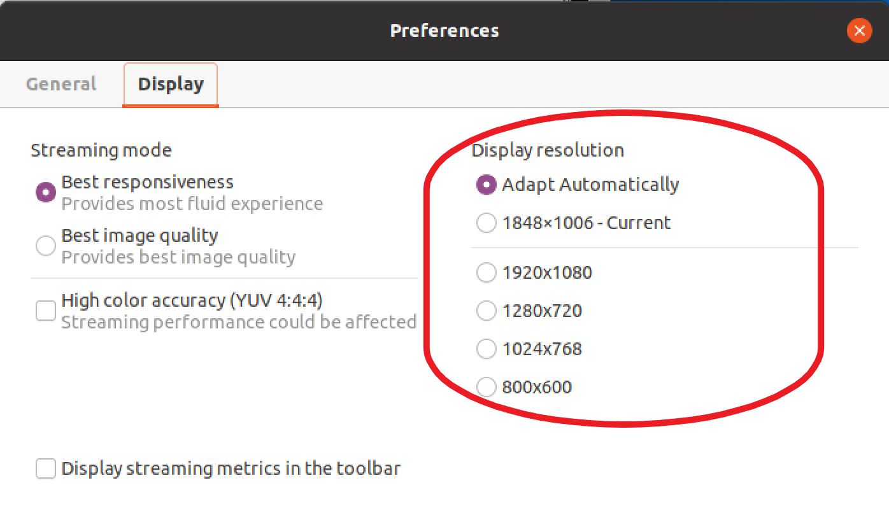

# Changing display resolution

By default, Amazon DCV automatically adapts the display resolution of the remote machine to match
the current size of the client. When the client window is resized, DCV requests the server to change
its display resolution to a size that fits within the client window.

Amazon DCV can configure a resolution according to the settings and the server system configuration.

- Web client resolution is limited by default to 1920x1080 (from web-client-max-head-resolution server setting).
- Native clients are limited by default to 4096x2160 (from max-head-resolution).
  Note that the available resolutions and number of monitors depend on the configuration of the server, make sure to follow the
  [prerequisites guide](../adminguide/setting-up-installing.md "../adminguide/setting-up-installing.md") to properly
  setup the system environment and drivers for best performance.

###### Note

Maximum supported per-monitor resolution is 4096x4096 for up to 4 monitors. Higher resolutions or more than 4 monitors are not supported in any configuration.

If you prefer a fixed resolution on the server, which does not change even when the client
window is resized, select the **Display Resolution** menu and specify the desired
resolution. If you decide to re-enable automatic resize, you can select **Adapt automatically** .

This functionality is available on the Windows client, web browser client, Linux client, and macOS client.

###### Changing display resolution on Windows clients

1. Click on the **Settings** icon from the menu at the top.
2. Select **Display Resolution** from the menu.
3. Select your preferred resolution from the drop-down menu.

###### Changing display resolution on macOS clients

1. Click on the **DCV Viewer** icon from the menu at the top.
2. Select **Preferences** from the drop-down menu.
3. Go to the **Display** tab.
4. Select your preferred resolution from the **Display Resolution** menu.

###### Changing display resolution on Linux clients

1. Click on the **Settings** icon from the menu at the top.
2. Select **Preferences** from the menu.
3. Go to the **Display** tab.
4. Select your preferred resolution from the **Display Resolution** menu.

