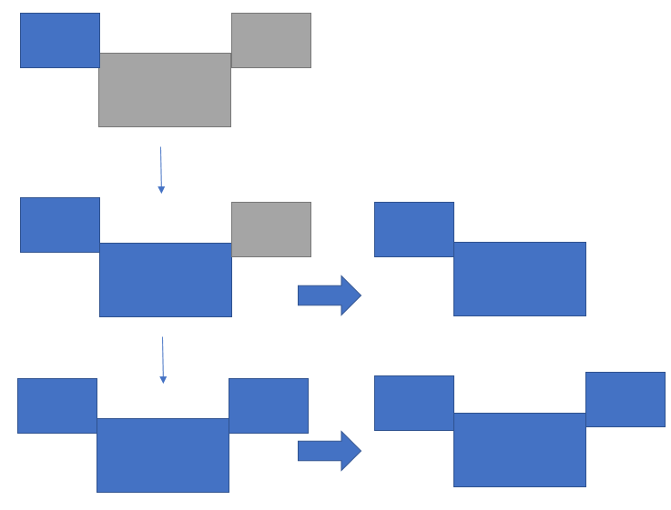
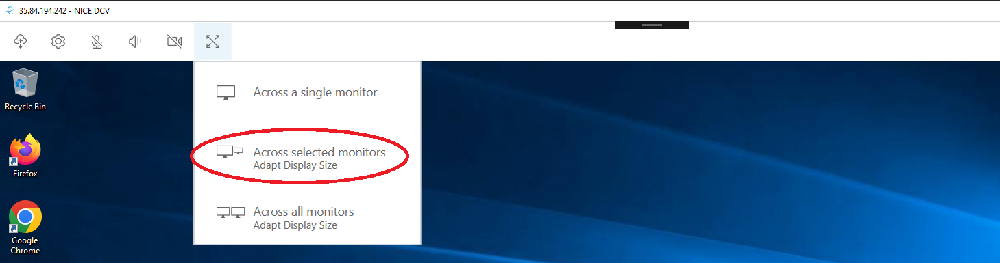
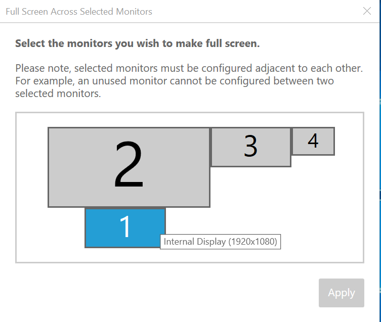
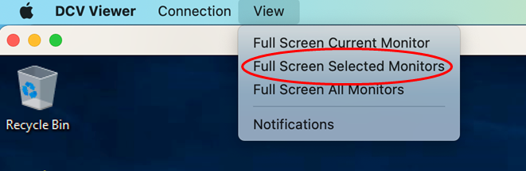
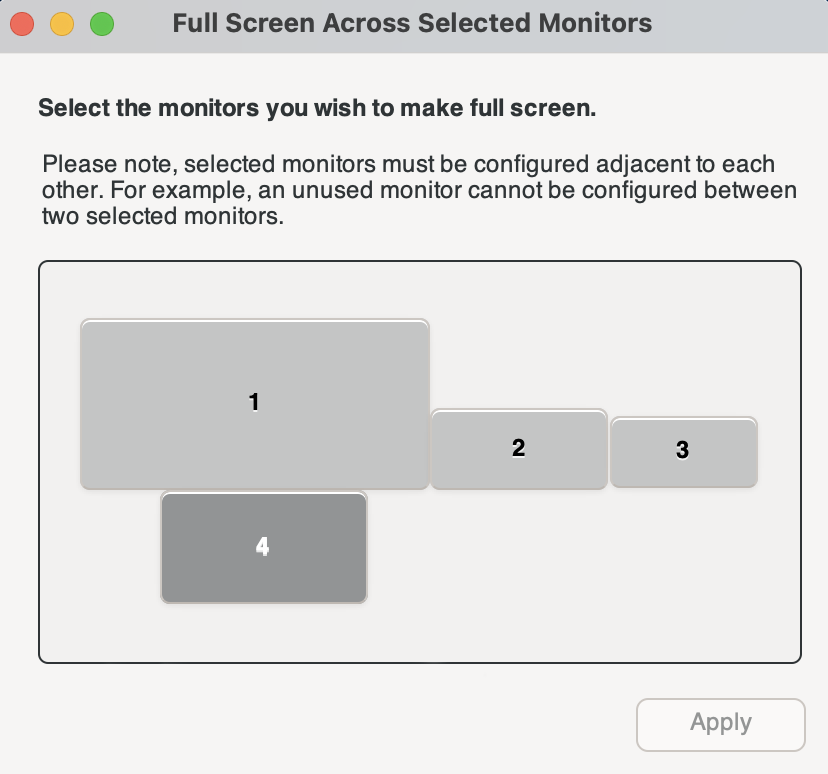
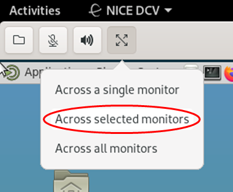
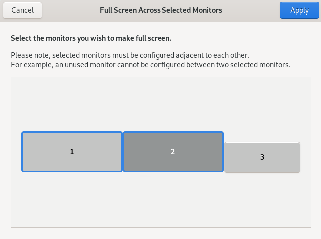

# Extending full-screen across selected monitors

If there are three or more monitors connected, DCV can also extend full-screen across a selection of those available monitors. If your selected monitors cannot go full screen,
an error message will appear and you will need to perform the procedure again.

Selected monitors must be set adjacent, or sharing a side with each other, in your display setting.

_Examples of adjacent monitor placement._

###### Note

The blue boxes are DCV enabled monitors.

The gray boxes are other monitors.

_Examples of nonadjacent monitor placement._

If your monitors are not set adjacent in your Windows display configuration, you will need to exit DCV and change your Display settings on your local machine.

- **Windows client**
  1.  Go to the top menu.
  2.  Select the **Full Screen** icon.

  ###### Note

  The **Full Screen** drop-down menu will appear.

   3. Select **Across selected monitors** from the drop down menu.

  ###### Note

  The **Across selected monitors** window will appear displaying your current monitor layout.

   4. Select which monitors you want DCV to be displayed full screen. 5. Click **Apply**.

- **macOS client**
  1.  Go to the top menu.
  2.  Select **View**.

  ###### Note

  The **View** drop-down menu will appear.

   3. Select **Full Screen Selected Monitors** from the drop down menu.

  ###### Note

  The **Full Screen Selected Monitors** window will appear displaying your current monitor layout.

   4. Select which monitors you want DCV to be displayed full screen. 5. Click **Apply**.

- **Linux client**
  1.  Go to the top menu.
  2.  Select **Full Screen** icon.

  ###### Note

  The **Full Screen** drop-down menu will appear.

   3. Select **Across selected monitors** from the drop down menu.

  ###### Note

  The **Across selected monitors** window will appear displaying your current monitor layout.

   4. Select which monitors you want DCV to be displayed full screen. 5. Click **Apply**.
