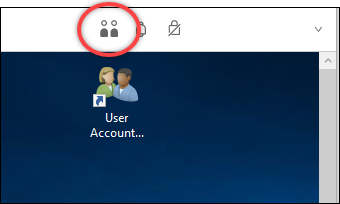
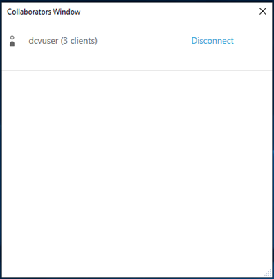
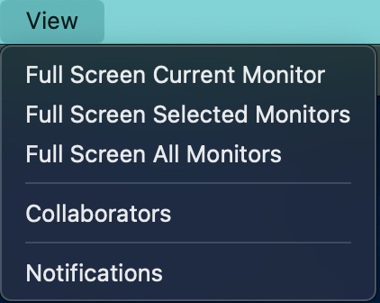
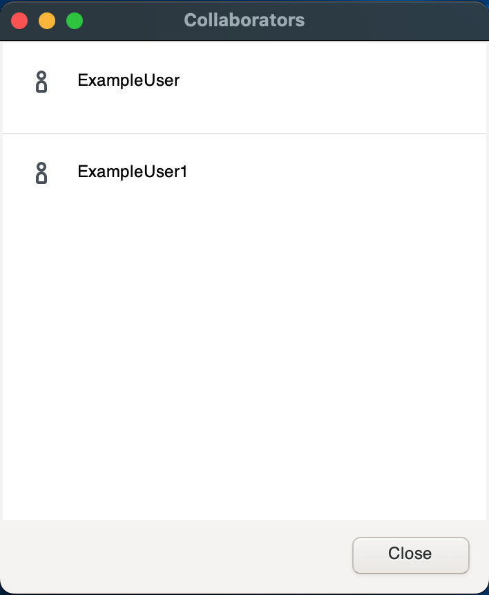

# Collaborating on a Amazon DCV session

Amazon DCV users can collaborate on the same session, enabling screen and mouse sharing.
Users can join authorized sessions while session owners can disconnect users from any session
collaboration. To take advantage of this feature, users must join the same session
identified by the same session ID.

###### Note

When collaborating on Amazon DCV sessions, the multiple monitor function is disabled.

**Requirements**

By default, the only user that can connect to a Amazon DCV session is the owner
of that session.

For users to collaborate on the same session, the active permissions applied to the session need to be
updated to include the `display` parameter. For more information on
editing the permissions file, see
[Configuring Amazon DCV authorization](../adminguide/security-authorization.md "../adminguide/security-authorization.md").

###### Note

Administrator privileges are required to edit the permissions file.

###### To collaborate on Amazon DCV sessions for Windows or Linux based servers:

1. Choose the **Collaborators** icon on the Amazon DCV client located in
   the DCV toolbar.

A **Collaborators Window** will open showing all of the connected
Amazon DCV sessions available. 2. Select a session to join. 3. Choose **Disconnect**, to remove one or all client connections, except
yours, from the DCV session.

This option is only available for session owners.

 4. Choose **Disconnect** to remove an user from an active session.

###### To collaborate on Amazon DCV sessions for macOS:

1. Go to **View** on the top toolbar.

 2. Choose **Collaborators** from the drop-down menu.

A **Collaborators Window** will open showing all of the connected
Amazon DCV sessions available.

 3. Select the session to join. 4. Choose **Disconnect** to remove one or all client connections, except yours,
from the DCV session.

This option is only available for session owners.
