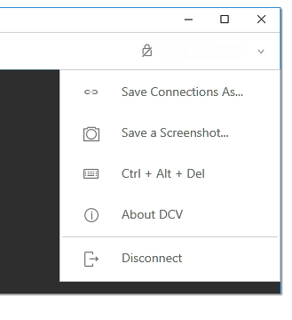

# Saving a screenshot

You can use Amazon DCV to save a screenshot of the Amazon DCV session. This functionality is available on the Windows, web browser, Linux, and macOS clients. The steps for saving a screenshot are similar on all clients.

You must be authorized to use this feature. If you aren't authorized, the functionality
isn't available in the client. For more information, see [Configuring Amazon DCV Authorization](../adminguide/security-authorization.md "../adminguide/security-authorization.md") in
the _Amazon DCV Administrator Guide_. If you aren't authorized to save
screenshots, the client also avoids the external tools that are running on your client
computer to capture a screenshot of the Amazon DCV client. Images that are obtained by these tools
either show a black rectangle instead of the Amazon DCV client window or only show the background
desktop. This functionality is available only on Windows and macOS clients.

###### To save a screenshot

1. Launch the client, and connect to the Amazon DCV session.
2. In the client, choose **Session**, **Save a Screenshot**.

 3. Choose a location and the name for the screenshot file.
