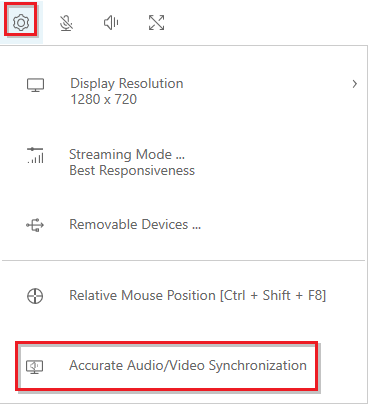
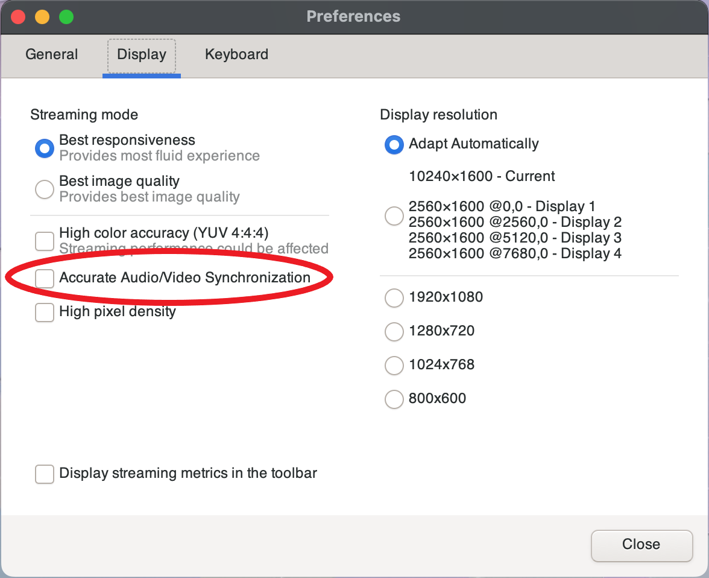
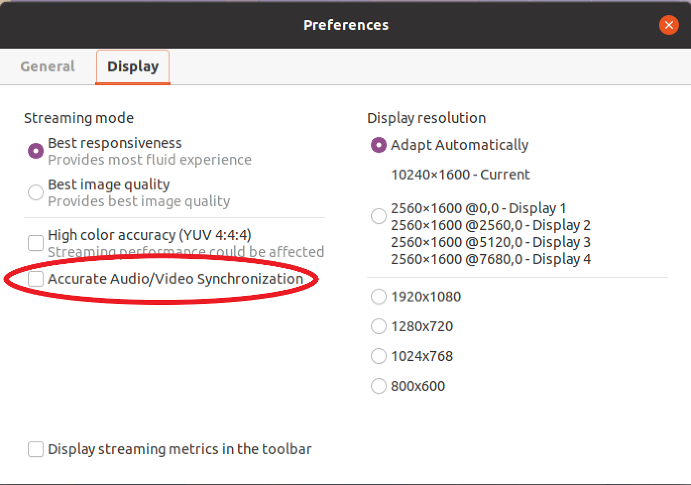

# Using accurate audio/video synchronization

The **Accurate Audio/Video synchronization** setting enables a mode that
minimizes the time difference in audio and video playback. This mode is useful in workloads
that require the video and audio to be accurately synchronized, such as lip sync.

###### Note

This feature may produce a lag in the perceived responsiveness of the remote system.

Accurate Audio/Video Synchronization functionality is supported on Windows and Linux servers
with hardware GPU acceleration, and for console sessions only. It is supported on all native clients.

###### Note

Accurate Audio/Video Synchronization is not supported on web based clients.

###### To enable or disable Audio/Video Synchronization

1. Launch the client and connect to the Amazon DCV session.
2. Do one of the following depending on your client.
   - Windows clients
     1. Choose the **Settings** icon.
     2. Select **Accurate Audio/Video Synchronization** from
        the drop-down menu.

     

   - macOS clients
     1. Choose the **DCV Viewer** icon.
     2. Select **Preferences** from
        the drop-down menu.
     3. Check the box for **Accurate Audio/Video Synchronization**.

     

   - Linux clients
     1. Choose the **Settings** icon.
     2. Select **Preferences** from
        the drop-down menu.
     3. Check the box for **Accurate Audio/Video Synchronization**.

     
