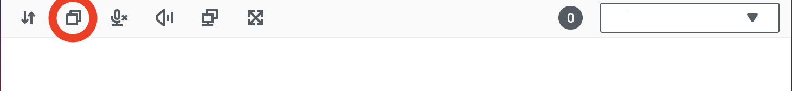

# Copying and pasting

You can use Amazon DCV to copy and paste text between your local computer and the Amazon DCV session.
You must be authorized to use this feature. If you are not authorized, the functionality is
not available in the client. For more information, see [Configuring Amazon DCV
Authorization](../adminguide/security-authorization.md "../adminguide/security-authorization.md") in the _Amazon DCV Administrator Guide_.

The type of content that can be copied and pasted, and the methods for copying and pasting differ
between the Windows client, web browser client, Linux client, and macOS client.

###### Topics

- [Windows, Linux, and macOS clients](#using-copy-paste-windows-linux "#using-copy-paste-windows-linux")
- [Web browser client](#using-copy-paste-browser "#using-copy-paste-browser")

## Windows, Linux, and macOS clients

You can use the Windows, Linux, and macOS clients to copy and paste text and images
between your local computer and the Amazon DCV session. You can do this using the keyboard shortcuts
and context (right-click) menu shortcuts. If you can't copy and paste, contact your Amazon DCV
server administrator to ensure that the permissions are properly configured.

## Web browser client

You can use the web browser client to copy and paste text and images between your local
computer and the Amazon DCV session. Use keyboard shortcuts and context (right-click) menu to copy and
paste text and images on Google Chrome and Microsoft Edge. Mozilla Firefox and Apple Safari
do not support copying and pasting images, and require a different procedure to copy and paste text.

###### To copy text from the session in Mozilla Firefox or Apple Safari and paste on your local computer

1. In the web browser client, highlight the text to copy and choose
   **Clipboard**, **Copy to Local Device**.

The text is now placed in your computer's clipboard. 2. Paste the text using the paste keyboard shortcut or context menu shortcut.

###### To copy text from your local computer and paste in the session in Mozilla Firefox or Apple Safari

1. On your local computer, copy the text using the copy keyboard shortcut or context menu.
2. In the web browser client, choose **Clipboard**, **Paste to Remote
   Session**.
3. Paste the text using the host operating system's paste shortcuts.
