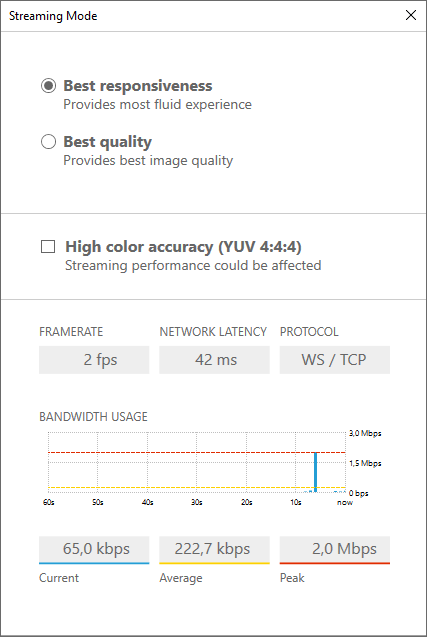
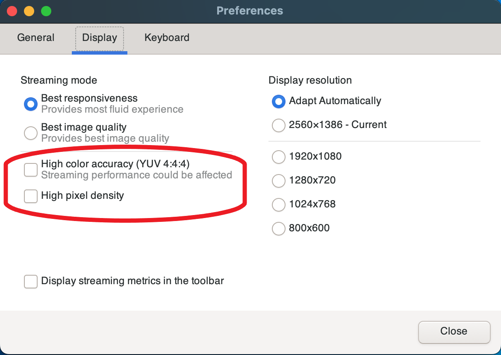
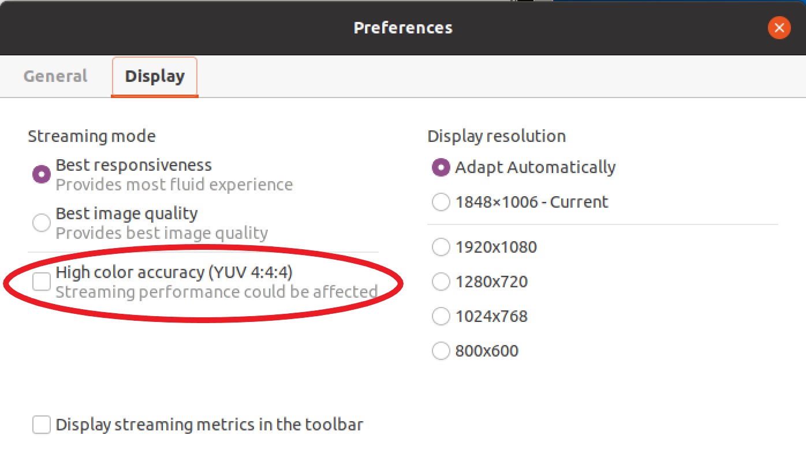
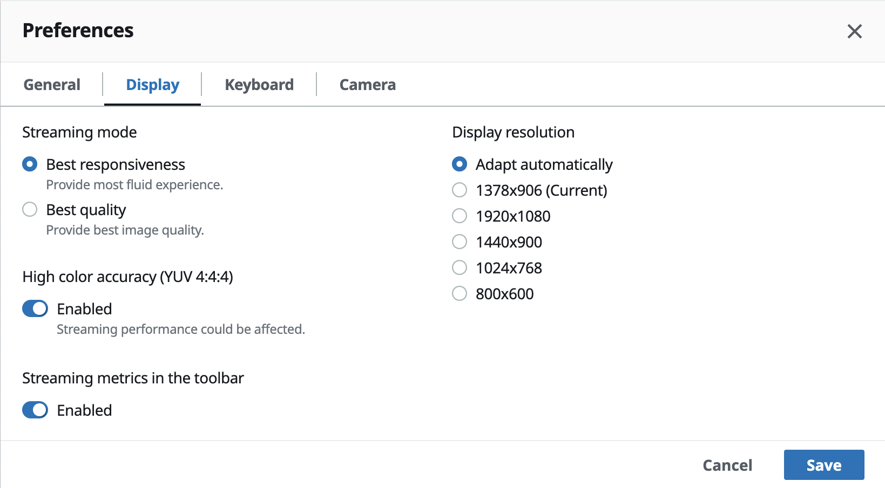

# Using high color accuracy

By default, Amazon DCV uses YUV 4:2:0 chroma subsampling when compressing the display output
and then updates the parts of the screen that are not changing over time to a full lossless RGB implementation.
This default behavior aims to strike a balance between performance and image fidelity,
though it may introduce chroma artifacts. By enabling the High color accuracy setting,
the YUV chroma subsampling will be set to 4:4:4, thus increasing color fidelity.
However this will increase network bandwidth and could affect performance of clients,
especially at high resolution, because most client machines do not support HW accelerated
decoding when using YUV 4:4:4.

The steps for setting the high color accuracy depend on the client used.

###### Topics

- [High color accuracy on native clients](#using-high-color-accuracy-native "#using-high-color-accuracy-native")
- [High color accuracy on Web browser client](#using-high-color-accuracy-web "#using-high-color-accuracy-web")

## High color accuracy on native clients

As long as you are using a Amazon DCV Server and a Amazon DCV Client both having version 2022.0 or later,
please follow these steps to enable high color accuracy:

###### Enabling high color accuracy on Windows clients

1. Choose the **Settings** icon.
2. Select **Streaming Mode** from the drop-down menu.

 3. Check the High color accuracy (YUV 4:4:4) checkbox in the **Streaming Mode** window. 4. Close the **Streaming Mode** window.

###### Enabling high color accuracy on macOS clients

1. Choose the **DCV Viewer** icon.
2. Select **Preferences** from the drop-down menu.
3. Select the **Display** tab in the **Preferences** window.
4. Check one or both of the following checkboxes:
   - High color accuracy (YUV 4:4:4)
   - High pixel density

 5. Close the **Preferences** window.

###### Enabling high color accuracy on Linux clients

1. Choose the **Settings** icon.
2. Select **Preferences** from the drop-down menu.
3. Select the **Display** tab in the **Preferences** window.
4. Check the checkbox for **High color accuracy (YUV 4:4:4)**.

 5. Close the **Preferences** window.

## High color accuracy on Web browser client

In order to use high color accuracy on Web browser client you need a Amazon DCV Server with version 2022.0 or later,
as well as a browser supporting the [VideoDecoder](https://developer.mozilla.org/en-US/docs/Web/API/VideoDecoder "https://developer.mozilla.org/en-US/docs/Web/API/VideoDecoder")
interface of the Web Codecs API.

The steps for enabling the high color accuracy are the same across all supported web browsers.

1. In the client, choose **Session**, **Preferences**.

 2. Under the **Display** tab, if the high color accuracy feature is available,
the corresponding toggle will be visible and allows to specify whether to enable or disable the
YUV chroma subsampling set to 4:4:4:

 3. Save and close the **Preferences** modal.
