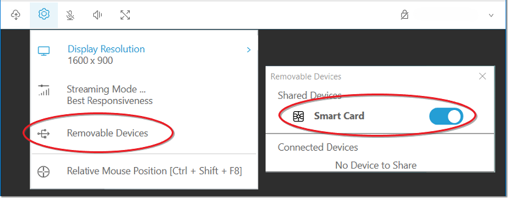
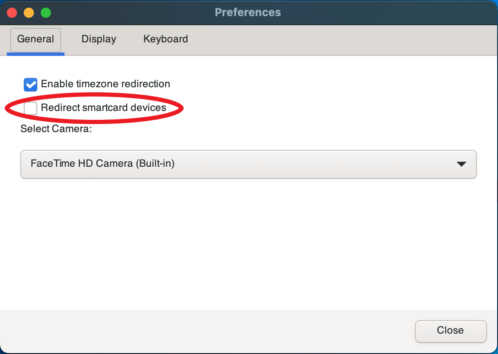
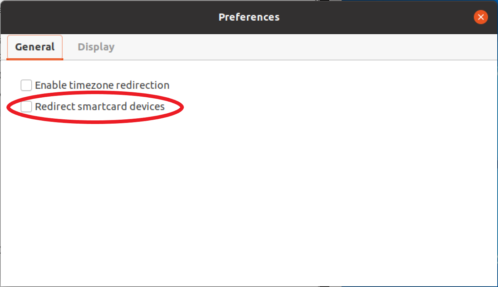

# Using a smart card

You can use Amazon DCV to use one or more smart cards that's connected to your client computer.
You can do this using the standard Personal Computer/Smart Card (PC/SC) interface, in a
Amazon DCV session. For each session, only one connected client can connect a smart card at a time.
This is especially important in environments where multiple clients connect to the same
session.

Smart card access is supported only with the Windows, Linux, and macOS clients. It's not
supported with the web browser client.

Only one client can connect a smart card at a time. While your smart card is connected,
no other clients who are connected to the session can connect a smart card.

After you're done using the smart card in the Amazon DCV session, release it. After it's
released, other clients who are connected to the session can connect a smart card. The
smart card is automatically released when you disconnect from the session.

You must be authorized to use this feature. If you are not authorized, the functionality is
not available in the client. For more information, see [Configuring Amazon DCV
Authorization](../adminguide/security-authorization.md "../adminguide/security-authorization.md") in the _Amazon DCV Administrator Guide_.

## Connecting a smart card

###### Connecting to a Windows client

1. Launch the client and connect to the Amazon DCV session.
2. Choose the **Settings** icon.
3. Select **Removable Devices** from the drop-down list.
4. Enable the **Smart Card** toggle.



###### Connecting to a macOS client

1. Launch the client and connect to the Amazon DCV session.
2. Choose the **DCV Viewer** icon.
3. Select the **General** tab in the **Preferences** window.
4. Check the **Redirect smartcard devices** checkbox.



###### Connecting to a Linux client

1. Launch the client and connect to the Amazon DCV session.
2. Choose the **Settings** icon.
3. Select the **General** tab in the **Preferences** window.
4. Check the **Redirect smartcard devices** checkbox.



## Using a smart card on Linux servers

- Open a terminal and launch the application using the `dcvscrun` command followed by the application name and arguments.

For example, to
launch `firefox` with smart card support, use the following command:

```
`$`  dcvscrun firefox
```

###### Important

If you enabled smart card caching, run the following command in the same terminal that
you set and exported the `DCV_PCSC_ENABLE_CACHE` environment variable
in.

## Releasing a smart card

###### Releasing from a Windows client

1. Choose the **Settings** icon.
2. Select **Removable Devices** from the drop-down list.
3. Disable the **Smart Card** toggle.

###### Releasing from a macOS and Linux clients

1. Choose the **Settings** icon.
2. Select the **General** tab in the **Preferences** window.
3. Uncheck the **Redirect smartcard devices** checkbox.

## Smart card data caching (optional)

To have the Amazon DCV server cache smart card data, you will need to enable the smart card caching feature.
By default, smart card caching is disabled. With smart card caching enabled, the server caches the results
of recent calls to the client's smart card. This helps to reduce the amount of traffic that is transferred
between the client and the server and improves performance.

You cannot enable smart card caching if it's disabled on the server. For more information,
see [Configuring Smart Card Caching](../adminguide/manage-smart-card.md "../adminguide/manage-smart-card.md") in the _Amazon DCV Administrator Guide_

###### Enabling smart card caching on Windows servers

1. Launch the client and connect to the Amazon DCV session.
2. Open a terminal window.
3. Run one of the following commands:
   - To enable smart card caching for the current terminal window:

   ```
   `C:\>` set DCV_PCSC_ENABLE_CACHE=1
   ```

   - To enable smart card caching permanently for all applications on the server:

   ```
   `C:\>` setx DCV_PCSC_ENABLE_CACHE 1
   ```

###### Enabling smart card caching on Linux servers

1. Launch the client and connect to the Amazon DCV session.

###### Note

Make sure to run the following command in the same terminal that you intend to
launch the application. 2. Open a terminal window where you ran the applicaiton with `dcvscrun`. 3. Export the `DCV_PCSC_ENABLE_CACHE` with the value `1`.

For example, you might run the command:

```
`$`  DCV_PCSC_ENABLE_CACHE=1 dcvscrun APPLICATION
```

or

```
`$`  DCV_PCSC_ENABLE_CACHE=1
`$`  dcvscrun APPLICATION
```
