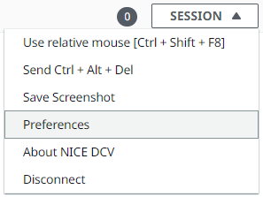
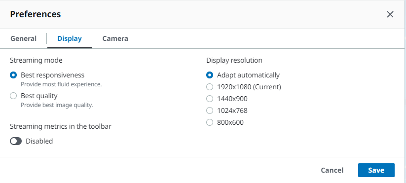
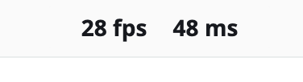
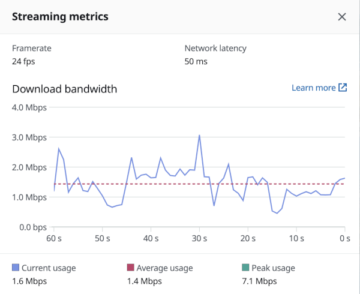

# Streaming modes on Web browser client

The steps for managing the streaming modes are the same across all supported web browsers.

1. In the client, choose **Session**, **Preferences**.

 2. Under the **Display** tab, choose one of the following options from the **Streaming options** section:

    * **Best responsiveness**
    * **Best quality**

 3. (Optional) For information about network performance, choose **Display Streaming
Metrics**. For more information, see [Streaming metrics](#using-streaming-metrics-web "#using-streaming-metrics-web"). 4. Save and close the **Preferences** modal.

## Streaming metrics

The streaming metrics can be used to evaluate your network performance and determine which
streaming mode is suitable for your network conditions.

The streaming metrics provide the following real-time information:

###### Note

Metrics are displayed for the current Amazon DCV session connection.

- **Framerate**—Indicates the number of frames received from
  the Amazon DCV server every second.
- **Network latency**—Indicates the amount of time (in milliseconds)
  it takes for a packet of data to be sent to the Amazon DCV server and back to the client.
- **Bandwidth usage**—Indicates the amount of data being
  sent and received over the network connection. The red line shows the peak network
  throughput. The yellow line shows the average throughput. The blue line shows the current
  (real-time) throughput.
  To view the streaming metrics:

1. In the client, choose **Session**, **Preferences**.

 2. Under the **Display** tab, enable the toggle to show **Streaming metrics in the toolbar**. 3. Close the **Preferences** modal. 4. The streaming metrics are then displayed in the center of the client toolbar.

 5. Click on the streaming metrics to see more detailed streaming data like in the following example.

 6. (Optional) Close the **Metrics** modal.
