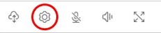
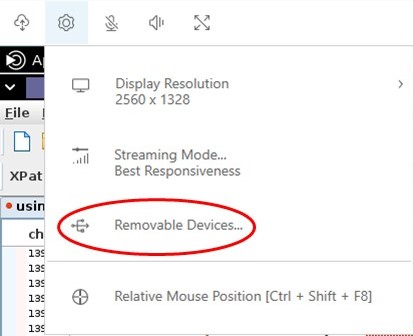
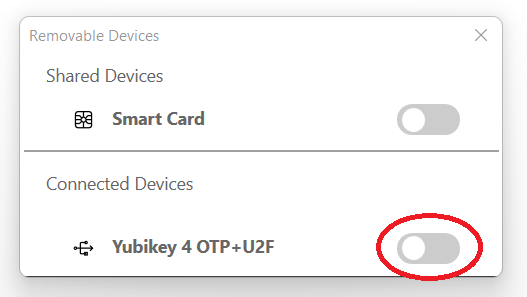

# Using USB remotization

###### Note

This feature is for installable Windows clients only.

With Amazon DCV you can use specialized USB devices such as 3D pointing devices and two-factor
authentication USB dongles. These devices must be connected to your computer for them to
interact with applications running on a Amazon DCV server.

###### Note

Graphic tablets, gamepads, and smart card readers are automatically supported by Amazon DCV and
do not require USB remotization to be used.

You must be authorized to use this feature. If you are not authorized, the functionality is
not available in the client. For more information, see [Configuring Amazon DCV
Authorization](../adminguide/security-authorization.md "../adminguide/security-authorization.md") in the _Amazon DCV Administrator Guide_.

After this feature is enabled, the most commonly used USB devices are supported. You can connect them to your computer
and use them on the server without additional configuration required.

However, some specialized USB devices aren't supported in the default configuration. Unsupported devices do not appear
in the **Settings** menu after they're connected. These devices must be added to the USB Device **Allow List**
on the Amazon DCV Server before they can be used. After they are added to this list, they will appear in the **Settings** menu on the client.

For information on this or any additional configuration that may be required on the Amazon DCV server, see [Enabling USB Remotization](../adminguide/manage-usb-remote.md "../adminguide/manage-usb-remote.md")
and in the _Amazon DCV Administrator Guide_.

## Using a USB device on a Amazon DCV server

1. Connect the USB device in any open USB slot on your computer.
2. Go to your DCV client session.
3. Choose the **Settings** icon located in the upper left of the window.

 4. Select **Removable Devices...** from the dropdown menu.

 5. Move the slider next to the USB device in the list.

Your USB device is ready to use now.
