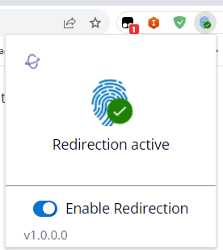

# Using WebAuthn redirection

Amazon DCV offers the WebAuthn Redirection feature, specifically designed for use with
Google Chrome and Microsoft Edge browsers. This functionality enables authentication in
session for web applications. This feature operates through a dedicated browser extension
that, once installed, redirects the WebAuthn requests from the web application to the DCV
client.

Authorization is required to use this feature. Otherwise, it is not available in the
client. For more information, see Configuring Amazon DCV Authorization in the Amazon DCV
Administrator Guide.

###### Note

WebAuthn redirection is supported only on Windows, Linux, and macOS clients. It is not
supported on the web browser client.

## Webauthn Redirection user interface

The extension opens a user interface used to monitor and control the Webauthn Redirection feature.

- **Extension Icon:** Located in the main body of user interface, this icon displays the feature's current state.

The icon will be one of the following:

| Icon            | Name        | Usage                                                                                                                              |
| --------------- | ----------- | ---------------------------------------------------------------------------------------------------------------------------------- |
| Inactive icon   | Inactive    | Redirection is inactive. This occurs when you disable the extension.                                                               |
| Active icon     | Ok (Active) | Redirection is active and connected to the underlying Amazon DCV software on the host.                                             |
| Processing icon | Processing  | Redirection is executing an operation in progress or is attempting to connect to the underlying Amazon DCV sofware in the host. |
| Error icon      | Error       | There is an error connecting to the underlying Amazon DCV software on the host.                                                    |

- **Status Message:** Located in the main body of user interface, the message will explain the current operational status.
- **Redirection Toggle:** Located at the bottom of the user
  interface, this switch enables or disables the feature.
  - Enabling redirection allows WebAuthn requests to be intercepted by the extension and forwarded to the client.
  - Disabling redirection allows WebAuthn requests to be processed locally by the browser.
