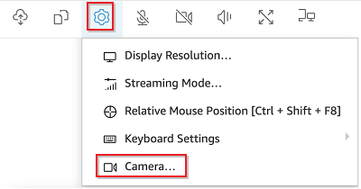
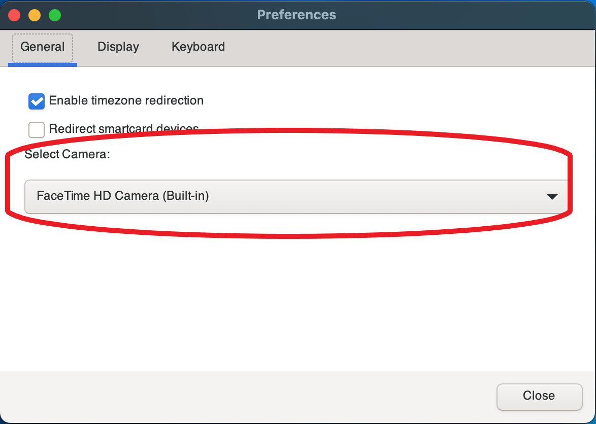

# Using a webcam on Windows, Linux and macOS clients

The steps for selecting the camera to use are similar across the Windows, Linux and macOS clients.

###### To select the webcam to use

1. Launch the client and connect to the Amazon DCV session.
2. Do one of the following depending on your client.
   - Windows and Linux clients
     1. Choose the **Settings** icon.
     2. Select **Camera**.
     3. Select the camera from the drop-down list

   
   - macOS client
     1. Choose the **DCV Viewer** icon.
     2. Select the **General** tab.
     3. Select the arrow down arrow in the **Select Camera:** field to open a drop-down list of cameras.
     4. Select the camera from the drop-down list

   

###### Note

- The camera menu items appears only if you're authorized to use a webcam in the
  session. If you don't see the camera menu items, you might not be authorized to use a
  webcam.
- You can't change the webcam selection while the webcam is in use, or while another
  client enabled a webcam in the session.

###### To start using your webcam in a session

You must first enable it. Use the webcam icon on the toolbar to enable or disable your
webcam for use in the session. You can also use the icon to determine its current state. The
webcam icon appears on the toolbar only if the following is the case:

- You're authorized to use a webcam.
- You have at least one webcam connected to your local computer.
- No other users enabled a webcam for use in the session.

| Toolbar icon    | Description                                                                                                                                                                                                                           |
| --------------- | ------------------------------------------------------------------------------------------------------------------------------------------------------------------------------------------------------------------------------------- | ----------------------------------------------------------------------------------------------------------------------------------------------------------------------------------------------------------------------------------------------------------------------------------------------------------------------------------------------------------------------------------------------------------------------------------------------------------------------------------------------------------------------------------------------------------------------------------------------------------------------------------------------------------------------------------------------------------------------------------------------------------------------------------------------------------------------------------------------------------------------------------------------------------------------------------------------------------------------------------------------------------------------------------------------------------------------------------------------------------------------------------------------------------------------- |
| Webcam disabled | Your webcam is disabled in the session. Other clients can enable a webcam for use in the session. Click the icon to enable your webcam in the session. If you didn't previously select the webcam to use, the default webcam is used. |
| Webcam enabled  | Your webcam is enabled in the session, but it isn't in use. While your webcam is enabled, no other clients that are connected to the session can use a webcam. Click the icon to disable your webcam in the session.                  |
| Webcam in use   | Your webcam is in use by a remote application in the Amazon DCV session. No other clients can enable a webcam while your webcam is in use. Click the icon to disable your webcam in the session.                                      | ## Troubleshooting ###### Topics  • [Webcam doesn't work on Windows 10](#win-10 "#win-10")  • [Client application says that the webcam is in use](#close-app "#close-app") ### Webcam doesn't work on Windows 10 Windows 10 provides built-in privacy settings that manage access to the device camera. If you're running Windows 10 on your client computer, these privacy settings might prevent use of the webcam. ###### Note If you're connecting to a Windows 2019 Amazon DCV server, you might need to perform these steps on the Amazon DCV server as well. To modify the privacy settings on your computer, do the following: 1. Choose the search icon on the toolbar. 2. Enter `Settings` and press **Enter**. 3. In the left-hand panel, choose **Camera**. 4. For **Allow apps to access your camera**, switch the toggle to the **On** position. 5. You might need to restart your computer for the changes to take effect. ### Client application says that the webcam is in use Only one application can use the webcam at a time. If you're using the webcam in multiple applications, first close the applications where it's no longer needed. |
