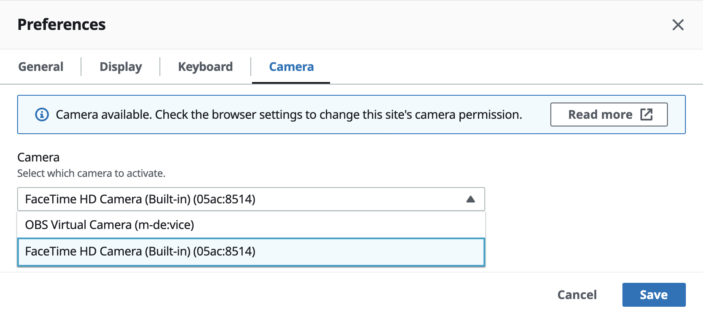

# Using a webcam on the web browser client

Webcam functionality is only supported with Chromium-based browsers, such as Google
Chrome or Microsoft Edge. It isn't supported on Mozilla Firefox or Apple Safari.

The steps for selecting the camera to use are the same across all supported web browsers..

###### To select the webcam to use

1. Launch the client and connect to the Amazon DCV session.
2. In the client, choose **Session**, **Preferences**.

 3. Under the **Camera** tab, select the camera to use.

 4. Close the **Preferences** modal.

###### Note

- The camera menu items appears only if you're authorized to use a webcam in the
  session. If you don't see the camera menu items, you might not be authorized to use a
  webcam.
- You can't change the webcam selection while the webcam is in use, or while another
  client enabled a webcam in the session.
- If the camera permission settings have not been expressly granted or denied by the user,
  you're prompted to allow camera detection before being able to select the camera to use.
- In case the camera permission settings have been expressly granted or denied by the user,
  you would be able to change such setting following this procedure:
  1.  At the top left of your browser window, click the area on the address bar left of the URL.
  2.  In the popup window that opened, select the desired camera permission setting to be applied.

###### To start using your webcam in a session

You must first enable it. Use the webcam icon on the toolbar to enable or disable your
webcam for use in the session. You can also use the icon to determine its current state. The
webcam icon appears on the toolbar only if the following is the case:

- You're authorized to use a webcam.
- You have at least one webcam connected to your local computer.
- No other users enabled a webcam for use in the session.

| Toolbar icon     | Description                                                                                                                                                                                                                                    |
| ---------------- | ---------------------------------------------------------------------------------------------------------------------------------------------------------------------------------------------------------------------------------------------- |
| Webcam disabled  | Your webcam is disabled in the session. Other clients can enable a webcam for use in the session. Click the icon to enable your webcam in the session. If you didn't previously select the webcam to use, the default webcam is used. |
| Webcam enabled   | Your webcam is enabled in the session, but it isn't in use. While your webcam is enabled, no other clients that are connected to the session can use a webcam. Click the icon to disable your webcam in the session.                     |
| Webcam streaming | Your webcam is in use by a remote application in the Amazon DCV session. No other clients can enable a webcam while your webcam is in use. Click the icon to disable your webcam in the session.                                         |

## Troubleshooting

### Client application says that the webcam is in use

Only one application can use the webcam at a time. If you're using the webcam in
multiple applications, first close the applications where it's no longer needed.
