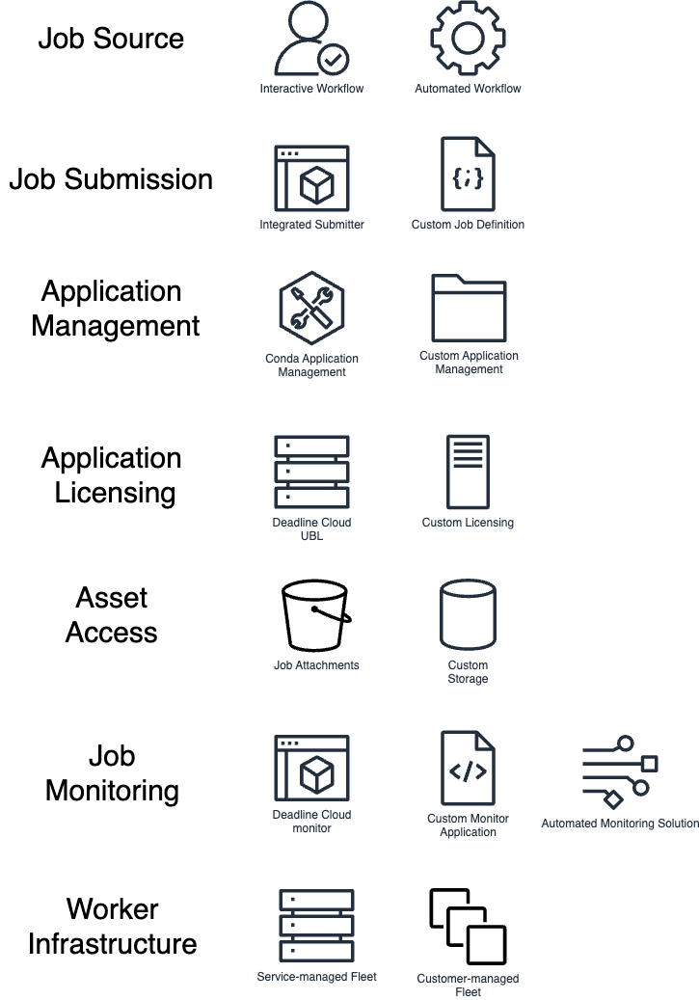
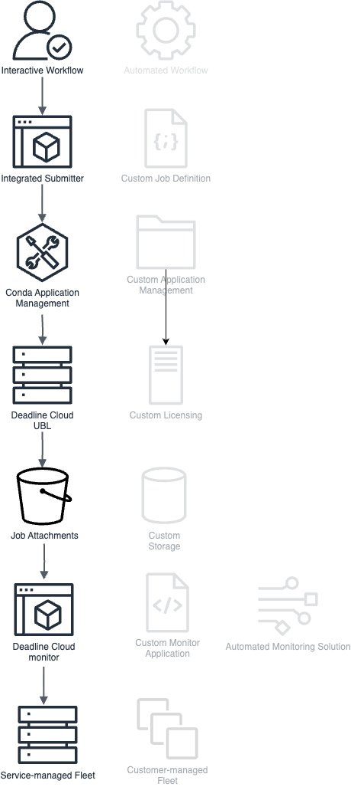
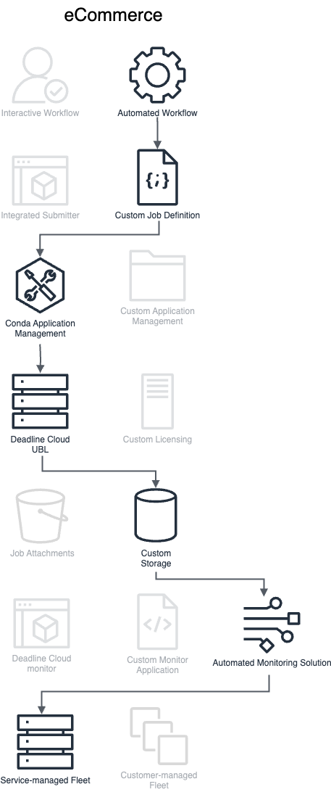
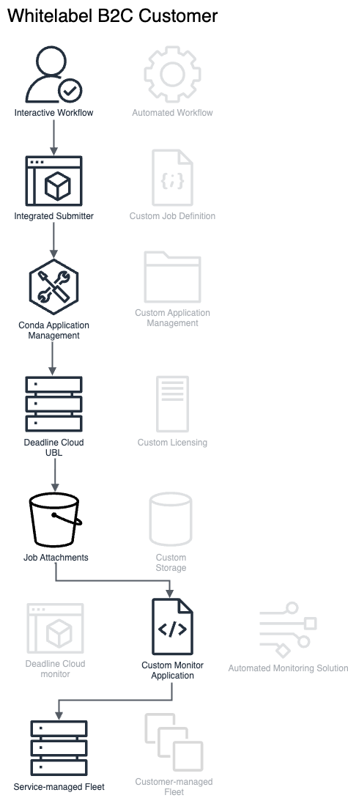

# Deadline Cloud Architecture Guidance

This topic provides guidance and best practices for designing and building reliable, secure, efficient, and cost-effective render farms for your workloads using Deadline Cloud. Using this guidance can help you build stable and efficient workloads, allowing you to focus on innovation, reduce costs, and improve your customer's experience.

This content is intended for chief technology officers (CTOs), architects, developers, and operations team members.

An end-to-end rendering workflow requires solutions at multiple layers of the process such as job generation, asset access, and job monitoring. Deadline Cloud offers multiple solutions for each layer of the rendering process. By selecting from Deadline Cloud's options in each layer, you can design a workflow that matches your use case.

For each layer, you will need to decide which approach is best for your use case. These are not strict scenario definitions and are not the only way to use Deadline Cloud. Instead these are a high-level set of concepts to help you understand how Deadline Cloud might be able to fit into your business or workflow. You can separate Deadline Cloud workloads into the following layers: Job Source, Job Submission, Application Management, Application Licensing, Asset Access, Output Management, and Worker Infrastructure Management.

In general, you can mix-and-match any scenario in one layer with any other scenario in another layer, except specific combinations which are specified below.

## Job source

The job source is the access point where new jobs will enter the system to be rendered by Deadline Cloud. At a high-level, there are two primary sources of jobs: human interactivity and automated computer systems.

### Interactive workflow

In this scenario, an artist or other creative role is the primary generator of work to be processed in the Deadline Cloud farm. Usually the output from these jobs are a primary artifact for the larger project or team. They perform their work using software such as an industry standard digital content creation (DCC) tool. They are manually submitting jobs to the Deadline Cloud farm and are viewing the outputs afterwards to review. The workstation itself is not managed by AWS.

In most cases, these artists use Deadline Cloud integrated submitters and the Deadline Cloud monitor in the Workload Application and Monitoring layers.

### Automated workflow

In this scenario, a programmatic system owned by the customer is the primary generator of jobs in the Deadline Cloud farm. This could be asset generation in a retail pipeline, like a turntable video generated from a 3D model or scan. This could be automated compositing of broadcast graphics and player cards for sports. The theme of this scenario is an individual isn't manually submitting each job to Deadline Cloud, but instead the job is generated as part of a larger system.

With automated jobs, it is less common for Deadline Cloud integrated submitters and the Deadline Cloud monitor to be used. Often the job definitions will be custom application development written by you and job outputs will automatically flow into a Digital Asset Management (DAM) system or Media Asset Management (MAM) system for approval and distribution.

## Job submission

Jobs are submitted to Deadline Cloud using [OpenJobDescription](https://github.com/OpenJobDescription/openjd-specifications "https://github.com/OpenJobDescription/openjd-specifications") templates. OpenJobDescription is a flexible open specification for defining batch processing jobs that are portable between different scheduling system deployments. The Job definition file describes the parameters of the job, the steps of the job, how a step is parameterized based upon the job inputs, as well as the actual script that will run on a Worker to perform the processing. The idea of Workload Submission is how these job definitions are created, who creates them and how they are submitted.

### Integrated submitter with DCC

A Deadline Cloud integrated submitter is a piece of software that ties together Deadline Cloud with an industry standard DCC or software package. The integrated submitter determines how to transform the data and configuration for a render, composite or other workload into a job template, something that can be understood by Deadline Cloud. Many integrated submitters are created and maintained by the Deadline Cloud team or the creator of the software package, but if one does not already exist for the desired application then you can create and maintain your own submitter. There is a finite set of DCCs that are supported by the Deadline Cloud team.

Interactive workflows usually involve integrated submitters, but not always. For templated, automated workflows, a common workflow is for an artist to setup a template job in their DCC and perform a one-time export of the **job bundle**. This job bundle defines how to run that particular kind of job on Deadline Cloud in a parameterized manner. This job bundle can be integrated into the Automated Workflow scenario for automation purposes.

### Custom job definition

For custom applications and workflows, it is possible to fully control how these job definitions are created and submitted to Deadline Cloud. For example, an e-commerce site might ask sellers to upload 3D models of the object they are selling. After this upload, the e-commerce platform could dynamically generate a job definition to submit to Deadline Cloud to automatically generate a turntable animation on a common background using common lighting to match the other 3D objects available on the site. During development of the ecommerce platform, a software developer would create a job definition, embed it into the ecommerce platform with parameters eventually provided by the sellers, and code the platform to submit this job during the platforms product upload workflow.

Deadline Cloud provides a number of sample job definitions in the [samples repository](https://github.com/aws-deadline/deadline-cloud-samples "https://github.com/aws-deadline/deadline-cloud-samples") on github.

## Application management

After a job is submitted to Deadline Cloud and assigned to a worker, the script from the job definition is executed on the worker. In most cases, this script will invoke an application to perform the actual processing, such as a renderer, composite, encode, filtering or any other of a number of compute-intensive tasks. Application management is the concept of ensuring the necessary version of the required software is available to the workers.

You can manage applications using any package management system you like, but Deadline Cloud provides a number of a tools to easily enable the use of conda packages. [Conda](https://anaconda.org/anaconda/conda "https://anaconda.org/anaconda/conda") is an open-source, cross-platform, language agnostic package manager and environment management system.

### Deadline Cloud-managed conda channel for service-managed fleets (SMF)

When using service-managed fleets, a Deadline Cloud-managed conda channel is automatically setup and configured for use by your jobs. The Deadline Cloud service provides a number of partner DCC applications and renders in this conda channel. For more information see [Create a queue environment](../userguide/create-queue-environment.md "../userguide/create-queue-environment.md") in the Deadline Cloud user guide. These packages are automatically kept up to date by the Deadline Cloud service and require no maintenance from you. This conda channel is only available when using service-managed fleets and are not available when using customer-managed fleets.

### Self-managed conda channel

If you are not able to use the Deadline Cloud-managed conda channel, you must determine how to install, patch and otherwise manage applications on your Deadline Cloud fleet. One option is to create a conda channel that you setup and maintain. This will most closely interoperate with the Deadline Cloud-managed conda channel. For example, you can use a DCC from the Deadline Cloud-managed conda channel but bring your own package that contains a specific DCC plugin. For more information about this process, see [Create a conda channel using S3](configure-jobs-s3-channel.md "configure-jobs-s3-channel.md").

### Custom application management

For application management, the requirement from Deadline Cloud is that the application is available in the PATH when the job script is executed on the worker.

If you already build and maintain Rez packages, you can use a queue environment to install the applications from Rez repositories. An example queue environment can be found on [AWS Deadline Cloud GitHub org](https://github.com/aws-deadline/deadline-cloud-samples/blob/mainline/queue_environments/rez_queue_env.yaml "https://github.com/aws-deadline/deadline-cloud-samples/blob/mainline/queue_environments/rez_queue_env.yaml").

If you already manage applications on a customer-managed fleets with long-lived workers or in system images, then no queue environment is required for application management. Ensure the application appears on the job user's path and submit the job.

## Application licensing

Many workloads commonly ran on Deadline Cloud require software licensing from the software vendor. These applications are often licensed per-seat, per-CPU or per-host. It is your responsibility to ensure that your usage of 3rd party software on Deadline Cloud abides by the 3rd party licensing agreement. If you are using open-source software, custom software, or otherwise license-free software, then configuring this layer is not required. Keep in mind that Deadline Cloud only supports render licensing and does not support workstation licensing.

### Service-managed fleets and usage-based licensing

When using Deadline Cloud service-managed fleets, usage-based licensing (UBL) is automatically configured for supported software. Jobs run on service-managed fleets automatically have environment variables set for supported applications to direct them to use the Deadline Cloud license servers. When using Deadline Cloud UBL, you are only charged for the number of hours you use the licensed application.

### Customer-managed fleets and usage-based licensing

Deadline Cloud usage-based licensing (UBL) is also available when not using service-managed fleets. In this scenario, you will setup Deadline Cloud license endpoints which provide IP addresses in your selected VPC subnets that provide access to Deadline Cloud license servers. After you configure the appropriate software-specific environment variables on your workers and configure network connectivity from the workers to those license endpoint IP addresses, the workers are able to check-out and check-in licenses for supported software. You are charged per hour for licenses the same as when using UBL in service-managed fleets.

### Custom licensing

You might use an application that is not supported by Deadline Cloud UBL or you might have preexisting licenses that are still valid. In this scenario, you are responsible for configuring the network path from your workers (customer- or service-managed) to the license servers.
For more information about custom licensing, see [Connect service-managed fleets to a custom license server](smf-byol.md "smf-byol.md").

## Asset access

After a job is submitted to a worker and the application is configured, the worker must be configured to access the asset data required for the job. This could be 3D data, texture data, animation data, video frames or any other sort of data used in your job.

Start with thinking about where your data is currently stored. This might be on the workstation hard drive, a user collaboration tool, source control, a shared filesystem on-premises or in the cloud, Amazon S3 or any number of other locations.

Next, consider what is necessary for a worker to access this data. Is this data only made available on your corporate network? What identity or credentials is required to access the data? Is the data source scaled to support the job with the number of workers you expect to process the job?

### Job attachments

The easiest to start with mechanism for asset access is Deadline Cloud job attachments. When a job is submitted using job attachments, the data required by the job is uploaded to an Amazon S3 bucket along with a manifest file specifying which files the job requires. With job attachments, no complicated networking or shared storage setup is required. Files are only uploaded once, so subsequent uploads complete more quickly. After a worker has finished processing a job, the output data is uploaded to Amazon S3 so it can be downloaded by the artist or another client. Job attachments scale for fleets of any size and is simple and fast to onboard to and use.

Job attachments is not the best tool for all situations. If your data is already on AWS, then job attachments add an additional copy of your data, including associated transfer time and storage costs. Job attachments require that the job can fully specify the data it requires at submission time, so that the data can be uploaded.

To use job attachments, your Deadline Cloud queue must have an associated job attachments bucket and the queue role must be used to provide access to that bucket. By default, Deadline Cloud integrated submitters all support job attachments. If you are not using a Deadline Cloud integrated submitter, job attachments can be used with your custom software by integrating the [Deadline Cloud python library](https://github.com/aws-deadline/deadline-cloud "https://github.com/aws-deadline/deadline-cloud").

### Custom storage access

If you do not use job attachments, you are responsible for ensuring workers have access to the data required for jobs. Deadline Cloud provides a number of tools to support this and to keep jobs portable. You might want to use a custom storage solution when you already have shared network storage for artists and workers, you prefer to use an external service like LucidLink, or other reasons.

Use [storage profiles](storage-profiles-and-path-mapping.md "storage-profiles-and-path-mapping.md") to model file systems on your workstation and worker hosts. Each storage profile describes the operating system and file system layout of one of your system configurations. Using storage profiles, when an artist using a windows workstation submits a job that is processed by a Linux worker, Deadline Cloud ensures path mapping occurs so the worker can access the data storage you have configured.

When using Deadline Cloud service-managed fleets, [host configuration scripts](smf-admin.md "smf-admin.md") and [VPC resource endpoints](smf-vpc.md "smf-vpc.md") enable workers to directly mount and access shared storage or other services available in your VPC.

## Job monitoring and output management

After jobs submitted to Deadline Cloud are successfully completed, a person or process will download the job output to use in the business workflow outside of Deadline Cloud. After job failure, job logs and monitoring information help diagnose issues.

### Deadline Cloud monitor

The Deadline Cloud monitor application is available on the web and for desktop. This solution is best suited for studios using interactive workflows for a wide range of DCCs using job attachments for storage. The monitor only supports you when using IAM Identity Center. IAM Identity Center is a Workforce Identity product, not a consumer identity (B2C) solution so it is not appropriate for many B2C scenarios.

### Custom monitor application

If you wish to customize the monitoring experience of your users, you are building a B2C product, or building a highly specialized system using Deadline Cloud you opt to create a custom monitoring application. You can use the [AWS Deadline Cloud API](../APIReference/Welcome.md "../APIReference/Welcome.md") to create this custom application, combining the context of your overall workflow with Deadline Cloud concepts. For example, your B2C product might have its own project concept which users setup and your application can nest Deadline Cloud jobs in the same interface.

### Automated monitoring solution

In some scenarios, no dedicated monitoring application is needed for Deadline Cloud. This scenario is common in automated workflows where Deadline Cloud is used to automatically render assets in a pipeline, such as broadcast graphics for sports or news. In this scenario, the Deadline Cloud API and EventBridge events are used to integrate with an external Media Asset Management system for approvals and moving data to the next step in the process.

## Worker infrastructure management

Deadline Cloud fleets are a grouping of servers (workers) that are able to process jobs submitted to a Deadline Cloud queue and are the core infrastructure of any Deadline Cloud farm.

### Service-managed fleets

In a service-managed fleet, Deadline Cloud takes responsibility for the worker hosts, operating system, networking, patching, autoscaling and other factors of running a render farm. You specify the minimum and maximum number of workers you want, along with the system specifications required for your application and Deadline Cloud does the rest. Service-managed fleets are the only fleet option that can use Deadline Cloud-managed conda channels to easily manage industry DCC applications. Additionally, Deadline Cloud UBL is automatically configured with service-managed fleets. Wait and Save fleets for lower cost, delay-tolerant workloads is only available using service-managed fleets.

### Customer-managed fleets

You use customer-managed fleets when you need more control over the worker hosts and their environment. Customer-managed fleets are best suited when using Deadline Cloud on-premises. To learn more, see [Create and use Deadline Cloud customer-managed fleets](manage-cmf.md "manage-cmf.md").

## Example architectures

### Traditional production studio

The traditional production studio requires significant compute, storage, and networking infrastructure that can span multiple physical locations to service rendering workloads. Each individual software package and vendor has unique hardware, software, networking, and licensing requirements that must be met while resolving versioning, compatibility, and resource conflicts.

It is common to have separate infrastructure requirements for artist workstations, render nodes, network storage, license servers, job queuing systems, monitoring tools, and asset management. Studios typically need to maintain multiple versions of DCC tools, renderers, plugins, and custom tools while managing complex licensing arrangements across their render farm. Your studio infrastructure becomes more complicated when you consider development, quality assurance, and production environments.

A typical Deadline Cloud deployment using service-managed options solves or reduces many of these challenges through:

- Interactive workflow job submission through integrated DCC submitters
- Application management via Deadline Cloud-managed conda channels
- Usage-based licensing automatically configured for supported software
- Asset management through job attachments
- Monitoring via the Deadline Cloud monitor application
- Infrastructure management through service-managed fleets

With this approach, artists can submit jobs directly from their familiar DCC tools to a scalable cloud render farm without managing complex infrastructure. The service automatically handles software deployment, licensing, data transfer, and infrastructure scaling. Artists can monitor their jobs through a web interface or desktop application, and outputs are automatically stored in Amazon S3 for easy access.

With this configuration, studios can create development and production environments in minutes, only pay for the compute and licensing they use, and focus on creative work rather than infrastructure management. The service-managed approach provides the fastest path to adopting cloud rendering while maintaining familiar workflows for artists.

### Studio in the Cloud

Modern visual effects and animation studios are increasingly moving their entire pipeline to the cloud, including artist workstations. This approach eliminates the need for on-premises infrastructure, enables global collaboration, and provides seamless scaling for both interactive work and rendering. However, it also introduces new challenges in managing cloud resources, ensuring low-latency access to data, and integrating cloud-based workstations with render farms.

A typical cloud-native studio requires a unified approach to managing cloud workstations, shared storage, rendering infrastructure, and software deployment across all these components. Traditional approaches often resulted in complex, manually-managed systems that struggled to balance performance, cost, and flexibility.

A Deadline Cloud deployment for a cloud-native studio can be implemented using:

- Interactive workflow job submission through integrated DCC submitters on cloud workstations
- Application management via Deadline Cloud-managed conda channels render nodes
- Usage-based licensing automatically configured for supported software
- Custom storage access using FSx for Windows File Server for shared project data
- Monitoring via the Deadline Cloud monitor application
- Infrastructure management using service-managed fleets

This approach allows artists to work on cloud-based workstations with direct access to high-performance shared storage and seamlessly submit jobs to the Deadline Cloud farm. The studio can manage software deployment across both workstations and render nodes using the same conda channels, ensuring consistency and reducing maintenance overhead.

Key benefits of this configuration include:

- Global collaboration with artists able to access workstations from anywhere
- Consistent software environments across workstations and render nodes
- High-performance shared storage accessible to both workstations and render nodes
- Flexible scaling of both interactive and batch compute resources
- Centralized management of all studio infrastructure in the cloud

Storage configuration in this scenario typically involves:

- FSx for Windows File Server for project data, accessible by both cloud workstations and Deadline Cloud workers
- Storage profiles in Deadline Cloud to manage path mapping between workstations and render nodes
- Direct mounting of FSx shares on Deadline Cloud workers using VPC resource endpoints and host configuration scripts

This cloud-native approach allows studios to eliminate on-premises infrastructure, enabling rapid scaling for projects of any size while maintaining familiar artist workflows. It provides the flexibility to use a mix of service-managed and customer-managed resources, optimizing for both ease of management and specific performance requirements.

By leveraging cloud workstations alongside Deadline Cloud, studios can achieve a fully integrated, globally accessible production pipeline that scales seamlessly from small teams to large productions.

### ECommerce Automation

The modern ecommerce platform requires automated asset generation at scale to provide rich product visualization across millions of items. Traditional approaches would require significant infrastructure investment to process large volumes of 3D models into standardized product media, often resulting in either under-provisioned systems that create processing backlogs or over-provisioned systems with idle capacity.

A typical automated ecommerce workflow needs to handle product upload processing, 3D model validation, render farm management, output processing, and integration with product information systems. Managing these workflows traditionally requires coordinating multiple rendering applications, compute resources, and data processing pipelines while ensuring consistent quality and maintaining cost efficiency at scale.

A Deadline Cloud deployment for ecommerce automation can be implemented using:

- Automated workflow job submission through custom API integration in the existing ecommerce ingestion application
- Custom job definitions tailored to standardized product visualization
- Application management via Deadline Cloud-managed conda channels
- Usage-based licensing automatically configured for supported software
- Direct Amazon S3 integration for asset management
- Custom monitoring application integrated with existing product management systems
- Service-managed fleets for elastic scaling

This approach enables processing of thousands of products per day, automatically generating standardized product visualizations like turntable animations. The service-managed infrastructure automatically scales to meet variable demand while maintaining cost efficiency through worker reuse and optimized application deployment.

### Whitelabel/OEM/B2C Customer

Traditional digital content creation (DCC) software typically requires users to maintain their own rendering infrastructure or process renders locally on their workstation, leading to either significant hardware investments or long wait times that interrupt creative workflows. For software vendors, providing cloud rendering capabilities traditionally required building and maintaining complex infrastructure and billing systems.

A Deadline Cloud deployment integrated into B2C software enables seamless cloud rendering directly within the user's familiar interface. This integration combines:

- Interactive workflow job submission embedded within the DCC application
- Deadline Cloud-managed conda channels for render application deployment
- Usage-based licensing configured automatically
- Asset management through job attachments with vendor-managed storage
- Custom monitoring integrated directly in the DCC interface
- Service-managed fleets shared across users

This approach allows end users to submit renders to the cloud with a single click from within their software, without managing accounts, infrastructure, or complex setup. The software vendor maintains a multi-tenant environment where:

- Users authenticate through their existing software credentials
- Jobs are automatically routed to dedicated per-user queues
- Assets are securely isolated using IAM-controlled storage prefixes
- Billing is handled through the vendor's existing systems
- Job status and outputs are streamed directly back to the user's application

The shared fleet approach ensures optimal performance by maintaining a warm pool of workers, minimizing startup times while maximizing resource utilization across the user base. This configuration allows software vendors to offer cloud rendering as a seamless product feature rather than a separate service requiring additional setup or accounts.

End users benefit from:

- One-click submission from their familiar interface
- Pay-as-you-go pricing without infrastructure management
- Fast job startup times through shared infrastructure
- Automatic download and organization of completed renders
- Consistent experience across all platforms

This integration pattern enables software vendors to provide enterprise-grade rendering capabilities to their entire user base while maintaining a simple, consumer-friendly experience that feels native to their application.

