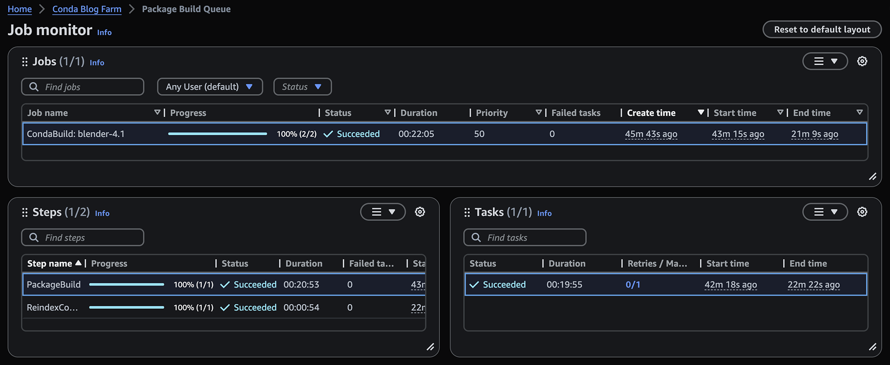

# Automate package builds with Deadline Cloud

For CI/CD workflows or when you need to build packages for multiple operating
systems, you can create a Deadline Cloud package building queue. The queue schedules
build jobs on your fleet, which build the packages and publish them to your Amazon Simple Storage Service (Amazon S3) conda
channel. This automation simplifies maintaining continuous package builds for software releases
across all your required configurations.

You can create a package building queue using an AWS CloudFormation (CloudFormation) template, or
manually from the Deadline Cloud console. The CloudFormation template deploys a complete farm with a
production queue and a package building queue already configured. Creating the queue from
the console gives you more control over individual settings.

## Create a package building queue with CloudFormation

You can use a CloudFormation template to create a Deadline Cloud farm that includes a
package building queue. The template configures a production queue and a package building
queue with a private Amazon S3 conda channel.

Before you deploy the template, create an Amazon S3 bucket to hold job attachments and
your conda channel. You can create a bucket from the [Amazon S3 console](https://console.aws.amazon.com/s3/ "https://console.aws.amazon.com/s3/"). You need the bucket name when you deploy the
template.

###### To deploy the CloudFormation template

1. Download the [deadline-cloud-starter-farm-template.yaml](https://github.com/aws-deadline/deadline-cloud-samples/raw/mainline/cloudformation/farm_templates/starter_farm/deadline-cloud-starter-farm-template.yaml "https://github.com/aws-deadline/deadline-cloud-samples/raw/mainline/cloudformation/farm_templates/starter_farm/deadline-cloud-starter-farm-template.yaml") template from the [Deadline Cloud samples](https://github.com/aws-deadline/deadline-cloud-samples/tree/mainline/cloudformation/farm_templates/starter_farm "https://github.com/aws-deadline/deadline-cloud-samples/tree/mainline/cloudformation/farm_templates/starter_farm") repository on GitHub.
2. From the [CloudFormation console](https://console.aws.amazon.com/cloudformation/ "https://console.aws.amazon.com/cloudformation/"),
   choose **Create Stack**, then **With new resources
   (standard)**.
3. Select the option to upload a template file, then upload the
   `deadline-cloud-starter-farm-template.yaml` file.
4. Enter a name for the stack, such as `StarterFarm`, and
   provide the name of an Amazon S3 bucket for job attachments and the conda channel.
5. Follow the CloudFormation console steps to complete stack creation.

For more information about the template parameters and customization options, see
the [starter farm README](https://github.com/aws-deadline/deadline-cloud-samples/tree/mainline/cloudformation/farm_templates/starter_farm "https://github.com/aws-deadline/deadline-cloud-samples/tree/mainline/cloudformation/farm_templates/starter_farm") in the Deadline Cloud samples repository on
GitHub.

## Create a package building queue from the console

Follow the instructions in [Create a queue](../userguide/create-queue.md "../userguide/create-queue.md") in the
_Deadline Cloud User Guide_. Make the following changes:

- In step 5, choose an existing Amazon S3 bucket. Specify a root folder name such as
  `DeadlineCloudPackageBuild` so that build artifacts stay
  separate from your normal Deadline Cloud attachments.
- In step 6, you can associate the package building queue with an existing fleet,
  or you can create an entirely new fleet if your current fleet is unsuitable.
- In step 9, create a new service role for your package building queue. You will
  modify the permissions to give the queue the permissions required for uploading
  packages and reindexing a conda channel.

### Configure the package building queue permissions

To allow the package building queue to access the `/Conda` prefix in
the queue's Amazon S3 bucket, you must modify the queue's role to give it read/write access.
The role needs the following permissions so that package build jobs can upload new
packages and reindex the channel.

- `s3:GetObject`
- `s3:PutObject`
- `s3:ListBucket`
- `s3:GetBucketLocation`
- `s3:DeleteObject`

1. Open the Deadline Cloud console and navigate to the queue details page for the package
   build queue.
2. Choose the queue service role, then choose **Edit
   queue**.
3. Scroll to the **Queue service role** section, then choose
   **View this role in the IAM console**.
4. From the list of permission policies, choose the
   **AmazonDeadlineCloudQueuePolicy** for your queue.
5. From the **Permissions** tab, choose
   **Edit**.
6. Add a new section to the queue service role like the following. Replace
   `amzn-s3-demo-bucket` and
   `111122223333` with your own bucket and
   account.

```
{
   "Effect": "Allow",
   "Sid": "CustomCondaChannelReadWrite",
   "Action": [
    "s3:GetObject",
    "s3:PutObject",
    "s3:DeleteObject",
    "s3:ListBucket",
    "s3:GetBucketLocation"
   ],
   "Resource": [
    "arn:aws:s3:::amzn-s3-demo-bucket",
    "arn:aws:s3:::amzn-s3-demo-bucket/Conda/*"
   ],
   "Condition": {
    "StringEquals": {
     "aws:ResourceAccount": "111122223333"
    }
   }
  },
```

## Submit a package build job

After you create a package building queue and configure the queue permissions, you
can submit jobs to build conda packages. The `submit-package-job` script in
the [Deadline Cloud
samples](https://github.com/aws-deadline/deadline-cloud-samples/tree/mainline/conda_recipes#readme "https://github.com/aws-deadline/deadline-cloud-samples/tree/mainline/conda_recipes#readme") repository on GitHub submits a build job for a conda
recipe.

You need the following:

- The [Deadline Cloud
  CLI](https://github.com/aws-deadline/deadline-cloud "https://github.com/aws-deadline/deadline-cloud") installed on your workstation.
- An active [AWS Deadline Cloud monitor (Deadline Cloud monitor)](../userguide/working-with-deadline-monitor.md "../userguide/working-with-deadline-monitor.md") login session.
- A clone of the [Deadline Cloud samples](https://github.com/aws-deadline/deadline-cloud-samples "https://github.com/aws-deadline/deadline-cloud-samples")
  repository.

###### To submit a package build job

1. Open the Deadline Cloud configuration GUI and set the default farm and queue to your
   package building queue.

```
deadline config gui
```

2. Change to the `conda_recipes` directory in the samples
   repository.

```
cd deadline-cloud-samples/conda_recipes
```

3. Run the `submit-package-job` script with the recipe directory. The
   following example builds the Blender 4.5 recipe.

```
./submit-package-job blender-4.5/
```

If the recipe requires a source archive that you have not yet downloaded, the
script provides download instructions. Download the archive and run the script
again.

After you submit the job, use the Deadline Cloud monitor to view the progress and status of the
job.



The monitor shows the two steps of the job: building the package and then reindexing
the conda channel. When you right-click on the task for the package building step and
choose **View logs**, the monitor shows the session actions:

- **Sync attachments** – Copies the input job
  attachments or mounts a virtual file system.
- **Launch conda** – The queue environment
  action. The build job doesn't specify conda packages, so this action finishes
  quickly.
- **Launch CondaBuild Env** – Creates a conda
  virtual environment with the software needed to build a conda package and reindex a
  channel.
- **Task run** – Builds the package and
  uploads the results to Amazon S3.

As the actions run, they send logs to Amazon CloudWatch (CloudWatch). When a job is complete, select
**View logs for all tasks** to see additional logs about the setup and
teardown of the environment.
