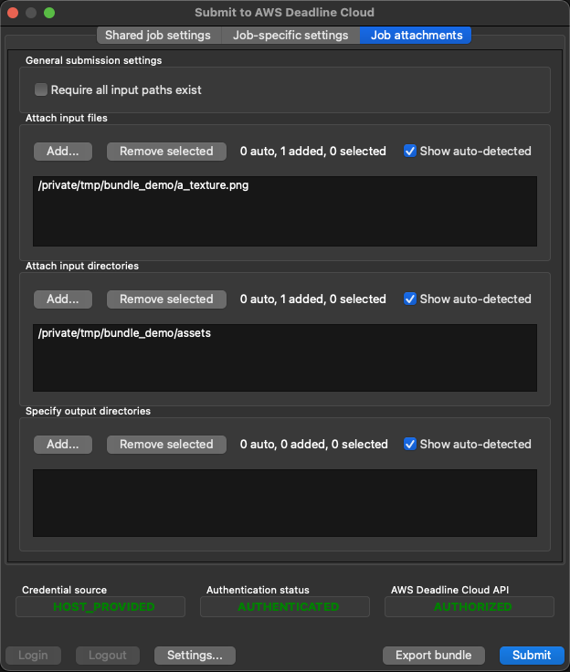

# Asset references elements for job bundles

You can use Deadline Cloud [job attachments](../userguide/storage-job-attachments.md "../userguide/storage-job-attachments.md")
to transfer files back and forth between your workstation and Deadline Cloud. The asset reference file
lists input files and directories, as well as output directories for your attachments. If you
don't list all of the files and directories in this file, you can select them when you submit
a job with the `deadline bundle gui-submit` command.

This file has no effect if you are not using job attachments.

You can define the job template in either YAML format (`asset_references.yaml`)
or JSON format (`asset_references.json`). The examples in this section are shown in
YAML format.

In YAML, the format of the file is:

```
assetReferences:
    inputs:
        # Filenames on the submitting workstation whose file contents are needed as
        # inputs to run the job.
        filenames:
        - `list of file paths`
        # Directories on the submitting workstation whose contents are needed as inputs
        # to run the job.
        directories:
        - `list of directory paths`

    outputs:
        # Directories on the submitting workstation where the job writes output files
        # if running locally.
        directories:
        - `list of directory paths`

    # Paths referenced by the job, but not necessarily input or output.
    # Use this if your job uses the name of a path in some way, but does not explicitly need
    # the contents of that path.
    referencedPaths:
    - `list of directory paths`
```

When selecting the input or output file to upload to Amazon S3, Deadline Cloud compares the file path
against the paths listed in your storage profiles. Each `SHARED`-type file system
location in a storage profile abstracts a network file share that is mounted on your
workstations and worker hosts. Deadline Cloud uploads only files that are not on one of these file
shares.

For more information about creating and using storage profiles, see [Shared
storage in Deadline Cloud](../userguide/storage-shared.md "../userguide/storage-shared.md") in the _AWS Deadline Cloud User Guide_.

###### Example - The asset reference file created by the Deadline Cloud GUI

Use the following command to submit a job using the [blender_render sample](https://github.com/aws-deadline/deadline-cloud-samples/tree/mainline/job_bundles/blender_render "https://github.com/aws-deadline/deadline-cloud-samples/tree/mainline/job_bundles/blender_render").

```
deadline bundle gui-submit blender_render/
```

Add some additional files to the job on the **Job attachments**
tab:


After you submit the job, you can look at the `asset_references.yaml` file in
the job bundle in the job history directory to see the assets in the YAML file:

```
% cat ~/.deadline/job_history/\(default\)/2024-06/2024-06-20-01-JobBundle-Demo/asset_references.yaml
assetReferences:
  inputs:
    filenames:
    - /private/tmp/bundle_demo/a_texture.png
    directories:
    - /private/tmp/bundle_demo/assets
  outputs:
    directories: []
  referencedPaths: []
```
