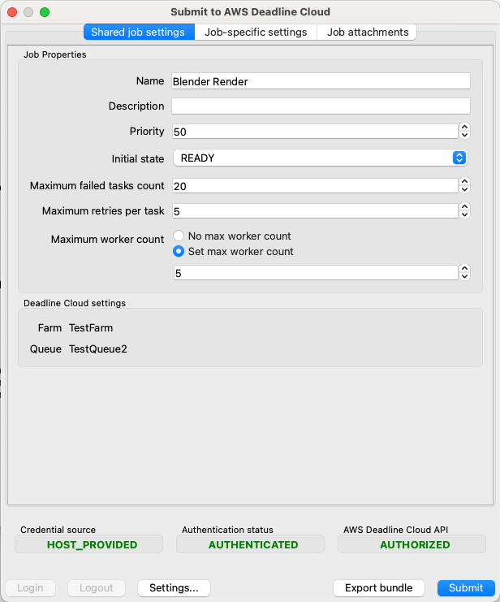

# Open Job Description (OpenJD) templates for Deadline Cloud

A _job bundle_ is one of the tools you use to define jobs for AWS Deadline Cloud.
They group an [Open
Job Description (OpenJD)](https://github.com/OpenJobDescription/openjd-specifications "https://github.com/OpenJobDescription/openjd-specifications") template with additional information such as files
and directories that your jobs use with job attachments. You use the Deadline Cloud command-line
interface (CLI) to use a job bundle to submit jobs for a queue to run.

A job bundle is a directory structure that contains an OpenJD job template, other files that
define the job, and job-specific files required as input for your job. You can specify the files
that define your job as either YAML or JSON files.

The only required file is either `template.yaml` or `template.json`.
You can also include the following files:

```
/template.yaml (or template.json)
/asset_references.yaml (or asset_references.json)
/parameter_values.yaml (or parameter_values.json)
/`other job-specific files and directories`
```

Use a job bundle for custom job submissions with the Deadline Cloud CLI and a job attachment, or you
can use an graphical submission interface. For example, the following is the Blender sample from
GitHub. To run the sample using the following command in [the
Blender sample directory](https://github.com/aws-deadline/deadline-cloud-samples/tree/mainline/job_bundles "https://github.com/aws-deadline/deadline-cloud-samples/tree/mainline/job_bundles"):

```
deadline bundle gui-submit blender_render
```


The job-specific settings panel are generated from the `userInterface` properties
of the job parameters defined in the job template.

To submit a job using the command line, you can use a command similar to the
following

```
deadline bundle submit \
    --yes \
    --name `Demo` \
     -p BlenderSceneFile=`location of scene file` \
     -p OutputDir=`file pathe for job output` \
      blender_render/
```

Or you can use the `deadline.client.api.create_job_from_job_bundle` function in
the `deadline` Python package.

All of the job submitter plugins provided with Deadline Cloud, such as the Autodesk Maya plugin,
generate a job bundle for your submission and then use the Deadline Cloud Python package to submit your
job to Deadline Cloud. You can see the job bundles submitted in the job history directory of you
workstation or by using a submitter. You can find your job history directory with the following
command:

```
deadline config get settings.job_history_dir
```

When your job is running on a Deadline Cloud worker, it has access to environment variables that
provide it with information about the job. The environment variables are:

| Variable name             | Available    |
| ------------------------- | ------------ | ------------------------------------------------------------------------------------------------------------------------------------------------------------------------------------------------------------------------------------------------------------------------------------------------------------------------------------------------------ |
| DEADLINE_FARM_ID          | All actions  |
| DEADLINE_FLEET_ID         | All actions  |
| DEADLINE_WORKER_ID        | All actions  |
| DEADLINE_QUEUE_ID         | All actions  |
| DEADLINE_JOB_ID           | All actions  |
| DEADLINE_SESSION_ID       | All actions  |
| DEADLINE_SESSIONACTION_ID | All actions  |
| DEADLINE_TASK_ID          | Task actions | ###### Topics <br>• [Job template elements for job bundles](build-job-bundle-template.md "build-job-bundle-template.md") <br>• [Parameter values elements for job bundles](build-job-bundle-parameters.md "build-job-bundle-parameters.md") <br>• [Asset references elements for job bundles](build-job-bundle-assets.md "build-job-bundle-assets.md") |
