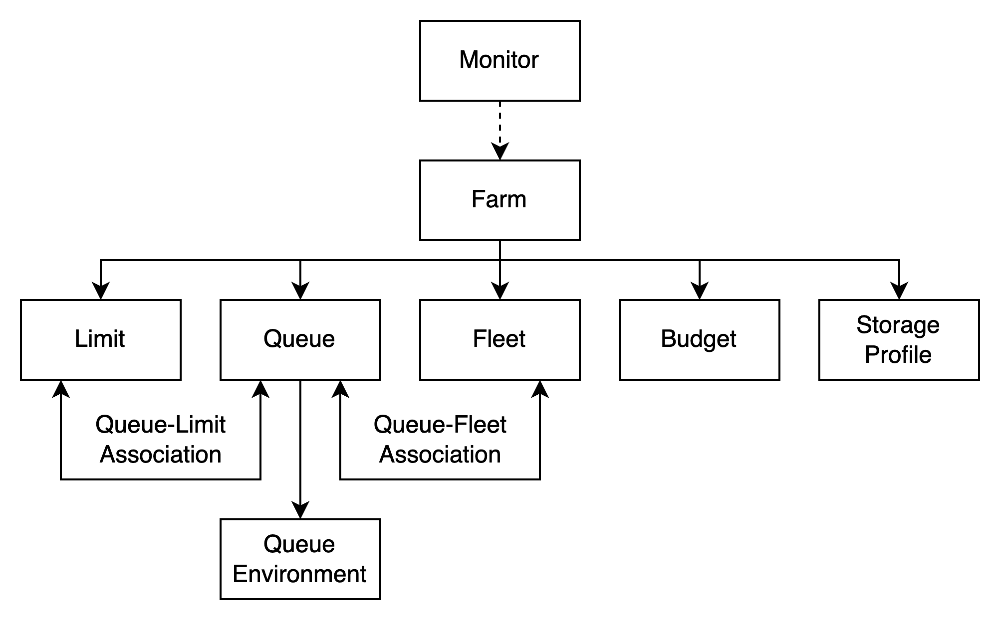
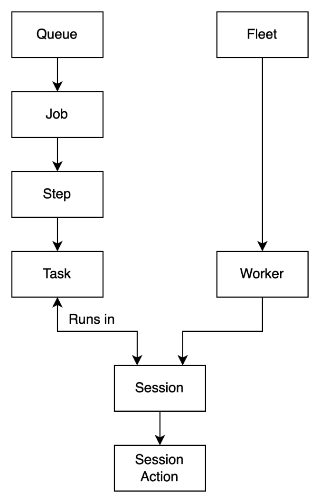

# Concepts and terminology for Deadline Cloud

To help you get started with AWS Deadline Cloud, this topic explains some of its key concepts and
 terminology.

## Farm resources

This diagram shows how Deadline Cloud farm resources work together.

**Farm**

A farm contains all other resources related to submitting and running jobs. Farms are independent from each other making them useful for separating production environments.

**Queue**

A queue holds jobs for scheduling on associated fleets. Users can submit jobs to a queue and manage their priority and status inside the queue. A queue must be associated with a fleet with a queue-fleet association for its jobs to be run, and queues can be associated with multiple fleets.

**Fleet**

A fleet contains compute capacity for running jobs. Fleets can be service-managed or customer-managed. Service-managed fleets run in Deadline Cloud and include built-in functionality like autoscaling, licensing, and software access. Customer-managed fleets run on your own compute resources like Amazon EC2 instances or on-premises servers.

**Budget**

A budget sets spending thresholds for your job activity and allows you to take actions when thresholds are reached, such as stopping job scheduling.

**Queue environment**

A queue environment defines scripts that run on each worker to set up or tear down the workload environment. They are useful for setting environment variables, installing software, and configuring asset storage.

**Storage profile**

A storage profile is a configuration for a group of hosts and workstations, that tells where data is located on the file system. Deadline Cloud uses storage profiles to map paths when running jobs on differently configured hosts, such as a job submitted from Windows and running on Linux.

**Limit**

A limit allows you to track usage of shared resources such as floating licenses and control how they are allocated between jobs. Limits are associated with queues with queue-limit associations.

**Monitor**

The monitor configures the URL for the Deadline Cloud monitor web application, allowing end users to monitor and manage jobs. It can be accessed in a browser or through the Deadline Cloud monitor desktop application.

## Job execution resources

This diagram shows how Deadline Cloud job resources work together.

**Job**

A job is a set of work that a user submits to Deadline Cloud to be scheduled and run on available workers. A job may render a 3D scene or run a simulation. Jobs are created from reusable job templates, which define the runtime environment and processes, and job-specific parameters. Jobs contain steps and tasks that define the work to be performed, and they can be configured with priorities, maximum worker counts, and retry settings.

**Job priority**

Job priority is the approximate order that Deadline Cloud processes a job in a queue.
 You can set the job priority between 1 and 100, jobs with a higher number
 priority are generally processed first. Jobs with the same priority are
 processed in the order received.

**Job properties**

Job properties are settings that you define when submitting a render job. Some
 examples include frame range, output path, job attachments, renderable camera,
 and more. The properties vary based on the DCC that the render is submitted
 from.

**Step**

A step is part of a job that provides a template for running many tasks that are identical except for the task parameter values. Steps can have dependencies on other steps, allowing you to create complex workflows with sequential or parallel execution paths. In rendering jobs, a step often defines the command for rendering a frame and uses the frame number as the task parameter.

**Task**

A task is the smallest unit of work in Deadline Cloud. Tasks are part of steps and are executed by workers, representing individual operations that need to be performed as part of a job. Tasks can be configured with specific parameters and are assigned to workers based on their capabilities and availability. In rendering jobs, a task often renders a single frame.

**Worker**

Workers are part of a fleet and execute tasks from jobs. Workers can be configured with specific capabilities such as GPU accelerators, CPU architecture, and operating system. In service-managed fleets, workers are created automatically as the fleet scales out and in.

**Instance**

Fleets use instances for CPU resources. An instance is an Amazon EC2 performance 
 instance. Deadline Cloud uses On-Demand and Spot instances.

**On-Demand instance**

On-Demand instances are priced by the second, have no long-term commitment, 
 and will not be interrupted.

**Spot instance**

Spot instances are unreserved capacity that you can use at a discounted price,
 but may be interrupted by On-Demand requests.

**Wait and Save**

The Wait and Save feature provides delayed job scheduling for lower cost and can
 be interrupted by On-Demand and Spot requests. Wait and Save is only available
 within Deadline Cloud service-managed fleets.

Wait and Save is for managing the execution of visual computing workloads in 
 AWS Deadline Cloud. See [AWS service terms](https://aws.amazon.com/service-terms/ "https://aws.amazon.com/service-terms/")
 for details.

**Session**

A session represents a worker's sequence of work on a job. During a single session, a worker may be assigned multiple tasks which it runs one after another. Sessions often have setup actions which configure environments and load assets before running the task actions.

**Session action**

A session action represents specific operations performed during a session such as setting up the environment, running a task, and syncing assets.

## Other important concepts and terminology

**Usage explorer**

Usage explorer is a feature of Deadline Cloud monitor. It provides an approximate estimate of your costs and usage.

**Budget manager**

Budget manager is part of the Deadline Cloud monitor. Use the budget manager to create and manage budgets. You can also use it to limit activities to stay within budget.

**Deadline Cloud client library**

The open-source client library includes a command line interface and library for managing Deadline Cloud. Functionality includes submitting job bundles based on the Open Job Description specification to Deadline Cloud, downloading job attachment outputs, and monitoring your farm using the command line interface (CLI).

**Digital content creation application (DCC)**

Digital content creation applications (DCCs) are third-party products where you create digital content. Deadline Cloud has built-in integrations with many DCCs such as Autodesk Maya, Blender, and Maxon Cinema 4D allowing you to submit jobs from within the DCC and render on service-managed fleets with pre-configured software and licensing.

**Job attachments**

Job attachments are a Deadline Cloud feature that you upload and download assets as part of a job such as textures, 3D models, and lighting rigs. Job attachments are stored in Amazon S3 and avoid the need for shared network storage.

**Job template**

A job template defines the runtime environment and all processes that run as part of a Deadline Cloud job.

**Deadline Cloud submitter**

A Deadline Cloud submitter is a plugin for a DCC that allows users to easily submit jobs from within the DCC.

**License endpoint**

A license endpoint makes Deadline Cloud's usage-based licensing for third-party products available inside your VPC. This model is pay as you go, and you are charged for the number of hours and minutes that you use. License endpoints are not connected to farms and can be used independently.

**Tags**

A tag is a label that you can assign to an AWS resource. Each tag consists of a key and an optional value that you define. With tags, you can categorize your AWS resources in different ways, such as by purpose, owner, or environment.

**Usage-based licensing (UBL)**

Usage-based licensing (UBL) is an on-demand licensing model that is available
 for select third-party products. This model is pay as your go, and you are
 charged for the number of hours and minutes that you use.
