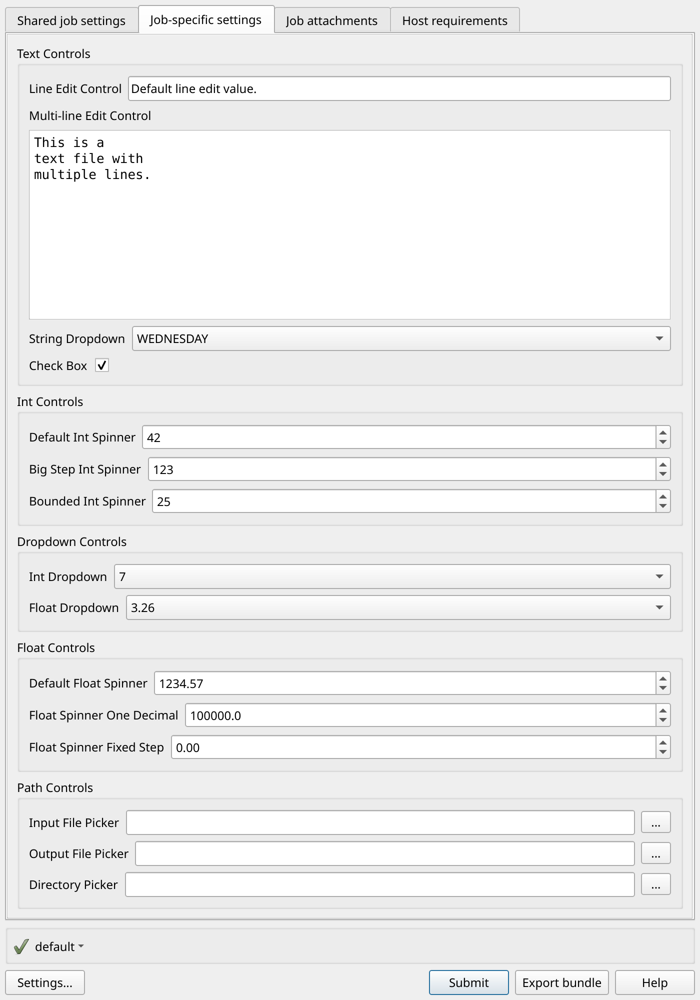

# Use every Open Job Description GUI control on Deadline Cloud

The
[gui\_control\_showcase](https://github.com/aws-deadline/deadline-cloud-samples/tree/mainline/job_bundles/gui_control_showcase "https://github.com/aws-deadline/deadline-cloud-samples/tree/mainline/job_bundles/gui_control_showcase")
job bundle shows every GUI control supported by user interface metadata on
[Open
Job Description job parameters](https://github.com/OpenJobDescription/openjd-specifications/wiki/2023-09-Template-Schemas#2-jobparameterdefinition "https://github.com/OpenJobDescription/openjd-specifications/wiki/2023-09-Template-Schemas#2-jobparameterdefinition"). Use it as a reference when you add
GUI controls to your own job templates.

Open the GUI submitter to see every control:

```
deadline bundle gui-submit job_bundles/gui_control_showcase
```


