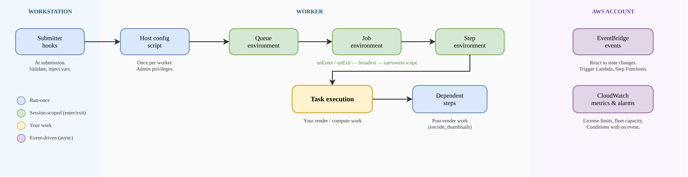

# Hooks, events, and integration points for jobs

Deadline Cloud provides several _integration points_ where you can run
your own logic around a job. An integration point is a place in the job lifecycle where Deadline Cloud
runs custom code or hands control to a service that you configure, such as a script that prepares
a worker or a rule that reacts to a job event. You use integration points to adapt Deadline Cloud to your
production pipeline: to install software, set environment variables, validate or change a job,
process outputs, or trigger downstream automation.

The integration points differ on three questions:

- **Where the code runs** – on your workstation, on
  the worker, or in the AWS Cloud.
- **When it runs** – at submission, before or after
  the work, or in response to an event.
- **Where you configure it** – in a workstation
  setting, a job bundle, a queue or fleet property, or your own AWS account.
  The following diagram shows where each integration point runs during the job lifecycle.
  Control flows from submission on the workstation, through worker execution, and into
  event-driven automation in your AWS account.

- **Workstation** – Submitter hooks and host
  configuration scripts run once.
- **Worker** – Queue, job, and step
  environments use session-scoped enter and exit actions. Task execution runs your
  work. Dependent steps run after the task completes.
- **AWS account** – EventBridge events and CloudWatch
  metrics and alarms respond asynchronously to state changes.

The following table summarizes the integration points. Choose one based on the answers to
the preceding questions. The sections after the table describe each option and link to detailed
instructions.

| Integration point                                 | Runs on     | Configured in                                        | When it runs                                                   | Use for                                                                                                                                         |
| ------------------------------------------------- | ----------- | ---------------------------------------------------- | -------------------------------------------------------------- | ----------------------------------------------------------------------------------------------------------------------------------------------- |
| Submitter hooks                                   | Workstation | Workstation configuration (all jobs) or a job bundle | During submission, before the job is created                   | Inject or override environment variables, validate or rewrite a job bundle, synchronize with production-tracking software at submission time |
| Host configuration scripts                        | Worker      | Fleet property (service-managed fleet)               | One time per worker, at startup, with administrator privileges | Network configuration, installing software that needs elevated privileges                                                                    |
| Queue environments                                | Worker      | Queue property                                       | When a session enters or exits, for every job in the queue     | Project-level configuration: non-admin software installs, shared environment variables, license or daemon setup                              |
| Job environments                                  | Worker      | Job bundle or job template                           | Before and after a job                                         | Per-job setup and teardown                                                                                                                      |
| Step environments                                 | Worker      | Job bundle or step template                          | Before and after a step                                        | Per-step setup and teardown                                                                                                                     |
| Dependent steps                                   | Worker      | Job bundle or step template (`dependsOn`)            | After an earlier step in the same job succeeds                 | Post-render work that needs the output files locally, such as encoding frames into a movie or generating thumbnails                          |
| Amazon EventBridge (EventBridge) events           | AWS Cloud   | Your AWS account (rule and target)                   | On a job, step, task, fleet, or budget state change            | Production tracking, notifications, cloud automation, chaining jobs across queues                                                            |
| Amazon CloudWatch (CloudWatch) metrics and alarms | AWS Cloud   | Your AWS account                                     | Continuously, against a threshold                              | Conditions that have no event, such as license availability (`LicensesInUse`) and fleet capacity                                             |

## Run custom logic on the workstation

Submitter hooks run during submission, before the job reaches the service. You configure
them per workstation, where they apply to all jobs submitted from that workstation, or inside
a job bundle, where they apply to that bundle. Submitter hooks can alter the bundle at
different points in the submission flow. Use them to inject environment variables, validate a
submission, or synchronize with production-tracking software at submission time.

For more information, see [Submission hooks](submission-hooks.md "submission-hooks.md").

## Run custom logic on the worker

The following integration points run on the rendering host. They are nested from the
broadest scope to the narrowest:

- **Host configuration scripts** run one time when a
  worker starts, with administrator privileges. Host configuration scripts are specific to
  service-managed fleets (SMFs). On a customer-managed fleet (CMF), you bake your own image
  instead. Use host configuration scripts for network setup and administrator-level software
  installs.
- **Queue, job, and step environments** each define
  `onEnter` and `onExit` actions. The actions run when the worker's
  session enters a scope and, in reverse order, when the session exits the scope. Queue
  environments are a good place for project-level configuration that applies to every job in
  a queue, such as shared software, environment variables, and license or daemon setup. Job
  and step environments narrow the scope to a single job or step.
- **Dependent steps** add a second step that uses
  `dependsOn` to depend on the render step. For example, you can render and then
  encode a movie, or render and then generate thumbnails. The step stays in the same job, so
  the outputs are already local. Dependent steps require a custom submitter or a
  hand-written job bundle. Job-to-job dependencies are not native. To chain separate jobs,
  use events in the cloud, as described in the following section.

###### Note

Environments are session-scoped, not per-task. An `onExit` action runs at
session teardown, not after every task. If you are migrating a Deadline 10 post-task
callback, use a dependent step instead of an environment `onExit` action.

For more information, see the following:

- [Run host configuration scripts with administrator privileges](smf-admin.md "smf-admin.md")
- [Create a queue
  environment](../userguide/create-queue-environment.md "../userguide/create-queue-environment.md")
- [Provide applications for your jobs](provide-applications.md "provide-applications.md")
- [Step dependencies](build-jobs-scheduling.md#jobs-scheduling-dependencies "build-jobs-scheduling.md#jobs-scheduling-dependencies")
- [Open Job Description template schemas](https://github.com/OpenJobDescription/openjd-specifications/wiki/2023-09-Template-Schemas "https://github.com/OpenJobDescription/openjd-specifications/wiki/2023-09-Template-Schemas") on the GitHub website, for
  `onEnter` and `onExit` scoping

## Respond to events in the cloud

EventBridge and CloudWatch let you react to job activity without consuming farm
capacity. Use them when your logic responds to job outcomes rather than running as part of a
job.

- Deadline Cloud sends events with the source `aws.deadline` to the default event bus
  in your AWS account. Events cover job, step, and task state changes, fleet size
  recommendations, and budget thresholds. You own the rule, the AWS Lambda (Lambda) function,
  and the dead-letter queue (DLQ). Wire a rule to a Lambda function for notifications, asset
  registration, or to chain jobs across queues (event to Lambda or () to
  `CreateJob`). Delivery is best-effort and events might arrive out of order, so
  make your consumers idempotent and configure retries and a DLQ.
- CloudWatch metrics and alarms cover conditions that EventBridge doesn't, most importantly license
  availability and fleet capacity. No event exists for license availability, so you alarm on
  the `LicensesInUse` metric and limit counts. The
  `Fleet Size Recommendation Change` event and the
  `RecommendedFleetSize` metric also drive customer-managed fleet auto
  scaling.

For more information, see the following:

- [Managing Deadline Cloud events using Amazon EventBridge](eventbridge-integration.md "eventbridge-integration.md")
- [Deadline Cloud events detail reference](events-detail-reference.md "events-detail-reference.md")
- [CloudWatch metrics](cloudwatch-metrics.md "cloudwatch-metrics.md")
- [Create fleet infrastructure with an Amazon EC2 Auto Scaling group](create-auto-scaling.md "create-auto-scaling.md")
- [Deadline Cloud events](../../../eventbridge/latest/ref/events-ref-deadline.md "../../../eventbridge/latest/ref/events-ref-deadline.md") in the _EventBridge service reference_
- [Asynchronous
  invocation](../../../lambda/latest/dg/invocation-async.md "../../../lambda/latest/dg/invocation-async.md") in the _Lambda Developer Guide_
- [Event retry policy and
  using dead-letter queues](../../../eventbridge/latest/userguide/eb-rule-retry-policy.md "../../../eventbridge/latest/userguide/eb-rule-retry-policy.md") in the _EventBridge User Guide_

## Choose an integration point

Use the following guidance to choose an integration point for a common need:

- To change a job before it's submitted, use a submitter hook.
- To run logic on the render host around the work, use a host configuration script or a
  queue, job, or step environment. Choose the broadest scope that fits, and use a queue
  environment for project-level configuration.
- To process job outputs while they're still local, use a dependent step.
- To react to job outcomes without consuming farm capacity, use an EventBridge rule with a
  Lambda function.
- For conditions that have no event, such as license or capacity limits, use a CloudWatch
  alarm.

## Additional resources

For related concepts and reference material, see the following:

- [Build jobs to submit to Deadline Cloud](building-jobs.md "building-jobs.md")
- [Configure jobs using queue environments](configure-jobs.md "configure-jobs.md")
- [Monitoring AWS Deadline Cloud](monitoring-overview.md "monitoring-overview.md")
