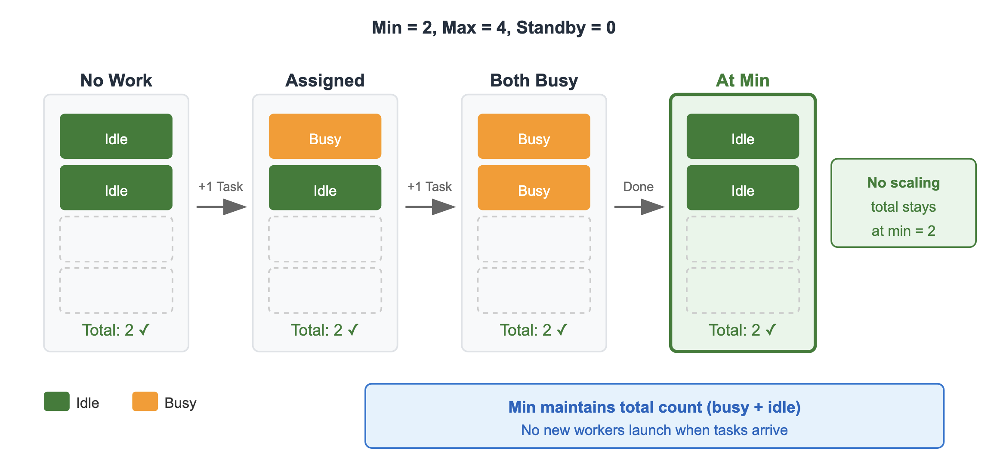
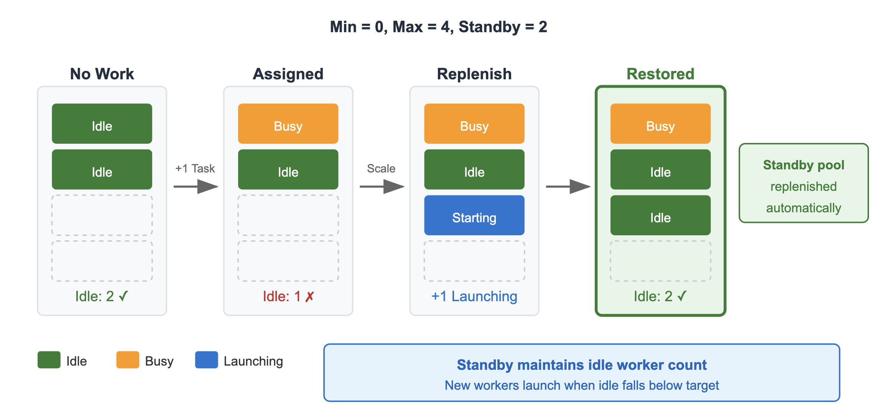

# Auto scaling configuration

Deadline Cloud provides auto scaling configuration options that allow you to customize
how your fleet scales workers up and down. These settings help you balance job
processing speed with cost efficiency based on your workflow requirements.

You can configure the following auto scaling settings for your fleet:

- **Minimum worker count** – Specifies the minimum number of workers maintained in the fleet at all times.
- **Maximum worker count** – Limits how many workers can run simultaneously.
- **Scale out rate** – Controls how quickly workers are added to your fleet.
- **Worker idle duration** – Controls how long workers wait for new work before shutting down.
- **Standby worker count** – Maintains a warm standby pool of idle workers to start jobs fast.
  How auto scaling works depends on your fleet type:

- **Service-managed fleets** – Deadline Cloud
  automatically implements auto scaling based on your configuration. You
  configure the settings and the service handles worker provisioning.
- **Customer-managed fleets** – If you
  have completed the auto scaling setup for your customer-managed fleet, the
  auto scaling configuration works the same as for service-managed fleets. The
  service uses the configuration to calculate desired capacity and sends
  recommended fleet size events to your fleet. For more information, see
  [Set up
  auto scaling for customer-managed fleets](../developerguide/create-auto-scaling.md "../developerguide/create-auto-scaling.md") in the
  _Deadline Cloud Developer Guide_.

## Scale out rate

The **scale out rate**
(`scaleOutWorkersPerMinute`) setting controls how many workers
start launching per minute when your fleet scales out. The scale out rate determines
your fleet's scale-up speed when a large job arrives. Workers take several minutes to
launch. To maintain a warm pool of workers that can start jobs immediately, set the
standby worker count. For more information, see [Standby worker count](#auto-scaling-standby-worker-count "#auto-scaling-standby-worker-count").

Consider the following when configuring the scale out rate:

- A higher rate launches more workers quickly, which can reduce job completion
  time for large jobs.
- A higher rate may launch more workers than necessary for short-lived tasks,
  increasing costs.
- A lower rate can help detect job failures earlier and reduce costs from
  wasted compute on failing jobs.
- For short-lived tasks, a conservative scaling approach can be more
  cost-effective because workers spend less time loading environments relative
  to actual task execution.

###### Note

The scale out rate is a best-effort setting. Actual scaling speed may vary
based on instance availability and other system factors. In rare conditions,
the actual rate may briefly exceed the configured value.

## Worker idle duration

The **worker idle duration**
(`workerIdleDurationSeconds`) setting controls how long
a worker remains available after it finishes processing a job, measured in seconds.
The default value is 300 seconds (5 minutes).

This setting is useful for iterative workflows where artists frequently revise and
resubmit jobs. By keeping workers available longer, subsequent job submissions can
start processing immediately without waiting for new workers to launch.

Consider the following when configuring worker idle duration:

- A longer duration keeps workers available for rapid iteration, reducing
  wait times between job submissions. However, longer durations increase
  costs because idle workers continue to incur charges.
- A shorter duration reduces costs by shutting down idle workers more
  quickly.
- For service-managed fleets, the maximum value is 86,400 seconds (24 hours)
  because workers are refreshed every 24 hours. If a worker
  has been running for 23 hours and you set an idle duration of 10 hours,
  the worker shuts down after 1 hour when it reaches the 24-hour limit.

## Standby worker count

The **standby worker count**
(`standbyWorkerCount`) setting specifies the
number of idle workers to maintain as a warm standby pool. These workers
can process new jobs without the delay of launching new instances.

This setting is useful when you want to reduce job start latency. For example,
standby workers are helpful when rendering with Windows instances, when using
host configuration scripts that install local dependencies, or when workers
require significant setup time. The fleet attempts to maintain the configured
number of idle workers, but the idle count may temporarily drop while replacement
workers are launching.

Consider the following when configuring standby worker count:

- Standby workers incur costs even when not processing jobs. Balance the
  number of standby workers against your budget and job start latency
  requirements.
- When the fleet reaches its maximum worker count, the standby pool may
  not be fully maintained. For example, if all workers are busy and the fleet
  is at its maximum size, no additional idle workers are launched.
- When the standby worker count exceeds the minimum worker count, the
  minimum worker count is effectively overridden. For example, with a minimum
  of 1 and a standby of 2, the fleet keeps 2 idle workers when no work is
  available, making the minimum setting redundant.

The following diagrams show how minimum worker count and standby worker count
affect fleet scaling behavior. Choose a tab to view each scenario.

Minimum worker count

Standby worker count

To automatically adjust your standby worker count on a schedule, use the
sample AWS CloudFormation (CloudFormation) template at [fleet\_standby\_scheduling](https://github.com/aws-deadline/deadline-cloud-samples/tree/mainline/cloudformation/farm_templates/fleet_standby_scheduling "https://github.com/aws-deadline/deadline-cloud-samples/tree/mainline/cloudformation/farm_templates/fleet_standby_scheduling") on GitHub.

## Configuring auto scaling settings

You can configure auto scaling settings when you create a fleet or update an
existing fleet.

###### To configure auto scaling settings

1. Open the [Deadline Cloud
   console](https://console.aws.amazon.com/deadlinecloud/home "https://console.aws.amazon.com/deadlinecloud/home").
2. Navigate to the farm that contains your fleet.
3. Choose the **Fleets** tab.
4. Select the fleet you want to configure, then choose
   **Edit**.
5. In the **Auto scaling** section, configure
   the following settings:

   - **Minimum worker count** – Enter the minimum
     number of workers to maintain.
   - **Maximum worker count** – Enter the maximum
     number of workers allowed.
   - **Scale out rate** – Enter the number of
     workers to launch per minute.
   - **Worker idle duration** – Enter the number
     of seconds that workers remain idle before shutting down.
   - **Standby worker count** – Enter the number
     of standby workers to maintain.

6. Choose **Save changes**.
