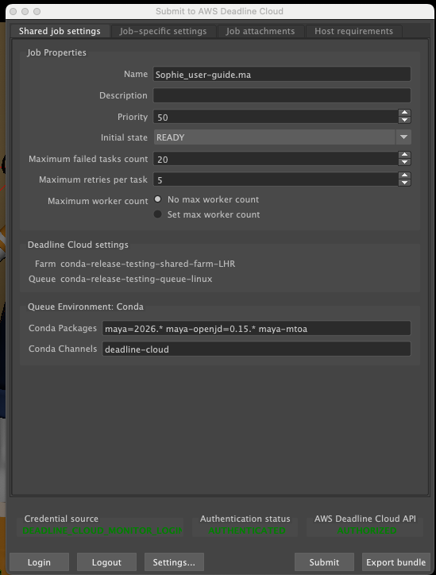
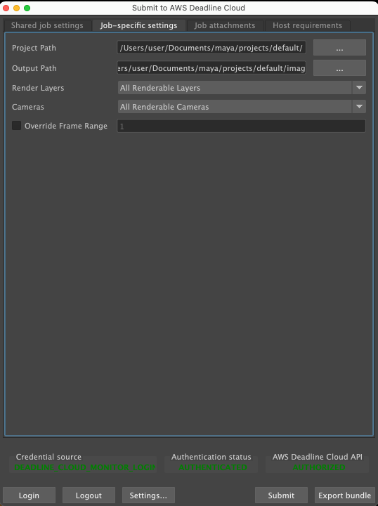

# Autodesk Maya

Autodesk Maya is a 3D computer animation, modeling, simulation, and rendering software used for creating interactive 3D applications, including video games, animated films, TV series, and visual effects. Maya is fully supported by Deadline Cloud with comprehensive integration including submitters, conda packages, usage-based licensing, and an adaptor for increased rendering performance. This guide provides step-by-step instructions for using Deadline Cloud with Autodesk Maya to render your projects faster by distributing rendering tasks across multiple machines.

## Support overview

Maya is supported by the following components:

- **Submitter**: Integrated plug-in for direct job submission from Maya.
- **Conda packages**: Automatic installation on service-managed fleets when using the submitter.
- **Adaptor**: A program on worker hosts that keeps the application loaded between tasks for faster rendering and reports render progress.
- **Cross-platform compatibility**: Submitter support for Windows, macOS, and Linux with worker support for Windows and Linux.
- **Usage-based Licensing**: Pay-as-you-go for Maya and renderer licensing.

## Maya version compatibility

The following table shows current support levels for Maya versions:

| Major Version | Submitter Support     | Conda Support | Render Engines                                | Usage-Based Licensing           |
| ------------- | --------------------- | ------------- | --------------------------------------------- | ------------------------------- |
| 2024          | Windows, macOS, Linux | Linux         | Maya Software, Arnold (MtoA)                  | Usage-based licensing available |
| 2025          | Windows, macOS, Linux | Linux         | Maya Software, Arnold (MtoA), V-Ray, Redshift | Usage-based licensing available |
| 2026          | Windows, macOS, Linux | Linux         | Maya Software, Arnold (MtoA), V-Ray, Redshift | Usage-based licensing available |

## Deadline Cloud Conda Channel

The following table lists all conda packages applicable to Maya available to Service-managed fleets in the deadline-cloud conda channel:

| OS    | Package       | Version  | Notes                           |
| ----- | ------------- | -------- | ------------------------------- |
| Linux | maya          | 2024     | Includes Maya Software renderer |
| Linux | maya          | 2025     | Includes Maya Software renderer |
| Linux | maya          | 2026     | Includes Maya Software renderer |
| Linux | maya-mtoa     | 2024.5.3 | Arnold for Maya 2024            |
| Linux | maya-mtoa     | 2025.5.4 | Arnold for Maya 2025            |
| Linux | maya-mtoa     | 2026.5.5 | Arnold for Maya 2026            |
| Linux | maya-openjd   |          | Includes the Maya Adaptor       |
| Linux | maya-redshift | 2025.4   | Redshift for Maya 2025          |
| Linux | maya-redshift | 2026.2.1 | Redshift for Maya 2026          |
| Linux | maya-vray     | 2025.7   | V-Ray for Maya 2025             |
| Linux | maya-vray     | 2026.7   | V-Ray for Maya 2026             |

## Getting started

To use Maya with Deadline Cloud:

1. Create a service-managed fleet and associate it with a queue. Your queue must be set up with a queue environment that supports the deadline-cloud conda channel. For more information, see [Creating a queue environment](create-queue-environment.md "create-queue-environment.md").
2. Install the Deadline Cloud monitor and Maya submitter on your artist workstation using the Deadline Cloud Submitter and monitor Installers. For more information, see [Set up your workstation](submitter.md "submitter.md").
3. Submit your job directly from Maya using the integrated submitter to the queue.
4. Monitor the job and download the output using the Deadline Cloud monitor.

## Installation

To install the Deadline Cloud submitter for Autodesk Maya, prepare the following environment:

- Windows, Linux, or macOS workstation.
- Autodesk Maya 2024, 2025, or 2026 installation.
- Optional: Arnold (MtoA 5.3.5 or higher), V-Ray, or Redshift for Maya installation.
- [Deadline Cloud monitor](monitor-onboarding.md "monitor-onboarding.md") installed.
- Access to an Deadline Cloud farm with either:

  - A service-managed fleet.
  - A customer-managed fleet with Autodesk Maya and licensing set up.

### Installing the submitter

The Autodesk Maya submitter extension allows you to submit jobs to Deadline Cloud directly from within Maya. To install the submitter:

1. Download the [Deadline Cloud submitter installer](submitter.md "submitter.md").
2. Run the installer and follow the on-screen instructions.
3. Launch Maya after installation.

### Updating the submitter

To update the submitter to the latest version, download and run the latest submitter installer.

## Using the Autodesk Maya submitter

To use the Deadline Cloud submitter for Maya, ensure your farm is configured with a Maya-capable fleet, and have the submitter installed. For installation steps, see [Installation](#maya-installation "#maya-installation"). To access Deadline Cloud, log into Deadline Cloud monitor or provide AWS credentials through a configuration profile.

### Submit a job

**To submit a job from Maya to Deadline Cloud**

1. Save your Maya file.
2. In Maya's shelf, choose the **Deadline Cloud** button.
3. Use the tabs in the dialog to customize your job.
4. (Optional) To export a job's associated files to your job history directory without submitting it, choose **Export bundle**.
5. Choose **Submit** and follow the prompts to send your job to Deadline Cloud.

### Shared job settings

Settings that apply to the entire job:

- **Farm Selection** - Choose which farm your job will render on.
- **Queue Selection** - Select the specific queue within your chosen farm.
- **Job Name** - Give your render job a descriptive name.
- **Job Description** - Add optional details about your render job.
- **Priority** - Set job priority for queue management.
- **Initial State** - Control whether the job starts immediately or remains paused.
- **Max Failed Tasks Count** - Set the maximum number of tasks that can fail before the job is marked as failed.
- **Max Retries Per Task** - Set the number of times a failed task is retried.
- **Max Worker Count** - Set the maximum number of workers that can work on this job simultaneously.
- **Conda Packages** - Specify additional conda packages required for your render.
- **Conda Channels** - Define custom conda channels for package installation.

### Maya-specific settings

Settings specific to Maya rendering:

- **Project Path** - Specify the Maya project path (automatically detected).
- **Output Path** - Specify the directory where rendered images are saved.
- **Output Filename** - Enter the base name for rendered image files.
- **Renderer** - Select the renderer to use (Arnold, V-Ray, Redshift, or Maya Software).
- **Cameras To Render** - Select specific cameras or render all renderable cameras.
- **Override Frame Range** - Optionally override the scene's frame range with custom values.
- **Render Layers** - Select which render layers to render.

#### Optional tabs

Options to modify the scene during submission:

- **Job Attachments** (optional) - Select which files will be uploaded and attached to the job. Files are automatically detected and attached by default.
- **Host Requirements** (optional) - Allows you to specify which types of hosts will be eligible for picking up tasks for this job.

For information about the submitter tabs, see the [Deadline Cloud guide for using a submitter](jobs-using-submitter.md "jobs-using-submitter.md").

## Advanced configurations

### Using unsupported versions

Deadline Cloud only supports and tests the workstation and worker software versions in the table above. When using the submitter, the worker will attempt to install the same version as used on the workstation. This installation fails if the workstation version of Maya does not appear in the version table above.

If you require an unsupported version of Maya, you have the following options:

- When submitting the job from Maya, you can override the CondaPackages queue parameter to specify a supported version to use on the worker (for example, `maya=2026, maya-openjd=*`). This override might or might not work, depending on the features used by your scene and how Maya works with scenes from your workstation version.
- You may build a custom conda recipe and channel for your desired version to be installed on the worker. Use the conda recipes for supported versions as a starting point:

  - [Maya conda recipe](https://github.com/aws-deadline/deadline-cloud-samples/tree/mainline/conda_recipes/maya-2026 "https://github.com/aws-deadline/deadline-cloud-samples/tree/mainline/conda_recipes/maya-2026")
  - [Maya OpenJD adaptor conda recipe](https://github.com/aws-deadline/deadline-cloud-samples/tree/mainline/conda_recipes/maya-openjd "https://github.com/aws-deadline/deadline-cloud-samples/tree/mainline/conda_recipes/maya-openjd")
    For more information about creating custom conda channels, see [Creating custom conda channels](../developerguide/configure-jobs-s3-channel.md "../developerguide/configure-jobs-s3-channel.md").

## Maya render engines

Maya supports multiple render engines that are fully compatible with Deadline Cloud:

| Render Engine | Description                         | GPU Support    | Notes                                              | Usage-Based Licensing   |
| ------------- | ----------------------------------- | -------------- | -------------------------------------------------- | ----------------------- |
| Maya Software | Built-in CPU renderer               | CPU-based      | Legacy renderer with basic features                | Included with Maya      |
| Arnold (MtoA) | Monte Carlo ray tracer              | GPU/CPU hybrid | Production quality rendering, MtoA 5.3.5+ required | Available for 2024-2026 |
| V-Ray         | Third-party photorealistic renderer | GPU/CPU hybrid | Requires separate licensing                        | Available for 2025-2026 |
| Redshift      | GPU-accelerated renderer            | GPU optimized  | Requires separate licensing                        | Available for 2025-2026 |

All render engines are automatically detected and configured by the Maya integrated submitter. The submitter maintains proper dependency handling and scene file management.

## Maya plugins

| Plugin        | Plugin Versions              | Conda Recipe Provided | SMF Conda Package Provided | Usage-based Licensing Support |
| ------------- | ---------------------------- | --------------------- | -------------------------- | ----------------------------- |
| Arnold (MtoA) | 2024.5.3, 2025.5.4, 2026.5.5 | Yes                   | Yes                        | Yes                           |
| V-Ray         | 2025.7, 2026.7               | Yes                   | Yes                        | Yes                           |
| Redshift      | 2025.4, 2026.2.1             | Yes                   | Yes                        | Yes                           |

### Arnold for Maya (MtoA)

Arnold is supported using the maya-mtoa conda package and is automatically installed when using the Maya integrated submitter. An additional licensing cost applies when using Arnold for rendering.

Conda recipe: [maya-mtoa conda recipe](https://github.com/aws-deadline/deadline-cloud-samples/tree/mainline/conda_recipes/maya-mtoa "https://github.com/aws-deadline/deadline-cloud-samples/tree/mainline/conda_recipes/maya-mtoa")

### V-Ray Plugin

V-Ray is supported using the maya-vray conda package and is automatically installed when using the Maya integrated submitter. An additional licensing cost applies when using V-Ray for rendering.

Conda recipe: [maya-vray conda recipe](https://github.com/aws-deadline/deadline-cloud-samples/tree/mainline/conda_recipes/maya-vray "https://github.com/aws-deadline/deadline-cloud-samples/tree/mainline/conda_recipes/maya-vray")

### Redshift Plugin

Redshift is supported using the maya-redshift conda package and is automatically installed using the Maya integrated submitter. An additional licensing cost applies when using Redshift for rendering.

Conda recipe: [maya-redshift conda recipe](https://github.com/aws-deadline/deadline-cloud-samples/tree/mainline/conda_recipes/maya-redshift "https://github.com/aws-deadline/deadline-cloud-samples/tree/mainline/conda_recipes/maya-redshift")

### Bifrost for Maya

You can use Autodesk Bifrost with Maya on Deadline Cloud. Because Bifrost requires the Autodesk installer, it isn't included in the deadline-cloud conda channel. Instead, you build your own conda package with the maya-bifrost conda recipe and add it to a custom conda channel. The recipe provides Bifrost 2.14.1.0 for Maya 2026 on Linux workers. For more information about custom conda channels, see [Creating custom conda channels](../developerguide/configure-jobs-s3-channel.md "../developerguide/configure-jobs-s3-channel.md").

Conda recipe: [maya-bifrost conda recipe](https://github.com/aws-deadline/deadline-cloud-samples/tree/mainline/conda_recipes/maya-bifrost-2026 "https://github.com/aws-deadline/deadline-cloud-samples/tree/mainline/conda_recipes/maya-bifrost-2026")

## Open source resources

The submitter and adaptor are open source and available on GitHub:

- [Maya submitter source code](https://github.com/aws-deadline/deadline-cloud-for-maya "https://github.com/aws-deadline/deadline-cloud-for-maya")
- [Maya conda recipes](https://github.com/aws-deadline/deadline-cloud-samples/tree/mainline/conda_recipes/maya-2026 "https://github.com/aws-deadline/deadline-cloud-samples/tree/mainline/conda_recipes/maya-2026")
