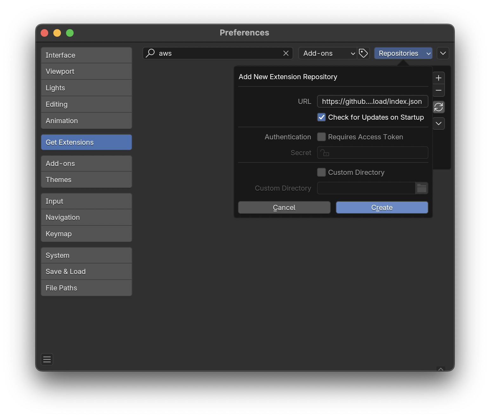
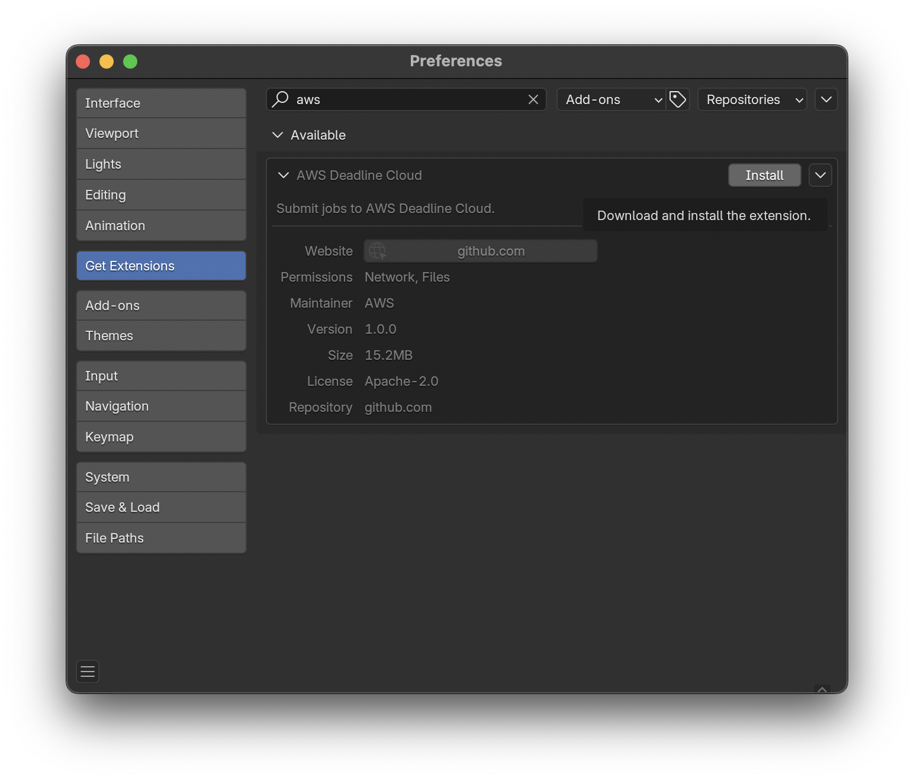
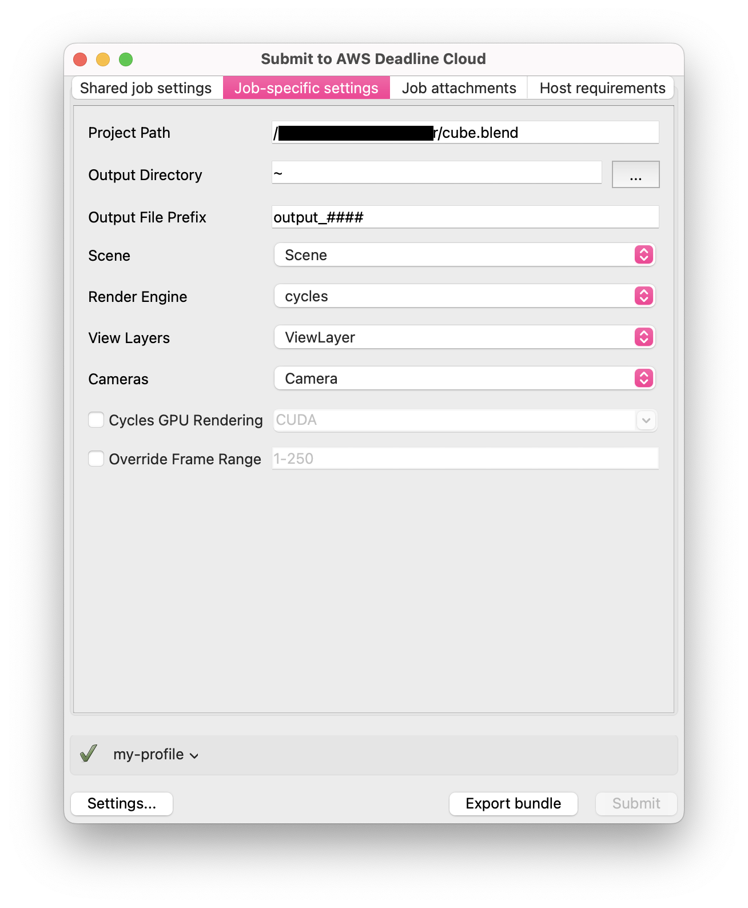

# Blender

Blender is a free and open-source 3D computer graphics software toolset used for creating animated films, visual effects, art, 3D printed models, motion graphics, interactive 3D applications, virtual reality, and computer games. Blender is supported by AWS Deadline Cloud (Deadline Cloud) with comprehensive integration including submitters, conda packages, and an adaptor for increased rendering performance. This guide provides step-by-step instructions for using Deadline Cloud with Blender to render your projects faster by distributing rendering tasks across multiple machines.

## Support overview

Blender is supported by the following components:

- **Submitter**: Integrated submitter for direct job submission from Blender with automatic scene and asset detection.
- **Conda packages**: Deadline Cloud for automatic installation on service-managed fleets.
- **Adaptor**: A program on worker hosts that keeps the application loaded between tasks for faster rendering and reports render progress.
- **Cross-platform compatibility**: Submitter support for Windows, macOS, and Linux with worker support for Windows and Linux with automatic path mapping.

## Blender version compatibility

The following table shows current support levels for Blender versions:

| Major Version | Submitter Support     | Conda Support | Render Engines           |
| ------------- | --------------------- | ------------- | ------------------------ |
| 3.6           | Windows, macOS, Linux | Linux         | Cycles, Eevee, Workbench |
| 4.2           | Windows, macOS, Linux | Linux         | Cycles, Eevee, Workbench |
| 4.5           | Windows, macOS, Linux | Linux         | Cycles, Eevee, Workbench |
| 5.0           | Windows, macOS, Linux | Linux         | Cycles, Eevee, Workbench |
| 5.1           | Windows, macOS, Linux | Linux         | Cycles, Eevee, Workbench |

## Deadline Cloud Conda Channel

The following table lists all conda packages applicable to Blender available to Service-managed fleets in the deadline-cloud conda channel:

| OS    | Package        | Version | Notes                                |
| ----- | -------------- | ------- | ------------------------------------ |
| Linux | blender        | 3.6     | Includes all built-in render engines |
| Linux | blender        | 4.2     | Includes all built-in render engines |
| Linux | blender        | 4.5     | Includes all built-in render engines |
| Linux | blender        | 5.0     | Includes all built-in render engines |
| Linux | blender        | 5.1     | Includes all built-in render engines |
| Linux | blender-openjd |         | Includes the Blender Adaptor         |

## Getting started

To use Blender with Deadline Cloud:

1. Create a service-managed fleet and associate it with a queue. Your queue must be set up with a queue environment that supports the deadline-cloud conda channel. For more information, see [Creating a queue environment](create-queue-environment.md "create-queue-environment.md").
2. Install the Deadline Cloud monitor and Blender submitter on your artist workstation using the Deadline Cloud monitor and submitter installers. For more information, see [Set up your workstation](submitter.md "submitter.md").
3. Submit your job directly from Blender using the integrated submitter to the queue.
4. Monitor the job and download the output using the Deadline Cloud monitor.

## Installation

To install the Deadline Cloud for Blender submitter, you need:

- A Windows, macOS, or Linux workstation.
- Blender 3.6 or later.

There are three ways to install the Deadline Cloud for Blender submitter:

- Using the Deadline Cloud submitter installer (recommended).
- Installing the submitter from Blender.
- Manually installing the submitter from source. For more information, see [Manual Installation](https://github.com/aws-deadline/deadline-cloud-for-blender/blob/mainline/DEVELOPMENT.md#manual-installation "https://github.com/aws-deadline/deadline-cloud-for-blender/blob/mainline/DEVELOPMENT.md#manual-installation") on the GitHub website.

### Using the Deadline Cloud submitter installer

You can install the Deadline Cloud for Blender submitter using the Deadline Cloud submitter installer.

**To install the submitter**

1. Download the [Deadline Cloud submitter installer](submitter.md "submitter.md").
2. Run the installer.

   - When prompted, select each version of Blender you want to use the submitter with.

3. Launch Blender.
4. Verify the installation by checking the **Render** menu for a **Submit to Deadline Cloud** option.

If the add-on is not available from the **Render** menu, you need to manually enable it.

**To manually enable the submitter add-on**

1. On the **Edit** menu, choose **Preferences…**.
2. Choose **File Paths** on the left side bar.
3. Find the **Script Directories** section and choose **+**.
4. For **Name**, enter `python`.
5. For **Path**, enter the path to the `python` directory in your Blender submitter installation.
6. Restart Blender for changes to take effect.

### Installing the submitter from Blender

###### Note

This feature is experimental and subject to change.

You can install and update the Blender submitter from within Blender using Blender's extension feature.

To install the Blender submitter using Blender extensions, you need:

- Blender 4.2 or later.
- A workstation with consistent internet access.

**To add the Blender submitter as an extension**

1. Open Blender.
2. On the **Edit** menu, choose **Preferences…**.
3. Choose **Get Extensions** on the left side bar.
4. Choose **Repositories**, **+**, **Add Remote Repository**.

 5. For **URL**, enter `https://github.com/aws-deadline/deadline-cloud-for-blender/releases/latest/download/index.json`. 6. Select **Check for Updates on Startup** and choose **Create**. 7. On the **Deadline Cloud** entry under **Available**, choose **Install**.

The add-on is now installed. You can use the new **Submit to Deadline Cloud** option in the **Render** menu.

When an update is available, an **Update** button appears next to the **Deadline Cloud** entry in the **Get Extensions** section.

## Using the Blender submitter

To use the Deadline Cloud for Blender submitter, you need:

- A profile to submit to Deadline Cloud with.
- An Deadline Cloud farm and queue to submit to.

### Submit a job

**To submit a job from Blender to Deadline Cloud**

1. Save your Blender file.
2. On the **Render** menu, choose **Submit to Deadline Cloud**.

   - You might see a pop-up to install GUI dependencies. Choose **OK** and wait for the dialog to disappear, then choose **Submit to Deadline Cloud** again.

3. Use the tabs in the dialog to customize your job.
4. (Optional) To export a job's associated files to your job history directory without submitting it, choose **Export bundle**.
5. Choose **Submit** and follow the prompts to send your job to Deadline Cloud.

### Blender-specific settings

The **Job-specific settings** tab has options specific to jobs created in Blender.

- _Project Path_ - The location where the current project is saved. This value can't be changed.
- _Output Directory_ - The location to save file outputs from the render job.
- _Output File Prefix_ - The pattern to use when naming file outputs, follows Blender's convention for file names. Output files are formatted like `[LayerName]_[CameraName]_[OutputPrefix].[EXT]`.
- _Scene_ - The scene from the current project to render.
- _Render Engine_ - The render engine (Cycles, EEVEE, or Workbench) to use.
- _View Layers_ - The layer to render, or "All Renderable Layers" to render each applicable layer in the scene separately.
- _Cameras_ - The camera to render, "All Renderable Cameras" to render each camera in the scene separately, or "Use Default Camera" to use the scene's default camera or cameras bound to timeline markers.
- _Cycles GPU Rendering_ - Whether to enable GPU rendering. Choose a device type supported by Blender or specify your own. If this device type is not supported on your rendering machine, the adaptor attempts to use a compatible device type before falling back to CPU rendering.
- _Override Frame Range_ - Select this option to render a different frame or frame range than is set in the scene file. Frame ranges follow the Open Job Description pattern. For more information, see the [IntRangeExpr specification](https://github.com/OpenJobDescription/openjd-specifications/wiki/2023-09-Template-Schemas#34111-intrangeexpr "https://github.com/OpenJobDescription/openjd-specifications/wiki/2023-09-Template-Schemas#34111-intrangeexpr") on the GitHub website.

For information about the other submitter tabs, see the [Deadline Cloud guide for using a submitter](jobs-using-submitter.md "jobs-using-submitter.md").

## Advanced configurations

### Using unsupported versions

Deadline Cloud only supports and tests the workstation and worker software versions in the table above. When using the submitter, the worker will attempt to install the same version as used on the workstation. This installation fails if the workstation version of Blender does not appear in the version table above.

If you require an unsupported version of Blender, you have the following options:

- When submitting the job from Blender, you can override the CondaPackages queue parameter to specify a supported version to use on the worker (for example, `blender=4.5, blender-openjd=*`). This override might or might not work, depending on the features used by your scene and how Blender works with scenes from your workstation version.
- You may build a custom conda recipe and channel for your desired version to be installed on the worker. Use the conda recipe for a supported version linked below as a starting point, and package your desired version in a custom conda channel. For more information about creating custom conda channels, see [Creating custom conda channels](../developerguide/configure-jobs-s3-channel.md "../developerguide/configure-jobs-s3-channel.md").

## Blender add-ons

You can make Blender add-ons available on service-managed fleet workers by building a conda package from a conda recipe and adding it to a custom conda channel. When the conda environment activates on a worker, the add-on is installed through Blender's API; when it deactivates, the add-on is removed. For more information about custom conda channels, see [Creating custom conda channels](../developerguide/configure-jobs-s3-channel.md "../developerguide/configure-jobs-s3-channel.md").

The following conda recipes are available on the GitHub website as starting points:

- [FLIP Fluids add-on conda recipe](https://github.com/aws-deadline/deadline-cloud-samples/tree/mainline/conda_recipes/blender-flipfluids "https://github.com/aws-deadline/deadline-cloud-samples/tree/mainline/conda_recipes/blender-flipfluids") packages the demo version of the FLIP Fluids liquid simulation add-on.
- [Blender add-on bundle conda recipe](https://github.com/aws-deadline/deadline-cloud-samples/tree/mainline/conda_recipes/blender-plugin-bundle "https://github.com/aws-deadline/deadline-cloud-samples/tree/mainline/conda_recipes/blender-plugin-bundle") packages multiple Blender add-ons from a single archive so that they install together when the conda environment activates.

## Blender render engines

Blender includes several built-in render engines that are supported:

| Render Engine | Description                  | GPU Support    | Notes                                              |
| ------------- | ---------------------------- | -------------- | -------------------------------------------------- |
| Cycles        | Physically-based path tracer | GPU/CPU hybrid | Production quality rendering with GPU acceleration |
| Eevee         | Real-time render engine      | GPU optimized  | Fast viewport and final rendering                  |
| Workbench     | Solid shading engine         | GPU optimized  | For modeling and sculpting workflows               |

All render engines are automatically detected and configured by the Blender integrated submitter. GPU acceleration is available when using service-managed fleets with GPU-enabled instances.

## Open source resources

The submitter and adaptor are open source and available on the GitHub website:

- [Deadline Cloud for Blender](https://github.com/aws-deadline/deadline-cloud-for-blender "https://github.com/aws-deadline/deadline-cloud-for-blender")
- [Blender conda recipes](https://github.com/aws-deadline/deadline-cloud-samples/tree/mainline/conda_recipes/blender-4.5 "https://github.com/aws-deadline/deadline-cloud-samples/tree/mainline/conda_recipes/blender-4.5") are available for supported versions.
