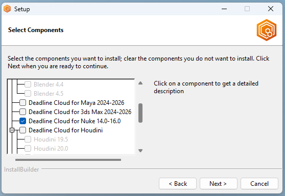

# Foundry Nuke

Foundry Nuke is a node-based digital compositing and visual effects application used for television and film post-production. Nuke is supported by AWS Deadline Cloud (Deadline Cloud) with submitters, conda packages, and an adaptor for increased rendering performance. This guide provides step-by-step instructions for using Deadline Cloud with Nuke to render your projects faster by distributing rendering tasks across multiple machines.

## Support overview

Nuke is supported by the following components:

- **Submitter**: Integrated submitter plugin for direct job submission from Nuke with automatic scene and asset detection.
- **Conda packages**: Packages to install nuke versions 15, 16, and 17 are available on the Deadline Cloud conda channel for service-managed fleets.
- **Adaptor**: A program on worker hosts that keeps the application loaded between tasks for faster rendering and reports render progress.
- **Cross-platform compatibility**: Submitter support for Windows, macOS, and Linux with worker support for Linux only with automatic path mapping.

## Nuke version compatibility

The following table shows current support levels for Nuke versions:

| Major Version | Submitter Support     | Conda Support |
| ------------- | --------------------- | ------------- |
| 15            | Windows, macOS, Linux | Linux         |
| 16            | Windows, macOS, Linux | Linux         |
| 17            | Windows, macOS, Linux | Linux         |

## Deadline Cloud Conda Channel

The following table lists conda packages applicable to Nuke available to Service-managed fleets in the deadline-cloud conda channel:

| OS    | Package     | Version | Notes                                |
| ----- | ----------- | ------- | ------------------------------------ |
| Linux | nuke        | 15      | Includes built-in compositing engine |
| Linux | nuke        | 16      | Includes built-in compositing engine |
| Linux | nuke        | 17      | Includes built-in compositing engine |
| Linux | nuke-openjd |         | Includes the Nuke Adaptor            |

## Getting started

To use Nuke with Deadline Cloud:

1. Create a service-managed fleet and associate it with a queue. Your queue must be set up with a queue environment that supports the deadline-cloud conda channel. For more information, see [Creating a queue environment](create-queue-environment.md "create-queue-environment.md").
2. Install the Deadline Cloud monitor and Nuke submitter on your artist workstation using the Deadline Cloud Submitter and monitor Installers. For more information, see [Set up your workstation](submitter.md "submitter.md").
3. Submit your job directly from Nuke using the integrated submitter to the queue.
4. Monitor the job and download the output using the Deadline Cloud monitor.

### Launch the submitter

###### To launch the Deadline Cloud submitter in Nuke

###### Note

Support for Nuke is provided using the conda environment for service-managed fleets. For more information, see [Default conda queue environment](create-queue-environment.md#conda-queue-environment "create-queue-environment.md#conda-queue-environment").

1. Install the Deadline Cloud monitor and Nuke submitter on your artist workstation using the Deadline Cloud Submitter and monitor Installers. For more information, see [Set up your workstation](submitter.md "submitter.md").
2. Open **Nuke**.
3. Open a Nuke script with dependencies that exist within the asset root directory.
4. Choose **AWS Deadline**, and then choose **Submit to Deadline Cloud** to launch the submitter.
5. If you are not already authenticated, choose **Login** and log in with your user credentials in the browser window.
6. Choose **Submit**.

## Installation

To install the Deadline Cloud for Nuke submitter, you need:

- A Windows, macOS, or Linux workstation.
- Nuke 14, 15, 16, or 17. We recommend Nuke 15 or later over Nuke 14, because these versions are supported by the [default conda queue environment](create-queue-environment.md#conda-queue-environment "create-queue-environment.md#conda-queue-environment") on service-managed fleets. To use Nuke 14 with a service-managed fleet, you need to make Nuke 14 available to the worker. The recommended way is to create your own conda package by following [Create a conda package for an application or plugin](../developerguide/conda-package.md "../developerguide/conda-package.md").

There are two ways to install the Deadline Cloud for Nuke submitter:

- Using the Deadline Cloud submitter installer (recommended).
- [Manually installing the submitter from source](https://github.com/aws-deadline/deadline-cloud-for-nuke/blob/mainline/DEVELOPMENT.md#manual-installation "https://github.com/aws-deadline/deadline-cloud-for-nuke/blob/mainline/DEVELOPMENT.md#manual-installation").

### Using the Deadline Cloud submitter installer

You can install the Deadline Cloud for Nuke submitter using the Deadline Cloud submitter installer.

**To install the submitter**:

1. Download the [Deadline Cloud submitter installer](submitter.md "submitter.md").
2. Run the installer.
3. When prompted to select components, find and mark the checkbox for Nuke.

 4. Finish running the installer. 5. Launch Nuke. 6. Verify the installation by checking if **Deadline Cloud** has been added to the top navigation bar.

## Using the Nuke submitter

The Deadline Cloud for Nuke submitter supports two types of jobs:

- Render jobs - Render the output files created by one or more of the [Write nodes](https://learn.foundry.com/nuke/content/comp_environment/rendering/output_write_nodes.html "https://learn.foundry.com/nuke/content/comp_environment/rendering/output_write_nodes.html") in your Nuke script.
- CopyCat training jobs - Perform training for a [CopyCat node](https://learn.foundry.com/nuke/content/reference_guide/air_nodes/copycat.html "https://learn.foundry.com/nuke/content/reference_guide/air_nodes/copycat.html") in your Nuke script.

### Render jobs

To use the Deadline Cloud for Nuke submitter, you need:

- A profile to submit to Deadline Cloud with.
- An Deadline Cloud farm and queue to submit to.

**To submit a render job from Nuke to Deadline Cloud**:

1. Save your Nuke file.
2. From the top navigation bar, choose **Deadline Cloud**. From the drop-down menu, choose **Submit to Deadline Cloud**.
3. Use the tabs in the dialog to customize your job.
4. (Optional) To export a job's associated files to your job history directory without submitting it, choose **Export bundle**.
5. Choose **Submit** and follow the prompts to send your job to Deadline Cloud.

#### Nuke render-specific settings

The **Job-specific settings** tab has options specific to jobs created in Nuke.

- _Write nodes_ - Which [write nodes](https://learn.foundry.com/nuke/content/comp_environment/rendering/output_write_nodes.html "https://learn.foundry.com/nuke/content/comp_environment/rendering/output_write_nodes.html") to render outputs for. You can either select to render all write nodes, or select a specific node.
- _Views_ - Which [views](https://learn.foundry.com/nuke/content/comp_environment/stereoscopic_films/setting_up_stereo_views.html "https://learn.foundry.com/nuke/content/comp_environment/stereoscopic_films/setting_up_stereo_views.html") should be rendered.
- _Override frame range_ - Select this option to render a different frame or frame range than is set in Nuke. Frame ranges follow the [Open Job Description](https://github.com/OpenJobDescription/openjd-specifications/wiki/2023-09-Template-Schemas#34111-intrangeexpr "https://github.com/OpenJobDescription/openjd-specifications/wiki/2023-09-Template-Schemas#34111-intrangeexpr") pattern.
- _Use proxy mode_ - Manages whether to use [proxy mode](https://learn.foundry.com/nuke/9.0/content/getting_started/managing_scripts/proxy_mode.html "https://learn.foundry.com/nuke/9.0/content/getting_started/managing_scripts/proxy_mode.html") in the submitted job.
- _Continue on error_ - If selected, Nuke tries to continue rendering when it encounters an error. If cleared, Nuke fails the task when it encounters an error.
- _Chunk size_ - Number of frames to group into each chunk (1-150). Use 1 for one frame per task (default). Higher values group frames into contiguous chunks to reduce per-task overhead. For more information, see [Task chunking for job templates](../developerguide/build-job-bundle-chunking.md "../developerguide/build-job-bundle-chunking.md").
- _Target chunk duration (seconds)_ - When you specify a value, the scheduler dynamically adjusts chunk sizes based on observed runtimes of completed chunks, aiming for this duration for each chunk. Leave at 0 to use a fixed chunk size for all chunks.
- _Use timeouts_ - Whether to use user-configured timeouts.
- _Render task timeout_ - Maximum duration of each action which performs a render. Default is 6 days.
- _Setup timeout_ - Maximum duration of each action which sets up the job for rendering, such as scene load. Default is 1 day.
- _Teardown timeout_ - Maximum duration of action which tears down the setup required for rendering. Default is 1 hour.
- _Include gizmos in job bundle_ - Whether to include [gizmos](https://learn.foundry.com/nuke/content/comp_environment/configuring_nuke/creating_sourcing_gizmos.html "https://learn.foundry.com/nuke/content/comp_environment/configuring_nuke/creating_sourcing_gizmos.html") in the job bundle.

For information about the other submitter tabs, see the [Deadline Cloud guide for using a submitter](jobs-using-submitter.md "jobs-using-submitter.md").

### CopyCat training jobs

To use the Deadline Cloud for Nuke submitter to train CopyCat nodes, you need:

- A profile to submit to Deadline Cloud with.
- An Deadline Cloud farm and queue to submit to.
- An Deadline Cloud fleet with GPU-enabled workers associated with the queue you will be submitting to. For instructions on creating a service-managed fleet with GPU access, see [Managing service-managed fleets](smf-manage.md "smf-manage.md").

**To submit a CopyCat training job from Nuke to Deadline Cloud**:

1. Create or open a Nuke script containing a CopyCat node.
2. Attach ground-truth and input nodes to the CopyCat node, and configure knobs on the node to desired values. See [Foundry's CopyCat documentation](https://learn.foundry.com/nuke/content/reference_guide/air_nodes/copycat.html "https://learn.foundry.com/nuke/content/reference_guide/air_nodes/copycat.html") for details on using CopyCat.
3. Save your Nuke file.
4. From the top navigation bar, choose **Deadline Cloud**. From the drop-down menu, choose **Submit CopyCat Training to Deadline Cloud**.
5. Use the tabs in the dialog to customize your job.
6. (Optional) To export a job's associated files to your job history directory without submitting it, choose **Export bundle**.
7. Choose **Submit** and follow the prompts to send your job to Deadline Cloud.

#### Nuke CopyCat training-specific settings

The **Job-specific settings** tab has options specific to CopyCat training jobs created in Nuke.

- _CopyCat Node_ - Select which CopyCat node to train by node name.
- _Use timeouts_ - Whether to use user-configured timeouts.
- _Render task timeout_ - Maximum duration of each action. In the case of CopyCat, the training is a single action. Default is 6 days.
- _Setup timeout_ - Maximum duration of each action which sets up the job, such as scene load. Default is 1 day.
- _Teardown timeout_ - Maximum duration of action which tears down the setup. Default is 1 hour.
- _Include gizmos in job bundle_ - Whether to include [gizmos](https://learn.foundry.com/nuke/content/comp_environment/configuring_nuke/creating_sourcing_gizmos.html "https://learn.foundry.com/nuke/content/comp_environment/configuring_nuke/creating_sourcing_gizmos.html") in the job bundle.

For information about the other submitter tabs, see the [Deadline Cloud guide for using a submitter](jobs-using-submitter.md "jobs-using-submitter.md").

## Advanced configurations

### Using unsupported versions

Deadline Cloud only supports and tests the workstation and worker software versions in the table above. When using the submitter, the worker attempts to install the same version as used on the workstation. This fails if the workstation version of Nuke does not appear in the version table above.

If you require an unsupported version of Nuke, you have the following options:

- When submitting the job from Nuke, you can override the CondaPackages queue parameter to specify a supported version to use on the worker (for example, `nuke=17, nuke-openjd=*`). This override might or might not work, depending on the features used by your composition and how Nuke works with compositions from your workstation version.
- You can build a custom conda recipe and channel for your desired version to be installed on the worker. Use the conda recipe for a supported version linked below as a starting point, and package your desired version in a custom conda channel. For more information about creating custom conda channels, see [Creating custom conda channels](../developerguide/configure-jobs-s3-channel.md "../developerguide/configure-jobs-s3-channel.md").

### Custom Nuke executable

You can set the `NUKE_EXECUTABLE` environment variable to point to a specific Nuke executable if it's not available on the PATH.

### OpenColorIO support

The Nuke integration includes full support for OpenColorIO (OCIO) color management workflows. Color configurations are automatically detected and included with job submissions to ensure consistent color handling across the render farm.

## Nuke plugins

You can add third-party Nuke plugins to a service-managed fleet by building a conda package from a conda recipe and adding it to a custom conda channel. For more information, see [Create a conda package for an application or plugin](../developerguide/conda-package.md "../developerguide/conda-package.md"). To include Nuke gizmos with a job instead, use the **Include gizmos in job bundle** option in the submitter.

### RevisionFX DENoise

RevisionFX DENoise is a noise-reduction plugin for Nuke compositing jobs. You can build a conda package for DENoise 3.6.9 on Linux workers with the nuke-denoise conda recipe, and then add it to a custom conda channel. A commercial DENoise license is required.

Conda recipe: [nuke-denoise conda recipe](https://github.com/aws-deadline/deadline-cloud-samples/tree/mainline/conda_recipes/nuke-denoise "https://github.com/aws-deadline/deadline-cloud-samples/tree/mainline/conda_recipes/nuke-denoise")

## Nuke compositing features

Nuke's compositing engine provides comprehensive support for:

| Feature          | Description                        | Notes                                    |
| ---------------- | ---------------------------------- | ---------------------------------------- |
| Write Nodes      | Multiple output formats and codecs | Automatically detected by submitter      |
| Frame Ranges     | Custom frame range specification   | Supports override and default ranges     |
| Multiple Views   | Stereo and multi-view rendering    | Proper handling of view-specific outputs |
| Color Management | OpenColorIO integration            | Automatic OCIO configuration detection   |
| Path Mapping     | Cross-platform path translation    | Windows/Linux compatibility              |
| CopyCat          | ML-based paint and rotoscoping     | Requires Nuke 14.0 or later              |

Compositing features are automatically detected and configured by the Nuke integrated submitter. The submitter maintains proper dependency handling and asset management for complex compositions.

## Open source resources

The submitter and adaptor are open source and available on GitHub:

- [Deadline Cloud for Nuke](https://github.com/aws-deadline/deadline-cloud-for-nuke "https://github.com/aws-deadline/deadline-cloud-for-nuke")
- [Nuke conda recipes](https://github.com/aws-deadline/deadline-cloud-samples/tree/mainline/conda_recipes "https://github.com/aws-deadline/deadline-cloud-samples/tree/mainline/conda_recipes") are available on GitHub for supported versions.
