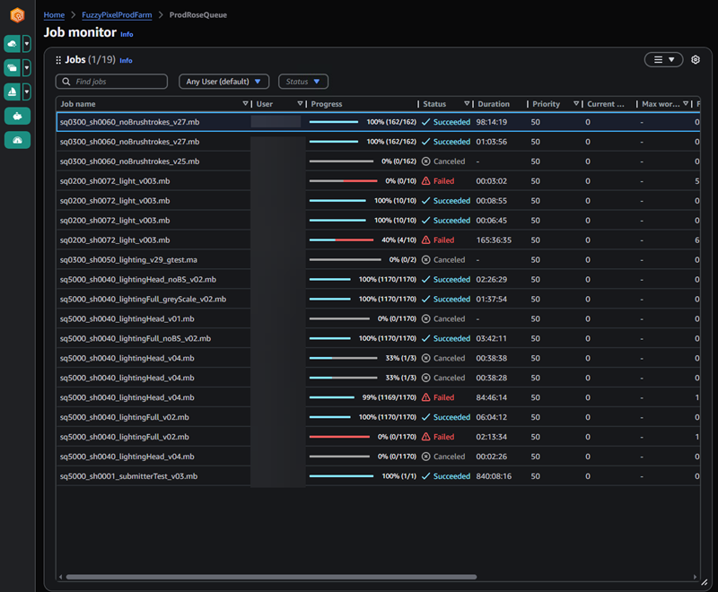

# Monitoring Deadline Cloud jobs

The AWS Deadline Cloud monitor provides you with an overall view of your jobs. Use it to:

* Monitor and manage jobs
* View worker activity on fleets
* Track budgets and usage
* Download a job's results.
To monitor a specific job, select the farm and queue containing the job, then select the
 job from the list. You can use the search box to locate a specific job or jobs in the
 queue.

Right click on a job, step, or task to see the options for the item. You can:

* Change the status
* Suspend and resume the item
* Requeue the item
* Download the output
* For tasks: View task and worker logs.
For more information, see [Using the Deadline Cloud monitor](working-with-deadline-monitor.md "working-with-deadline-monitor.md").

Each task in a job or step has a status. The status of a job or step depends on the status
 of its tasks. The status is determined by tasks that have these statuses, in order. Step
 statuses are determined the same as the job status.

The following list describes the statuses:

`NOT_COMPATIBLE`

The job is not compatible with the farm because there are no fleets that can
 complete one of the tasks in the job. 

`RUNNING`

One or more workers are running tasks from the job. As long as there is at least one
 running task, the job is marked `RUNNING`.

`ASSIGNED`

One or more workers are assigned tasks in the job as their next action. The
 environment, if any, is set up. 

`STARTING`

One or more workers is setting up the environment for running tasks. 

`SCHEDULED`

Tasks for the job are scheduled on one or more workers as the worker's next
 action.

`READY`

At least one task for the job is ready to be processed.

`INTERRUPTING`

At least one task in the job is being interrupted. Interruptions can happen when you
 manually update the job's status. It can also happen in response to an interruption due
 to Amazon Elastic Compute Cloud (Amazon EC2) Spot price changes.

`FAILED`

One or more tasks in the job didn't complete successfully.

`CANCELED`

One or more tasks in the job have been canceled.

`SUSPENDED`

At least one task in the job has been suspended.

`PENDING`

A task in the job is waiting on the availability of another resource.

`SUCCEEDED`

All tasks in the job were successfully processed.
