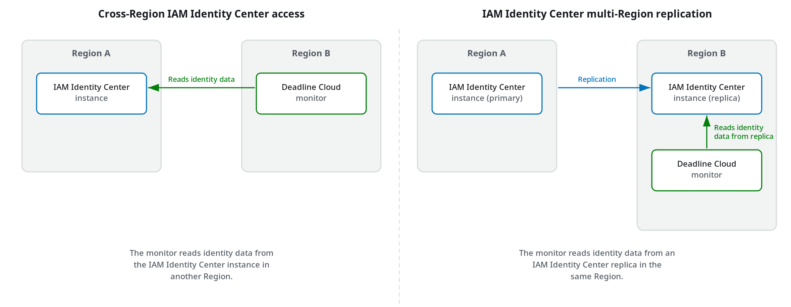

# Create monitors in additional Regions

Each Deadline Cloud monitor manages resources in a single AWS Region. To manage resources in
additional Regions, you can create a separate monitor in each Region.

If your IAM Identity Center instance is not available in the Region where you want to create a
monitor, you have the following options:

- **Cross-Region IAM Identity Center access** – Create a
  monitor in a different Region, and Deadline Cloud reads IAM Identity Center identity data from the
  Region where your IAM Identity Center instance is located. This option requires no changes to
  your IAM Identity Center configuration.
- **IAM Identity Center multi-Region replication** –
  Replicate your IAM Identity Center instance to additional Regions so that monitors in those
  Regions use an IAM Identity Center replica in the same Region. This option provides lower
  latency and regional availability, but requires additional IAM Identity Center
  configuration.
  The following diagram shows how each approach works.

The following table compares the two approaches.

Comparison of multi-Region approaches| Consideration | Cross-Region IAM Identity Center access | IAM Identity Center multi-Region replication |
| --- | --- | --- |
| Setup requirements | No additional IAM Identity Center setup required | Requires configuring IAM Identity Center replication |
| Identity data location | Remains in the IAM Identity Center Region only | Replicated to each configured Region |
| Latency | Depends on distance to the IAM Identity Center Region | Lower latency when an IAM Identity Center replica is in the same Region |
| Regional availability | Depends on IAM Identity Center Region availability | Continues to work if the IAM Identity Center primary Region is unavailable |

## Cross-Region IAM Identity Center access

With cross-Region IAM Identity Center access, you create an Deadline Cloud monitor in a different Region
than your IAM Identity Center instance. Deadline Cloud reads IAM Identity Center identity data from the Region where
your IAM Identity Center instance is located.

When you create a monitor using the Deadline Cloud console, the console automatically
detects your IAM Identity Center instance and connects the monitor to it, even if the instance is
in a different Region. When you create a monitor using an AWS SDK, specify the
Region where your IAM Identity Center instance is located.

### Considerations

- Cross-Region IAM Identity Center access requires your IAM Identity Center instance to be in a
  commercial AWS Region. IAM Identity Center instances in opt-in Regions aren't
  supported.
- You can't change the IAM Identity Center Region after you create the
  monitor.

## IAM Identity Center multi-Region replication

IAM Identity Center multi-Region replication synchronizes your IAM Identity Center identity store data,
including users, groups, and group memberships, to additional AWS Regions. After
you enable replication to a Region, you can connect your monitor in that Region to
the IAM Identity Center replica.

Multi-Region replication is useful in the following scenarios:

- You need lower latency for users closer to the replicated Region.
- You need monitors that continue to work if the IAM Identity Center primary Region is
  unavailable.

To enable multi-Region replication, see
[Using
IAM Identity Center across multiple AWS Regions](../../../singlesignon/latest/userguide/multi-region-iam-identity-center.md "../../../singlesignon/latest/userguide/multi-region-iam-identity-center.md") in the _IAM Identity Center User
Guide_. After you enable replication for a Region, you can create Deadline Cloud
monitors there by using the console or an AWS SDK.
