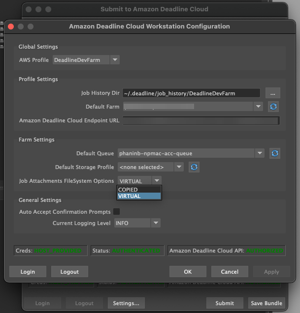

# Deadline Cloud virtual file system

Virtual file system support for job attachments in AWS Deadline Cloud enables client software on
 workers to communicate directly with Amazon Simple Storage Service. Workers can load files only when needed instead
 of downloading all files before processing. Files are stored locally. This approach avoids
 downloading assets used more than once multiple times. All files are removed after the job
 completes.


* The virtual file system provides a significant performance boost for specific job
 profiles. In general, smaller subsets of total files with larger fleets of workers show the
 most benefit. Small numbers of files with fewer workers have roughly equivalent processing
 times.
* Virtual file system support is only available for Linux workers in
 service-managed fleets.
* The Deadline Cloud virtual file system supports the following operations, but is not POSIX
 compliant:


	+ File `create`, `delete`, `open`, `close`,
	 `read`, `write`, `append`, `truncate`,
	 `rename`, `move`, `copy`, `stat`,
	 `fsync`, and `falloc`
	+ Directory `create`, `delete`, `rename`,
	 `move`, `copy`, and `stat`
* The virtual file system is designed to reduce data transfer and improve performance when
 your tasks access only part of a large data set, and is not optimized for all workloads. You
 should test your workload before running production jobs.

## Enable VFS support


Virtual file system support (VFS) is enabled for each job. A job falls back to the default
 job attachments framework in these cases:


* A worker instance profile does not support a virtual file system.
* Problems prevent launching the virtual file system process.
* The virtual file system can't be mounted.
###### To enable virtual file system support using the submitter

1. When submitting a job, choose the **Settings** button to open the
 **AWS Deadline Cloud workstation configuration panel**.
2. From the **Job attachments filesystem options** dropdown, choose
 **VIRTUAL**.



3. To save your changes, choose **OK**.
###### To enable virtual file system support using the AWS CLI

* Use the following command when you submit a saved job:


```
deadline bundle submit-job --job-attachments-file-system VIRTUAL
```
To verify that the virtual file system launched successfully for a particular job, review
 your logs in Amazon CloudWatch Logs. Look for the following messages:


```
Using mount_point `mount_point`
Launching vfs with command `command`
Launched vfs as pid `PID number`
```
If the log contains the following message, virtual file system support is disabled:


```
Virtual File System not found, falling back to COPIED for JobAttachmentsFileSystem.
```

## Troubleshooting virtual file system support


You can view logs for your virtual file system using the Deadline Cloud monitor. For instructions,
 see [View session and worker logs in Deadline Cloud](view-logs.md "view-logs.md").


Virtual file system logs are also sent to the CloudWatch Logs group that's associated with the queue
 shared with the worker agent output.
