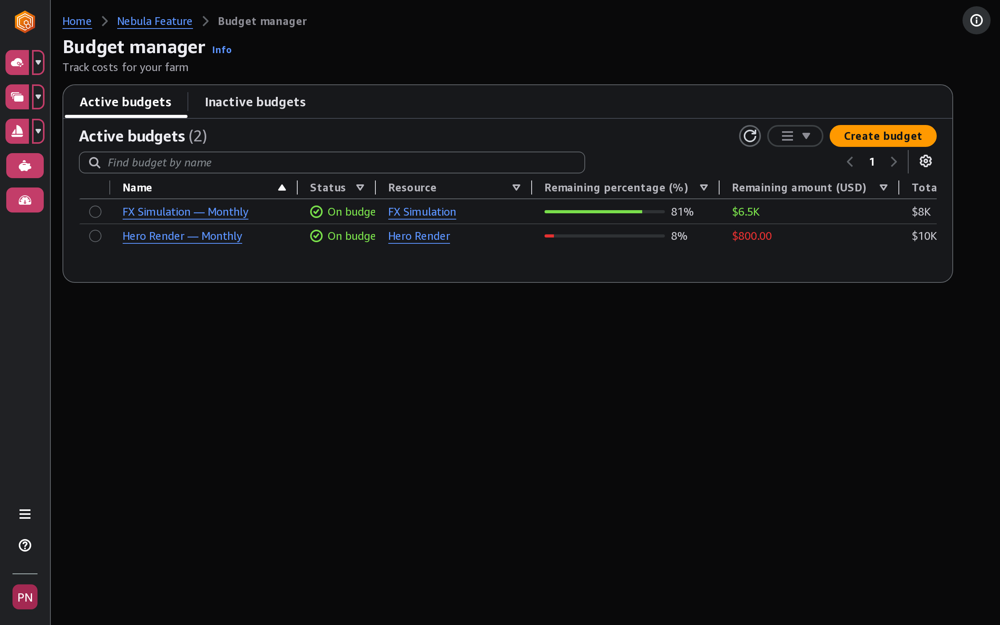

# Control costs with a budget

The Deadline Cloud budget manager helps you control spending on a queue. You can create budget
amounts and limits, and set automated actions to help reduce or stop additional spending
against the budget. Each budget tracks the estimated cost of one queue, so you can give
each project, department, or vendor its own queue and its own spending cap.

The following sections provide you with the steps for using the Deadline Cloud budget
manager.

###### Topics

- [Prerequisite](#budget-manager-prereqs "#budget-manager-prereqs")
- [Open the Deadline Cloud budget manager](#access-budget-manager "#access-budget-manager")
- [How budget actions affect running and new work](budget-actions.md "budget-actions.md")
- [Create a budget for a Deadline Cloud queue](create-budget.md "create-budget.md")
- [View a Deadline Cloud queue budget](view-a-budget.md "view-a-budget.md")
- [Edit a budget for a Deadline Cloud queue](edit-a-budget.md "edit-a-budget.md")
- [Deactivate a budget for a Deadline Cloud queue](deactivate-a-budget.md "deactivate-a-budget.md")
- [Monitor a budget with EventBridge events](budget-threshold-events.md "budget-threshold-events.md")

## Prerequisite

To use the Deadline Cloud budget manager, you must have `OWNER` access level. To
grant `OWNER` permission, follow the steps in [Managing users in Deadline Cloud](managing-users.md "managing-users.md").

## Open the Deadline Cloud budget manager

To open the Deadline Cloud budget manager, use the following procedure.

1. Sign in to the AWS Management Console and open the Deadline Cloud [console](https://us-west-2.console.aws.amazon.com/deadlinecloud/home "https://us-west-2.console.aws.amazon.com/deadlinecloud/home").
2. Choose **View farms**.
3. Locate the farm that you want to get information about, then choose
   **Manage jobs**.
4. In the Deadline Cloud monitor, in the left navigation pane, choose
   **Budgets**.

The budget manager summary page displays a list of both active and inactive budgets:

- **Active** budgets track against the selected
  resource (a queue).
- **Inactive** budgets have either expired or been
  canceled by a user, and are no longer tracking costs against this budget's
  limits.

After you choose a budget, the budget summary page contains basic information about
the budget. Information provided includes the budget name, status, resources, remaining
percentage, remaining amount, total budget, start date, and end date.
