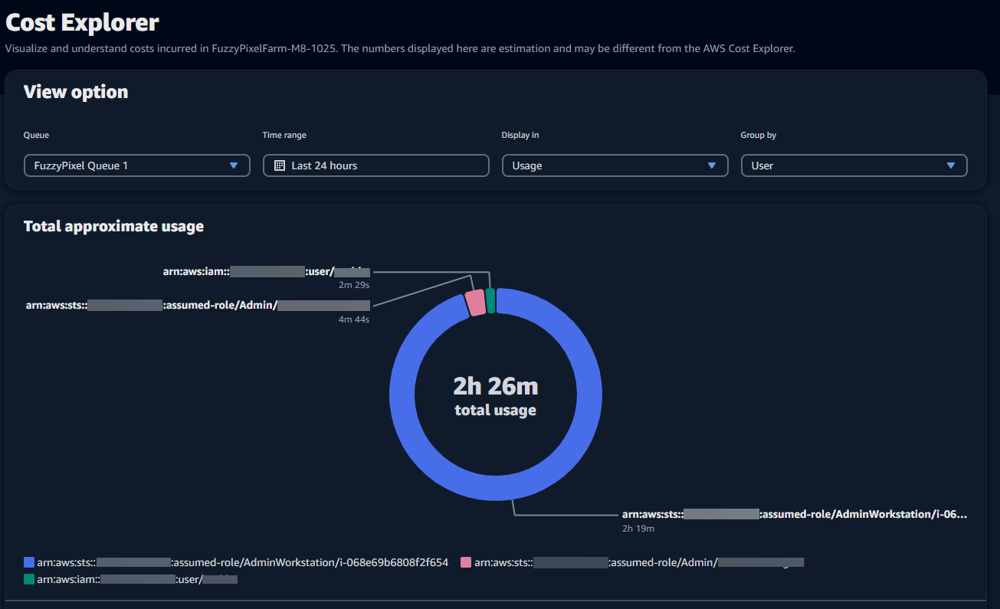
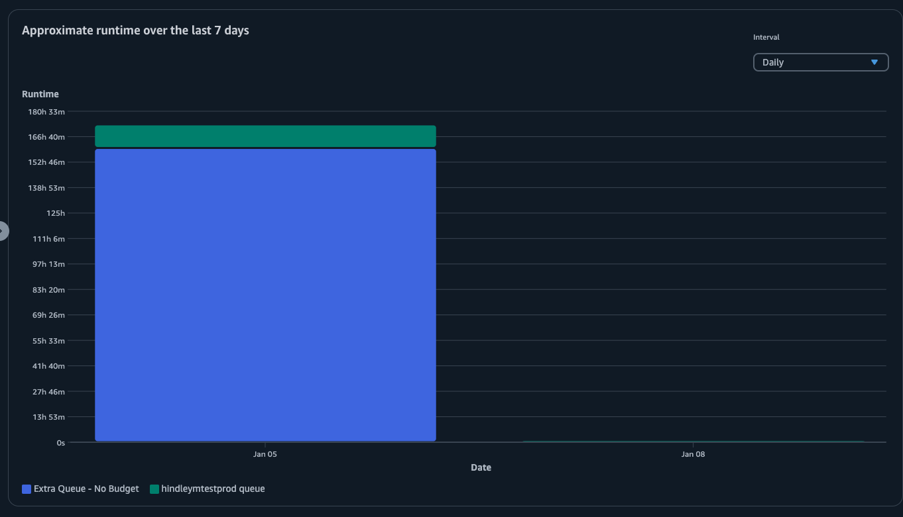

# Track usage and costs with the Deadline Cloud usage
 explorer

With the Deadline Cloud usage explorer, you can see real-time metrics on the activity happening on
 each farm. You can look at the farm’s costs by different variables, such as queue, job,
 license product, or instance types. Select various time frames to see usage during a
 specific period of time, and look at usage trends over the course of time. You can also see
 a detailed breakdown of selected data points, allowing for a closer look into metrics. Usage
 can be shown by time (minutes and hours) or by cost ($USD).

The following sections show you the steps for accessing and using the Deadline Cloud usage
 explorer.

###### Topics

* [Prerequisite](#usage-explorer-prereqs "#usage-explorer-prereqs")
* [Open the usage explorer](#access-usage-explorer "#access-usage-explorer")
* [Use the usage explorer](#using-usage-explorer "#using-usage-explorer")

## Prerequisite

To use the Deadline Cloud usage explorer, you must have either `MANAGER` or
 `OWNER` farm permissions. For more information, see [Manage users and groups for farms, queues, and
 fleets](manage-users-by-farm.md "manage-users-by-farm.md").

###### Note

If your time zone doesn't align to a full hour, such as India Standard Time
 (UTC+5:30), the usage explorer doesn't show usage metrics. To see metrics, set your
 time zone to a zone that aligns to a full hour.

## Open the usage explorer

To open the Deadline Cloud usage explorer, use the following procedure.

1. Sign in to the AWS Management Console and open the Deadline Cloud [console](https://us-west-2.console.aws.amazon.com/deadlinecloud/home "https://us-west-2.console.aws.amazon.com/deadlinecloud/home").
2. To see all available farms, choose **View farms**.
3. Locate the farm that you want to get information about, then choose
 **Manage jobs**. The Deadline Cloud monitor opens in a new
 tab.
4. In the Deadline Cloud monitor, from the left menu, select **Usage
 explorer**.

## Use the usage explorer

From the usage explorer page, you can select specific parameters in which the data can
 be displayed. By default, you see total usage in time (hours and minutes) within the
 last 7 days. You can change these parameters, and the information displayed changes
 dynamically in accordance to the parameter settings.

You can group the results based on the queue, job, compute usage, instance type, or
 license product. If you choose license product, costs are calculated for specific
 licenses. For all other groups the time is calculated by adding up the time taken for
 each task to run.

The usage explorer returns only 100 results based on the filter criteria that you set.
 The results are listed in descending order by the date created timestamp. If there are
 more than 100 results, you get an error message. You can refine your query to reduce the
 number of results:

* Select a smaller time range
* Select fewer queues
* Select a different grouping, such as grouping by queue instead of job

###### Topics

* [Use visual graphs to review data](#visual-graphs "#visual-graphs")
* [View a breakdown of metrics](#breakdown "#breakdown")
* [View approximate runtime of queues](#approximate-runtime "#approximate-runtime")

### Use visual graphs to review data

You can review data in a visual format to identify trends and potential areas that
 might need more analysis or attention. Usage explorer offers a pie chart that
 displays overall usage and cost with the option to group the totals into smaller
 subtotals. 

###### Note

The chart *only* displays the top five
 results with other results combined in an "others" section. You can view all
 results in the breakdown section below the chart.

### View a breakdown of metrics

Beneath the pie chart, usage explorer offers a more detailed breakdown of specific
 metrics, which will change as parameters change. By default, five results display in
 the usage explorer. You can scroll through results using the pagination arrows in
 the breakdown section. 

Breakdown is minimized by default. To expand and display the results, select the
 **View all breakdown** arrow. To download the breakdown, choose
 **Download data**. 

### View approximate runtime of queues

You can also view the approximate runtime of your queues based on different
 intervals that you specify. The interval options are hourly, daily, weekly, and
 monthly. After you select an interval, the graph displays the approximate runtime of
 your queues. 

