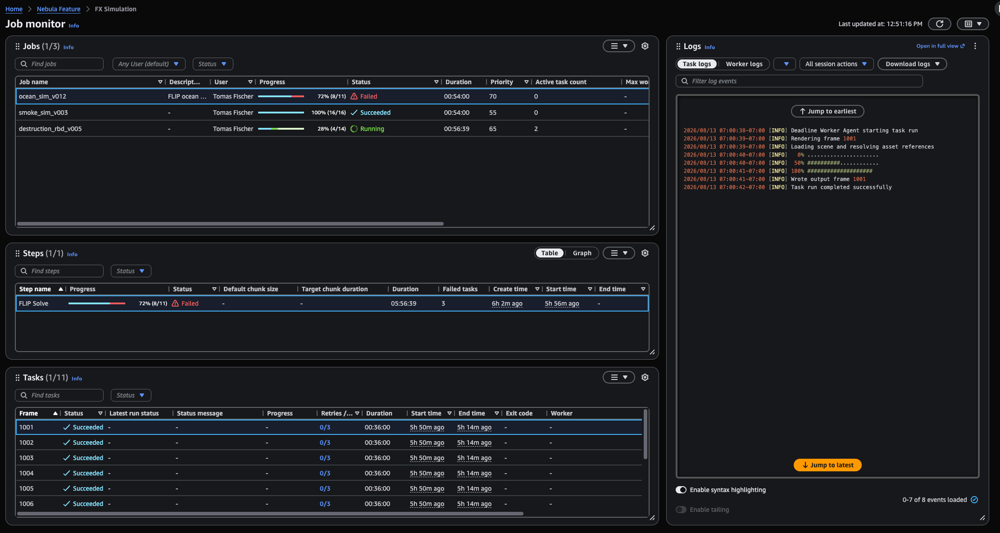

# View session and worker logs in Deadline Cloud

Logs provide you with detailed information about the status and processing of tasks.
In the AWS Deadline Cloud monitor, you can see the following two types of logs:

- _Session logs_ detail the timeline of actions,
  including:

  - Setup actions, such as attachment syncing and loading the software
    environment
  - Running a task or set of tasks
  - Closure actions, such as shutting down the environment on a
    worker
    A session includes processing of at least one task, and can include multiple
    tasks. Session logs also show information about Amazon Elastic Compute Cloud (Amazon EC2) instance type,
    vCPU, and memory. Session logs also include a link to the log for the worker
    used in the session.

- _Worker logs_ provide details for the timeline of actions
  that a worker processes during its lifecycle. Worker logs can contain
  information about multiple sessions.
  You can download session and worker logs so that you can examine them offline.

You can read a task's logs in two places. **View logs** opens the logs
on their own page. The **Logs** panel shows the logs for the task that
you select on the **Job monitor** page, so you can move between tasks
without leaving the job, step, and task lists. The panel isn't shown until you add it.
For more information, see [Customize the panels in the job monitor](customize-job-monitor-panels.md "customize-job-monitor-panels.md").

###### To view task logs in the job monitor

1. Add the **Logs** panel to the **Job
   monitor** page. For more information, see [Customize the panels in the job monitor](customize-job-monitor-panels.md "customize-job-monitor-panels.md").
2. Select a job, select a step, and then select a task. The
   **Logs** panel shows the logs for the selected task.

 3. (Optional) Choose **Task logs** or **Worker
logs**. 4. (Optional) Choose **All session actions**, and then choose a
single action to move the log to that part of the session. 5. (Optional) To find text in the log, use **Filter log
events**. To save the log, choose **Download
logs**. 6. (Optional) To open the logs on their own page, choose **Open in full
view**.

###### Note

When the **Logs** panel is on the page, the task
**Actions** menu doesn't show the **View
logs** and **View worker logs** items that open logs in
the monitor, because the panel already shows the logs for the selected task. The
items that open logs in a new tab are still available.

###### To view session logs

1. Follow the steps in [View and manage job details in Deadline Cloud](view-a-job.md "view-a-job.md") to
   view a list of jobs.
2. Select a job from the **Jobs** list.
3. Select a step from the **Steps** list.
4. Select a task from the **Tasks** list.
5. From the **Actions** menu, choose **View
   logs**.
   The **Timelines** section shows a summary of the actions for the
   task. To see more tasks run in the session and to see the shutdown actions for the
   session, choose **View logs for all tasks**.

###### To view worker logs from a task

1. Follow the steps in [View and manage job details in Deadline Cloud](view-a-job.md "view-a-job.md") to
   view a list of jobs.
2. Select a job from the **Jobs** list.
3. Select a step from the **Steps** list.
4. Select a task from the **Tasks** list.
5. From the **Actions** menu, choose **View
   logs**.
6. Choose **Session info**.
7. Choose **View worker log**.

###### To view worker logs from fleet details

1. Follow the steps in [View queue and fleet details in Deadline Cloud](view-queue-and-fleet.md "view-queue-and-fleet.md") to view a fleet.
2. Select a **Worker ID** from the **Workers**
   list.
3. From the **Actions** menu, choose **View worker
   logs**.
