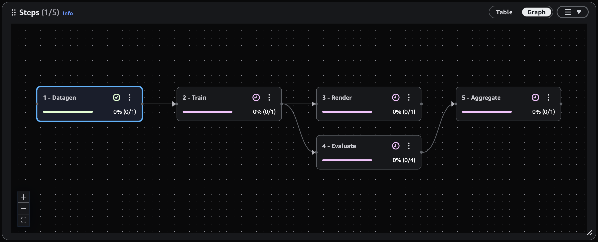

# View step dependencies as a graph

The **Steps** list can show your steps as a table or as a
dependency graph. The graph shows each step as a node and each dependency as an arrow
that points from a step to the step that depends on it, so you can see the order in
which your steps run. Each node shows the step's name and run status.

###### To view the step dependency graph

1. Select a job from the **Jobs** list.
2. At the top of the **Steps** list, choose
   **Graph**. To return to the table, choose
   **Table**.
   In the graph, you can do the following:

- Choose a node to select its step. The **Tasks** list then
  shows the tasks in that step.
- On a node, choose the actions menu, then choose **View step
  dependencies** to filter the panel to the steps that the selected
  step depends on and the steps that depend on it.
  If a job has no step dependencies, the graph reports that none were found. Jobs with
  dependencies are created by workflows that submit dependent steps, such as a job that
  renders frames and then publishes the result.
