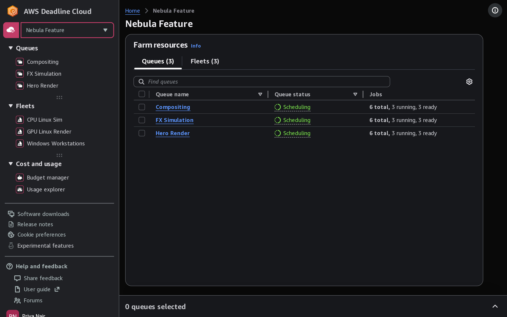
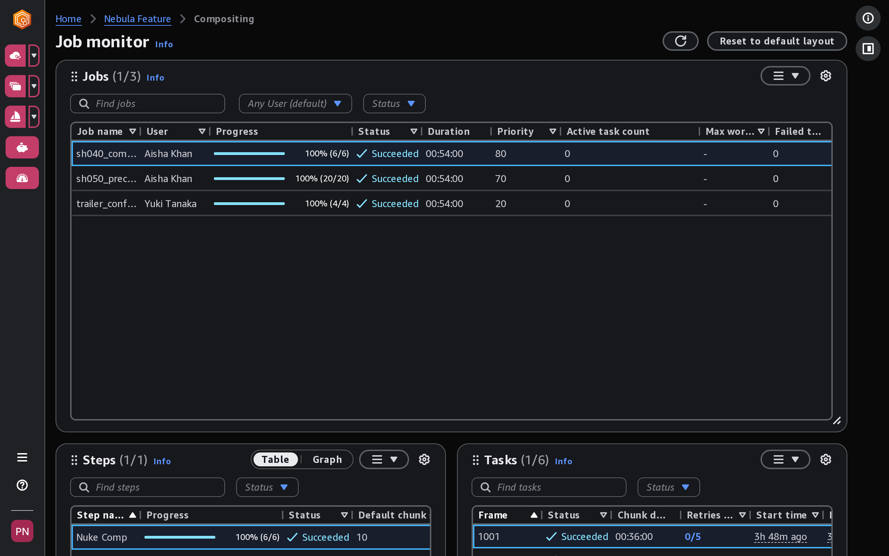

# Using the Deadline Cloud monitor

The AWS Deadline Cloud monitor provides you with an overall view of your visual compute jobs. You
can use it to monitor and manage jobs, view worker activity on fleets, track budgets and
usage, and to download a job's results.

When you open a farm, the monitor lists its queues and fleets. The navigation pane
provides access to each queue's job monitor and to the cost and usage tools.

Each queue has a job monitor that shows you the status of jobs, steps, and tasks. The
monitor provides ways to manage jobs directly from the monitor. You can make prioritization
changes, cancel jobs, requeue jobs, and resubmit jobs.

The Deadline Cloud monitor has a table that shows summary status for a job, or you can select a job to see
detailed task logs that help troubleshoot issues with a job.

You can use the Deadline Cloud monitor to download the results to the location on your workstation that
was specified when the job was created.

The Deadline Cloud monitor also helps you monitor usage and manage costs. For more information, see [Track spending and usage for Deadline Cloud farms](manage-costs.md "manage-costs.md").

###### Topics

- [Monitors and farms in multiple Regions](monitors-additional-regions.md "monitors-additional-regions.md")
- [Share the Deadline Cloud monitor URL](share-monitor-url.md "share-monitor-url.md")
- [Open the Deadline Cloud monitor](open-deadline-cloud-monitor.md "open-deadline-cloud-monitor.md")
- [Submit a job bundle](submit-job-bundle-monitor.md "submit-job-bundle-monitor.md")
- [View queue and fleet details in Deadline Cloud](view-queue-and-fleet.md "view-queue-and-fleet.md")
- [Manage jobs, steps, and tasks in Deadline Cloud](view-jobs-steps-tasks.md "view-jobs-steps-tasks.md")
- [View and manage job details in Deadline Cloud](view-a-job.md "view-a-job.md")
- [Customize the panels in the job monitor](customize-job-monitor-panels.md "customize-job-monitor-panels.md")
- [View a step in Deadline Cloud](view-a-step.md "view-a-step.md")
- [View a task in Deadline Cloud](view-a-task.md "view-a-task.md")
- [View session and worker logs in Deadline Cloud](view-logs.md "view-logs.md")
- [View worker details in the worker dashboard](view-worker-dashboard.md "view-worker-dashboard.md")
- [Download finished output in Deadline Cloud](download-finished-output.md "download-finished-output.md")
- [View output download status in Deadline Cloud](auto-downloads-status.md "auto-downloads-status.md")
- [Browsing job attachments in Deadline Cloud](browse-job-attachments.md "browse-job-attachments.md")
- [Automate Deadline Cloud monitor desktop deployment and workflows](monitor-automate-desktop.md "monitor-automate-desktop.md")
- [Manage cookie preferences in the Deadline Cloud monitor](monitor-cookie-preferences.md "monitor-cookie-preferences.md")
