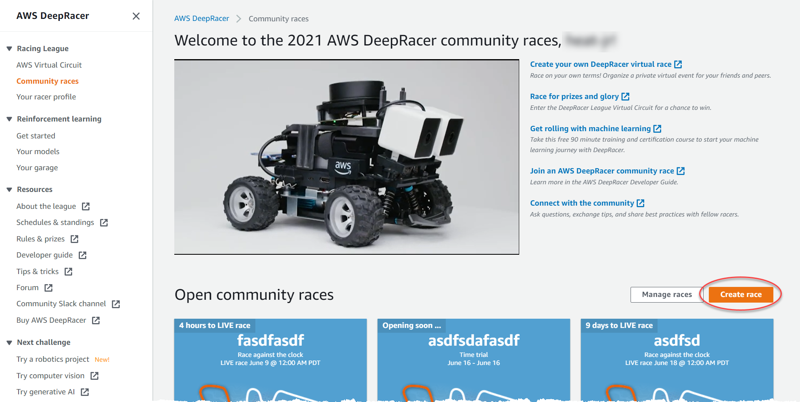
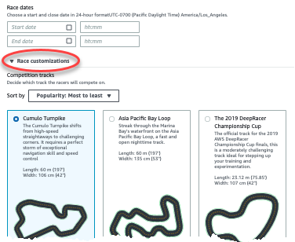
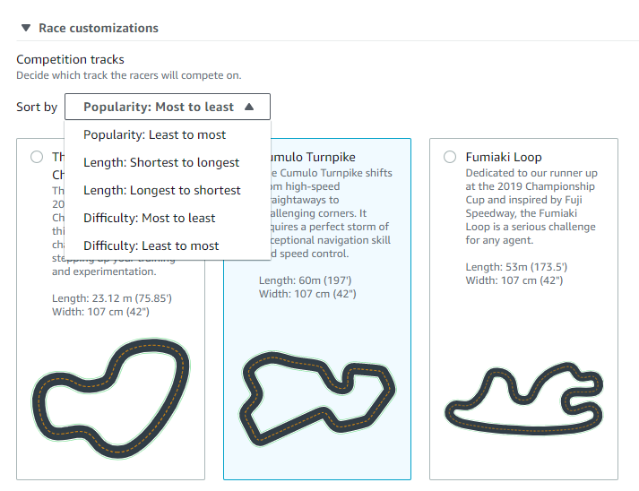
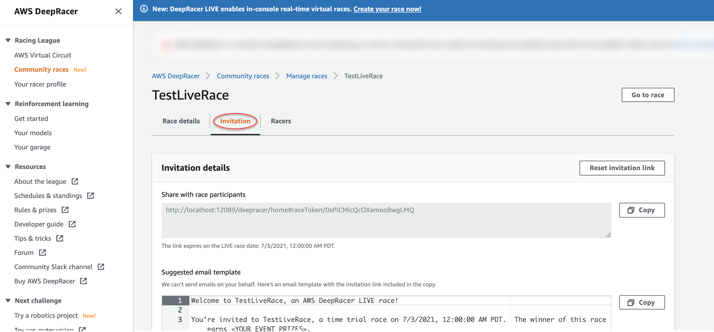
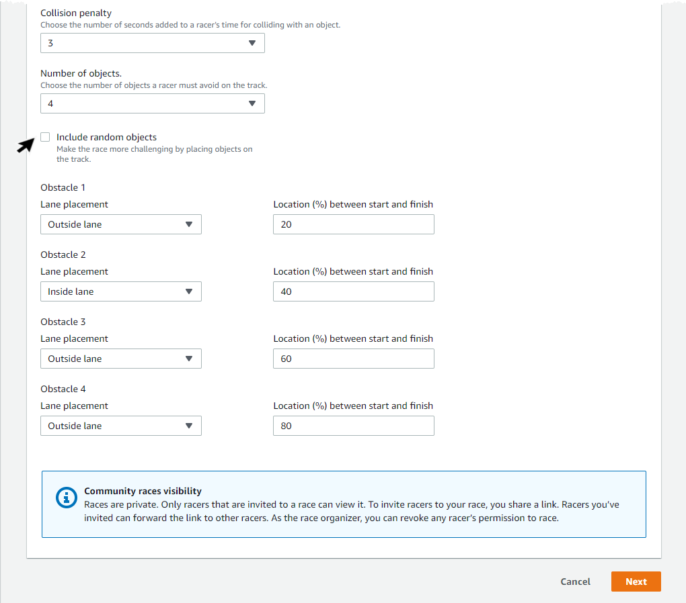
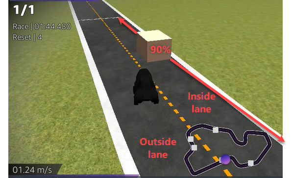
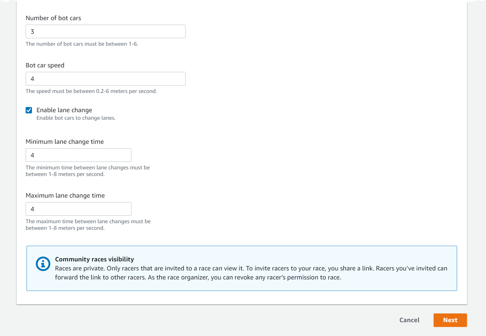

# Customize a race

To create a race that is tailored for your group, expand **Race customizations** on the
**Race details** page. The settings for a time trial race also apply to object avoidance and
head-to-bot races, but object avoidance and head-to-bot race types have additional settings that give you the control
to create race environments specially tuned to your event goals.

###### To customize a race

1. Open the [AWS DeepRacer console](https://console.aws.amazon.com/deepracer "https://console.aws.amazon.com/deepracer").
2. Choose **Community races**.
3. On the **Community races** page, choose **Create race**.

 4. On the **Race details** page, choose a competition format: a **Classic
race**, in which your guests can participate on their own schedule within the time frame you
set, or a **LIVE race**, which can be broadcast privately or publicly as a real-time
event. 5. Based on your competition format choice, follow steps 1-3 of **To continue creating a Classic
race** or **To continue creating a LIVE race** in [Create a virtual community race: a quick start guide](deepracer-create-community-race.md "deepracer-create-community-race.md") . 6. After choosing your **Race dates**, expand **Race customizations**.

 7. Choose a competition track. You can sort tracks by **Popularity: Most to least/Least to
most**, **Difficulty: Most to least/Least to most**, and **Length:
Longest to shortest/shortest to longest**. To see all tracks in each category, choose
**View more race track options**. To close the expanded menu, choose **View fewer
race track options**.

 8. Optionally, write a description for your race that summarizes the goals and rules of the event for
participants. For LIVE races, add the link for your event's video conference or LIVE stream. The description
appears in your leaderboard details. 9. For **Ranking method** for a classic race, choose between the **Best lap
time**, where the winner is the racer who posts the fastest lap; **average
time** where, after multiple attempts within the time-frame of the event, the winner is the
racer with the best average time; or **Total time**, where the winner is the racer with the
fastest overall average. Leaderboard standings for all LIVE races are ranked by best lap time so this field
does not appear. 10. For classic races, choose a value for **Minimum laps**, which is the number of consecutive
laps a racer must complete to qualify for submission of the result to the race's leaderboard. For a beginners'
race, choose a smaller number. For advanced users, choose a larger number. This customization is not available
for LIVE races because the default is one lap. 11. For **Off-track penalty**, choose the number of seconds to add to a racer's time when their
RL model drives off track. 12. You have now completed all the customization options for a **Time trial** race. If you
chose a **Time trial** race format, choose **Next** to review race details.
If you chose an [Object Avoidance](#object-avoidance-customizations "#object-avoidance-customizations") or [Head-to-bot](#head-to-bot-customizations "#head-to-bot-customizations") race format, skip to the appropriate procedure to
finish customizing your race. 13. On the **Review race details** page, review the race specifications. To make changes,
choose **Edit** or **Previous** to return to the **Race
details** page. When you're ready to get the invitation link, choose
**Submit**. 14. To share your race, choose **Copy invitation link** on the modal to your clipboard and
paste it into emails, text messages, and your favorite social media applications. You can also choose the
**Invitation tab** to share your race on the **<Your Race Name>**
page. The link expires on the race's close date.

 15. Choose **Done**. The **Manage races** page is displayed.
To learn how to use our email template to invite new racers, remove racers from your race, check on racers' model
submission status and more, see [Manage Community Races](deepracer-manage-community-races.md "deepracer-manage-community-races.md").

###### To finish customizing an object avoidance race

1. For **Collision penalty**, choose the number of seconds added to a racer's time for
   colliding with an object or bot. The more seconds added the greater the challenge.

 2. For **Number of objects**, choose how many obstacles a racer must avoid on the track. The
more objects, the more difficult the race. 3. To add random objects to the race track which will populate in different places for each racer, choose
**Include random objects**. This is more challenging for participants, because it takes
training for longer periods of time and reward function trial and error to create RL models that generalize
well to random events like unexpected objects on a race track. 4. Choose where to place each object by choosing a lane number or object location for **Lane
placement**. The track is divided in half at the center line, creating inside and outside lanes.
You can place an object on either the inside or outside lane.

 5. For each object, choose a value for **Location (%) between start and finish**. The number
represents the location, represented as a percentage, between the starting and finish lines of your track
where you want to place the object. 6. You have now completed all the unique customization options for an object avoidance race. Choose
**Next**. 7. On the **Review race details** page, review the race specifications. To make changes,
choose **Edit** or **Previous** to return to the **Race
details** page. When you're ready to get the invitation link, choose
**Submit**. 8. To share your race, choose **Copy invitation link** and paste it into emails, text
messages, and your favorite social media applications. All races are private and can be seen only by racers
with the invitation link. The link expires on the race's close date. 9. Choose **Done**. The **Manage races** page is displayed.
To learn about what you can do with your race, see [Manage Community
Races](deepracer-manage-community-races.md "deepracer-manage-community-races.md").

###### To finish customizing a head-to-bot race

1. For **Number of bot cars**, choose the number of cars you want to race against your
   participants' AWS DeepRacer RL models. Bot cars are similar to video game AI vehicles. They are random objects that
   move, so they are a step up in complexity from stationary objects. The more bots on the track, the more
   challenging the race. Choose up to six.

 2. For **Bot car speed**, choose how fast you want the bot cars to move around the track.
Speed is measured in meters per second. The speed must be between 0.2 – 6 meters per second. 3. If you want to allow bots to change lanes, which adds further complexity to the challenge for your racers'
AWS DeepRacer RL models, choose **Enable lane change**. 4. For **Minimum lane change time** , choose the minimum number of seconds that pass between
instances where the bot cars change lanes. 5. For **Maximum lane change time**, choose the maximum number of seconds that pass between
instances where the bot cars change lanes. 6. You have now completed all the unique customization options for a head-to-bot race. Choose
**Next**. 7. On the **Review race details** page, review the race specifications. To make changes,
choose **Edit** or **Previous** to return to the **Race
details** page. When you're ready to get the invitation link, choose
**Submit**. 8. To share your race, choose **Copy invitation link** and paste it into emails, text
messages, and your favorite social media applications. All races are private and can be seen only by racers
with the invitation link. The link expires on the race's close date. 9. Choose **Done**. The **Manage races** page is displayed.
To learn about how you can edit and erase your race, see [Manage
Community Races](deepracer-manage-community-races.md "deepracer-manage-community-races.md").
