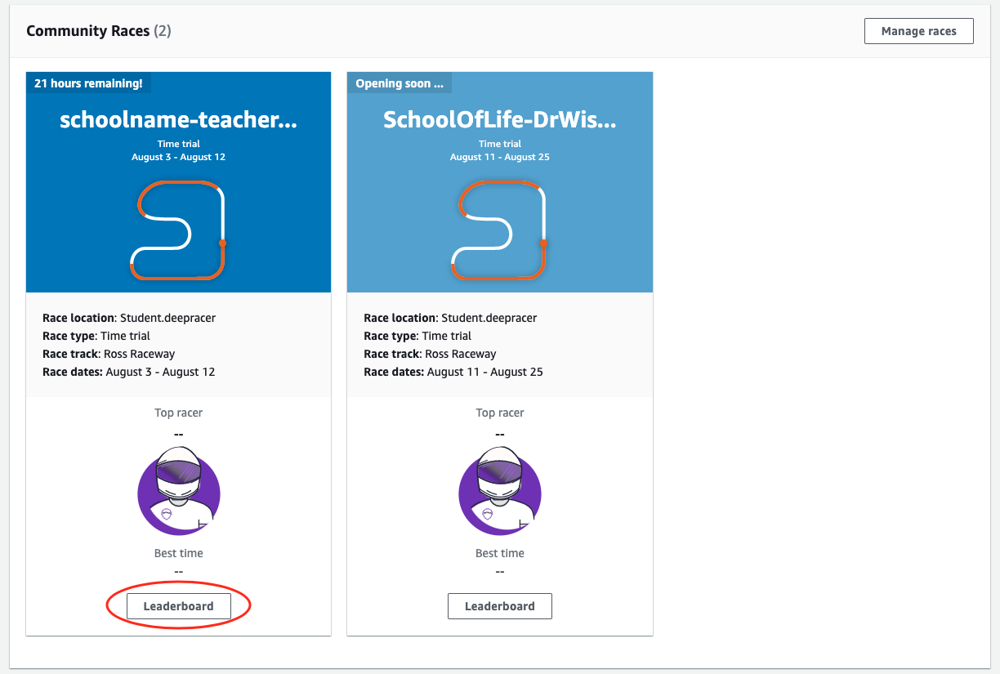
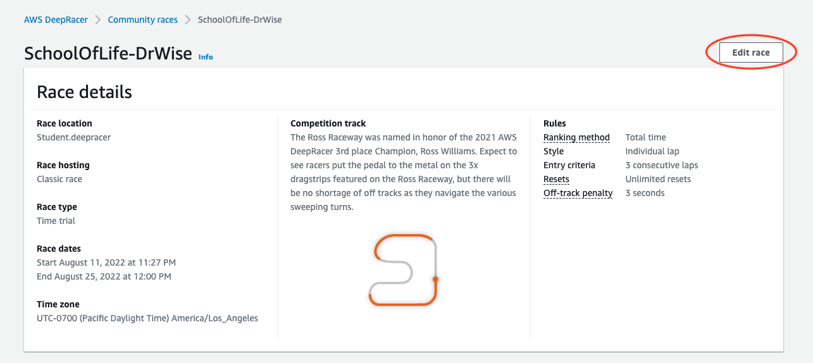
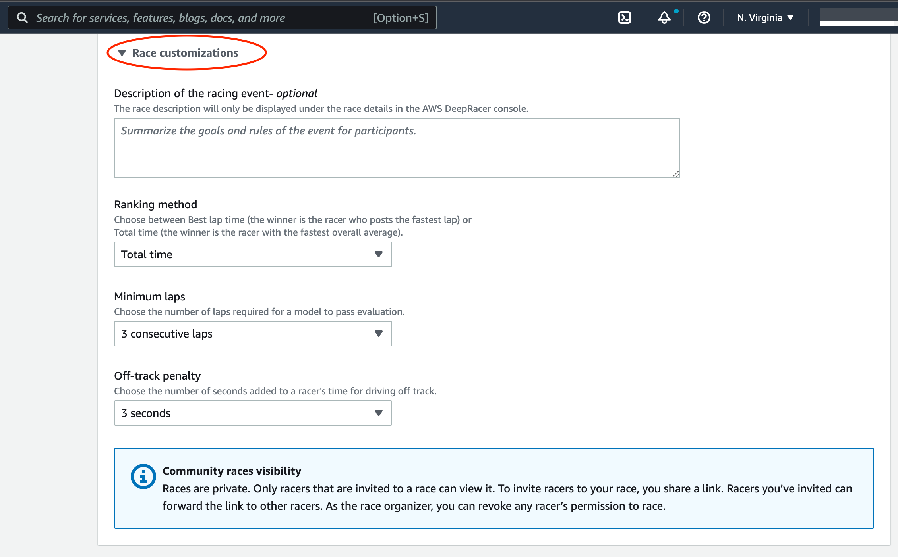

# Customize an AWS DeepRacer Student community

race

To create a race that is tailored for your group, add customizations that increase or decrease a race's complexity and challenge.

###### To customize a student race

1. Open the [AWS DeepRacer console](https://console.aws.amazon.com/deepracer "https://console.aws.amazon.com/deepracer").
2. Choose **Community races**.
3. On the **Community races** page, choose the **Leaderboard** for the race you want to customize.

 4. On the **Race details** page, choose **Edit race**.

 5. Expand **Race customizations**.

 6. Optionally, write a description for your race that summarizes the goals and rules of the event for
participants. The description
will appear in your leaderboard details. 7. For **Ranking method** for a classic race, choose between the
**Best lap time**, where the winner is the racer who posts
the fastest lap; **average time**, where, after multiple
attempts within the time-frame of the event, the winner is the racer with the
best average time; or **Total time**, where the winner is the
racer with the fastest overall average. 8. Choose a value for **Minimum laps**, which is the number of consecutive
laps a racer must complete to qualify for submission of the result to the race's leaderboard. For a beginners'
race, choose a smaller number. For advanced users, choose a larger number. 9. For **Off-track penalty**, choose the number of seconds to add to a racer's time when their
RL model drives off track. 10. You have now completed all the customization options for your student
community race. Choose **Next** to review the race details. 11. On the **Review race details** page, review the race specifications. To make changes,
choose **Edit** or **Previous** to return to the **Race
details** page. When you're ready to get the invitation link, choose
**Submit**. 12. Choose **Done**. The **Manage races** page is displayed.
To learn how to use our email template to invite new racers, remove racers from your race, check on racers' model
submission status and more, see [Manage Community Races](deepracer-manage-community-races.md "deepracer-manage-community-races.md").
