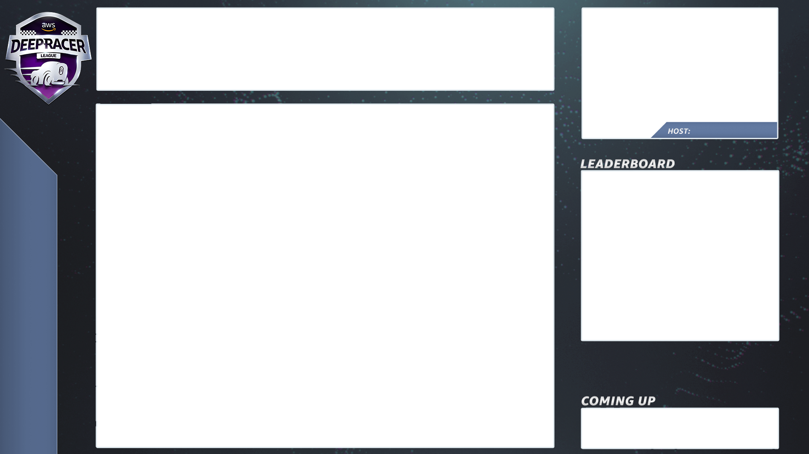

# Broadcast a LIVE community race using AWS DeepRacer League production

playbooks

LIVE races are real-time events that occur at a designated date and time. They range in scope from small events with
one race organizer facilitating one private video conference to large events broadcast publicly by a small team of
organizers, commentators, and broadcasters using a LIVE streaming service like Twitch.

## Organizer roles

The following are suggested roles organizers can play during an AWS DeepRacer LIVE event. The more complex the event you
plan, the more help you may need to enlist.

###### Organizers

Race organizers set up the race and associated video conference to organize and guide the racers. During a
LIVE race, organizers use the organizer controls to queue, launch racers, and call a winner. Organizers do not
appear on the LIVE channel.

###### Commentators

Commentators discuss the race while it’s happening, providing a play-by-play of events, additional
information, and inside knowledge of the event and its participants. Commentators are the main speakers of the
public event.

###### Broadcasters

Broadcasters use streaming software to create scenes ahead of time and transition through them during the
LIVE race. A broadcaster also manages the video feeds. The broadcasters do not appear on the LIVE channel.
They act as producer of content during the event.

## Broadcaster scenes

The LIVE stream of an AWS DeepRacer event tells the story of your race. To promote engagement throughout the beginning,
middle, and end of your event, use _scenes_. These are animations and layouts
composed of graphic overlays and video streams that punctuate the different segments of your event.

An _overlay_ is a graphic (usually a transparent PNG file) that sits on top of
the broadcaster mode window of your race and the (optional) webcam streams or your commentators. It’s like a mask
for your stream. Position your content underneath it so everything lines up seamlessly to create one unified
layout.

Use streaming software, such as OBS, to set up your scenes before your broadcast. Smoothly transition through
them during the event to create dynamic pacing and audience delight. For example, use an intro animation scene to
kickoff the event. Then transition to your primary content scene (PCS), which is the main layout containing the
race view and one or two windows for commentators. Cut to a full screen dual commentator or commentator and
interviewee scene to keep things lively, and end with a leaderboard scene. Optionally, create commercial scenes to
cut in between races.

## AWS DeepRacer scene templates

The AWS DeepRacer League Virtual Circuit team has created a collection of template files for you to use for your LIVE community
races. Download the [AWS DeepRacer Scene Templates](samples/AWS_DeepRacer_Twitch_Frames.md "samples/AWS_DeepRacer_Twitch_Frames.md") and use them
to broadcast a professional-looking event.

###### Scene types and how to use them

1. Intro AWS DeepRacer shield animation
2. Console share only view:
   - Base layer - screen share of the broadcaster mode url of your race. Resize it to fit frames of
     scene.

3. Single commentator view (1up):
   - Base layer - screen share of the broadcaster mode url of your race. Resize it to fit frames of
     scene.
   - Next layer - OBS Ninja or local webcam if commentator you are filming is in the same room. Pull
     in and resize under scene frame in upper right picture in picture (PIP) window.

4. Commentator plus interviewee or dual commentator (2up):
   - Base layer - screen share of the broadcaster mode url of your race. Resize it to fit frames of
     scene.
   - Next layer - OBS Ninja or local webcam if commentator you are filming is in the same room. Pull
     in and resize under scene frame in upper right picture in picture (PIP) window.
   - Pull in dual webcam feeds or ninja feeds into upper right windows resizing to fit (in setup a
     week before your event - AV check all your feeds and assign cameras in OBS)

5. Dual commentator full screen (no racing view; interview only):
   - No base layer console; only two camera feeds.

6. Ending leaderboards:
   - In real time, manually enter leaderboard results over scene layer.

###### AWS DeepRacer scene template file tips

- 34 - Configure your titles for commentators (prebuild scenes with names in PIPs)
- 234 - Racing views
  - Consider replacing the AWS DeepRacer League logo in the upper left with your company
    logo.
  - Replace the text in the lower left with your race name and your info in the vertical
    text.

An AWS DeepRacer LIVE Community Race Private Broadcast is a good fit for a small, informal race.

###### Organizer roles

- For a standard race you only need one organizer.

###### Hardware

- Recommended hardware - minimum 16 GB of ram
- (Optional) Quality microphones, headsets, or AirPods
- (Optional) LED ring light - To avoid seeing the ring light reflected on eyeglasses, position it at
  an angle to wearer’s face.
- (Optional) Webcams and GoPros - to diversify footage

###### Tips

- Use a Chrome or Firefox browser (Check that your browser is up to date)
- Disconnect from VPN if using
- Close all extra tabs

###### To run a private LIVE AWS DeepRacer event

1. Open the [AWS DeepRacer console](https://console.aws.amazon.com/deepracer "https://console.aws.amazon.com/deepracer").
2. Choose **Community races.**
3. On the Community races page, choose **Create race**.
4. Decide which date and time you would like to host a standard LIVE community race.
5. Before following the steps to create a LIVE community race, under Race date, check to see that this
   time frame is available. LIVE community races can be as long as four hours. Contact customer support
   to schedule a longer race.
6. When you settle on an available date time, create a corresponding video conference for race
   organizers and participants. If you are running a small race with little to no audience, one video
   conference is all you need. If you’d like to run a larger private race, create another video
   conference for broadcasting your race to an audience.
7. Follow the steps in [Create a virtual community race: a quick start guide](deepracer-create-community-race.md "deepracer-create-community-race.md") and select **To
   continue creating a LIVE race**.
   1. Optionally, on step 8, choose **Copy** next to the **Suggested
      email template** and create an email for racers and race organizers. Fill in your
      prizes, model submission time frame, and the conference bridge link where your racers will
      meet to queue up and prepare for the race.

8. On race day, follow instructions to [Run a LIVE AWS DeepRacer community race](deepracer-moderate-live-community-race.md "deepracer-moderate-live-community-race.md").
9. Distribute prizes, if any, to race participants.
   An AWS DeepRacer LIVE community race premium broadcast uses multiple broadcast scenes, a crew of three or more to
   broadcast a race on a global streaming platform. The following instructions use Twitch as an example.

###### Organizer roles

- Organizers
- Commentators/MC
- Broadcasters
- Twitch moderator - optional

###### Hardware

- Recommended hardware: You should have a minimum of 16 GB of RAM
- (Optional) Quality microphones, headsets, or AirPods
- (Optional) LED ring light: To avoid seeing the ring light reflected on eyeglasses, position it at
  an angle to wearer’s face.
- (Optional) Webcams and GoPros: Use these to diversify footage.

###### Tips

- Use a Chrome or Firefox browser (Check that your browser is up to date).
- Disconnect from VPN if you're using one.
- Close all extra tabs.

###### Prerequisites

- [Twitch account](https://www.twitch.tv/ "https://www.twitch.tv/") - LIVE video streaming service.
- Twitch stream key - lets the software know where to send your video.
- [Open Broadcaster Software (OBS)](https://obsproject.com/ "https://obsproject.com/") - Free and open source
  software for video recording and LIVE streaming.
- (Optional) [VDO Ninja (formerly OBS Ninja)](https://vdo.ninja/ "https://vdo.ninja/") - Tool for adding
  and switching to and from additional video feeds if you opt to include commentators and interviewees.

###### To run a public LIVE AWS DeepRacer event

1. Set up a [Twitch](https://www.twitch.tv/ "https://www.twitch.tv/") account by following the steps in [How to sign
   up for a Twitch account](https://help.twitch.tv/s/article/creating-an-account-with-twitch?language=en_US "https://help.twitch.tv/s/article/creating-an-account-with-twitch?language=en_US").
2. Locate your Twitch stream key. Learn how to find your [Twitch Steam
   key](https://www.businessinsider.com/how-to-find-twitch-stream-key "https://www.businessinsider.com/how-to-find-twitch-stream-key").
3. Download [Open Broadcaster Software (OBS)](https://obsproject.com/ "https://obsproject.com/").
4. Learn how to use [OBS](https://obsproject.com/wiki/OBS-Studio-Overview "https://obsproject.com/wiki/OBS-Studio-Overview") to manage
   your scenes. Set them up ahead of time. We recommend preparing your assets at least one week before
   your race:
   1. Download the included AWS DeepRacer scene templates.
   2. Load scenes and modify them.
   3. Update the source with your race URL.
   4. Check your cameras.
   5. Assign people to their feeds.

5. Optionally, if commentators and interviewee are part of your broadcast event, use [VDO Ninja (formerly OBS Ninja)](https://vdo.ninja/ "https://vdo.ninja/") to manage multiple video feeds.
   Learn how to use [OBS Ninja](https://youtu.be/vLpRzMjUDaE "https://youtu.be/vLpRzMjUDaE") .
6. Navigate to the [AWS DeepRacer
   console](https://console.aws.amazon.com/deepracer/home?region=us-east-1#getStarted "https://console.aws.amazon.com/deepracer/home?region=us-east-1#getStarted") to create a race.
7. Choose **Community races**.
8. On the **Community races** page, choose **Create race**.
9. Decide on which date and time you would like to host a public LIVE community race.
10. Before following the steps to create a LIVE community race, under **Race date**,
    check to see that this time frame is available. LIVE community races have a default duration of four
    hours. Contact customer support to schedule a longer race. There is no action to take if your LIVE
    race is shorter than four-hours.
11. When you settle on an available date and time, create a corresponding video conference for race
    organizers and participants.
12. Next, create another video conference for your broadcasters.
13. Follow the steps to set up a LIVE community race.
    1. Optionally, on step 8, under Description of race, add the link for your LIVE stream for
       racers to share with their families and friends. You may also include the racer room
       conference bridge for racers. The description will appear in your leaderboard details
       providing easy access to the links.
    2. Optionally, on step 12, choose **Copy** next to the **Suggested
       email template** and create an email for racers and race organizers. Fill in your
       prizes, model submission time frame, and the conference bridge link where your racers will
       meet to queue up and prepare for the race.
    3. Create another email or chat for your team of organizers.

14. On the race day, follow instructions to [Run a LIVE AWS DeepRacer community race](deepracer-moderate-live-community-race.md "deepracer-moderate-live-community-race.md")
15. Celebrate winners and participants, distribute prizes, write blogs, tweet, post, and proliferate.
