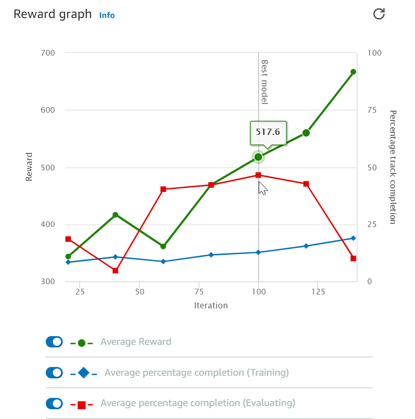

# Train and evaluate AWS DeepRacer models using the AWS DeepRacer console

To train a reinforcement learning model, you can use the AWS DeepRacer console. In the console,
create a training job, choose a supported framework and an available algorithm, add a reward
function, and configure training settings. You can also watch training proceed in a
simulator. You can find the step-by-step instructions in [Train your first AWS DeepRacer model](deepracer-get-started-training-model.md "deepracer-get-started-training-model.md") .

This section explains how to train and evaluate an AWS DeepRacer model. It also shows how to create
and improve a reward function, how an action space affects model performance, and how
hyperparameters affect training performance. You can also learn how to clone a training
model to extend a training session, how to use the simulator to evaluate training
performance, and how to address some of the simulation to real-world challenges.

###### Topics

- [Create your reward
  function](#deepracer-train-models-define-reward-function "#deepracer-train-models-define-reward-function")
- [Explore action
  space to train a robust model](#deepracer-define-action-space-for-training "#deepracer-define-action-space-for-training")
- [Systematically tune hyperparameters](#deepracer-iteratively-adjust-hyperparameters "#deepracer-iteratively-adjust-hyperparameters")
- [Examine AWS DeepRacer training job progress](#deepracer-examine-training-progress "#deepracer-examine-training-progress")
- [Clone a trained model to start a new
  training pass](#deepracer-clone-trained-model "#deepracer-clone-trained-model")
- [Evaluate AWS DeepRacer models in
  simulations](#deepracer-evaluate-models-in-simulator "#deepracer-evaluate-models-in-simulator")
- [Optimize training AWS DeepRacer
  models for real environments](#deepracer-evaluate-model-test-approaches "#deepracer-evaluate-model-test-approaches")

## Create your reward

function

A
[reward
function](deepracer-reward-function-reference.md "deepracer-reward-function-reference.md") describes immediate feedback (as a reward or penalty score) when
your AWS DeepRacer vehicle moves from one position on the track to a new position. The function's
purpose is to encourage the vehicle to make moves along the track to reach a destination
quickly without accident or infraction. A desirable move earns a higher score for the
action or its target state. An illegal or wasteful move earns a lower score. When
training an AWS DeepRacer model, the reward function is the only application-specific
part.

In general, you design your reward function to act like an incentive plan. Different
incentive strategies could result in different vehicle behaviors. To make the vehicle
drive faster, the function should give rewards for the vehicle to follow the track. The
function should dispense penalties when the vehicle takes too long to finish a lap or
goes off the track. To avoid zig-zag driving patterns, it could reward the vehicle to
steer less on straighter portions of the track. The reward function might give positive
scores when the vehicle passes certain milestones, as measured by [waypoints](deepracer-reward-function-input.md "deepracer-reward-function-input.md"). This could
alleviate waiting or driving in the wrong direction. It is also likely that you would
change the reward function to account for the track conditions. However, the more your
reward function takes into account environment-specific information, the more likely
your trained model is over-fitted and less general. To make your model more generally
applicable, you can explore [action space](#deepracer-define-action-space-for-training "#deepracer-define-action-space-for-training").

If an incentive plan is not carefully considered, it can lead to [unintended consequences of opposite
effect](https://en.wikipedia.org/wiki/Cobra_effect "https://en.wikipedia.org/wiki/Cobra_effect"). This is possible because the immediate feedback is a necessary but
not sufficient condition for reinforcement learning. An individual immediate reward by
itself also can’t determine if the move is desirable. At a given position, a move can
earn a high reward. A subsequent move could go off the track and earn a low score. In
such case, the vehicle should avoid the move of the high score at that position. Only
when all future moves from a given position yield a high score on average should the
move to the next position be deemed desirable. Future feedback is discounted at a rate
that allows for only a small number of future moves or positions to be included in the
average reward calculation.

A good practice to create a
[reward
function](deepracer-reward-function-reference.md "deepracer-reward-function-reference.md") is to start with a simple one that covers basic scenarios. You can
enhance the function to handle more actions. Let's now look at some simple reward
functions.

###### Topics

- [Simple reward function
  examples](#deepracer-reward-function-simple-examples "#deepracer-reward-function-simple-examples")
- [Enhance your reward
  function](#deepracer-iteratively-enhance-reward-functions "#deepracer-iteratively-enhance-reward-functions")

### Simple reward function

examples

We can start building the reward function by first considering the most basic
situation. The situation is driving on a straight track from start to finish without
going off the track. In this scenario, the reward function logic depends only
`on_track` and `progress`. As a trial, you could start
with the following logic:

```
def reward_function(params):
    if not params["all_wheels_on_track"]:
        reward = -1
    else if params["progress"] == 1 :
        reward = 10
    return reward
```

This logic penalizes the agent when it drives itself off the track. It rewards the
agent when it drives to the finishing line. It's reasonable for achieving the stated
goal. However, the agent roams freely between the starting point and the finishing
line, including driving backwards on the track. Not only could the training take a
long time to complete, but also the trained model would lead to less efficient
driving when deployed to a real-world vehicle.

In practice, an agent learns more effectively if it can do so bit-by-bit
throughout the course of training. This implies that a reward function should give
out smaller rewards step by step along the track. For the agent to drive on the
straight track, we can improve the reward function as follows:

```
def reward_function(params):
    if not params["all_wheels_on_track"]:
        reward = -1
    else:
        reward = params["progress"]
    return reward
```

With this function, the agent gets more reward the closer it reaches the
finishing line. This should reduce or eliminate unproductive trials of driving
backwards. In general, we want the reward function to distribute the reward more
evenly over the action space. Creating an effective reward function can be a
challenging undertaking. You should start with a simple one and progressively
enhance or improve the function. With systematic experimentation, the function can
become more robust and efficient.

### Enhance your reward

function

After you have successfully trained your AWS DeepRacer model for the simple straight track,
the AWS DeepRacer vehicle (virtual or physical) can drive itself without going off the track.
If you let the vehicle run on a looped track, it won't stay on the track. The reward
function has ignored the actions to make turns to follow the track.

To make your vehicle handle those actions, you must enhance the reward function.
The function must give a reward when the agent makes a permissible turn and produce
a penalty if the agent makes an illegal turn. Then, you're ready to start another
round of training. To take advantage of the prior training, you can start the new
training by cloning the previously trained model, passing along the previously
learned knowledge. You can follow this pattern to gradually add more features to the
reward function to train your AWS DeepRacer vehicle to drive in increasingly more complex
environments.

For more advanced reward functions, see the following examples:

- [Example 1: Follow the center line in time trials](deepracer-reward-function-examples.md#deepracer-reward-function-example-0 "deepracer-reward-function-examples.md#deepracer-reward-function-example-0")
- [Example 2: Stay inside the two borders in time trials](deepracer-reward-function-examples.md#deepracer-reward-function-example-1 "deepracer-reward-function-examples.md#deepracer-reward-function-example-1")
- [Example 3: Prevent zig-zag in time trials](deepracer-reward-function-examples.md#deepracer-reward-function-example-2 "deepracer-reward-function-examples.md#deepracer-reward-function-example-2")
- [Example 4: Stay in one lane
  without crashing into stationary obstacles or moving vehicles](deepracer-reward-function-examples.md#deepracer-reward-function-example-3 "deepracer-reward-function-examples.md#deepracer-reward-function-example-3")

## Explore action

space to train a robust model

As a general rule, train your model to be as robust as possible so that you can
apply it to as many environments as possible. A robust model is one that can be applied
to a wide range of track shapes and conditions. Generally speaking, a robust model is
not "smart" because its reward function does not have the ability to contain explicit
environment-specific knowledge. Otherwise, your model is likely to be applicable only to
an environment similar to the trained one.

Explicitly incorporating environment-specific information into the reward function
amounts to feature engineering. Feature engineering helps reduce training time and can
be useful in solutions tailor made to a particular environment. To train a model of the
general applicability though, you should refrain from attempting a lot of feature
engineering.

For example, when training a model on a circular track, you can't expect to
obtain a trained model applicable to any non-circular track if you have such
geometric properties explicitly incorporated into the reward function.

How would you go about training a model as robust as possible while keeping the
reward function as simple as possible? One way is to explore the action space spanning
the actions your agent can take. Another is to experiment with [hyperparameters](#deepracer-iteratively-adjust-hyperparameters "#deepracer-iteratively-adjust-hyperparameters") of
underlying training algorithm. Often times, you do both. Here, we focus on how to
explore the action space to train a robust model for your AWS DeepRacer vehicle.

In training an AWS DeepRacer model, an action (`a`) is a combination of
speed (`t` meters per second) and steering angle (`s` in degrees).
The action space of the agent defines the ranges of speed and steering angle the agent
can take. For a discrete action space of `m` number of speeds,
`(v1, .., vn)` and
`n` number of steering angles, `(s1, ..,
 sm)`, there are `m*n` possible actions
in the action space:

```
a1:           (v1, s1)
...
an:           (v1, sn)

...
a(i-1)\*n+j:   (vi, sj)
...

a(m-1)\*n+1:   (vm, s1)
...
am\*n:         (vm, sn)

```

The actual values of `(vi,
 sj)` depend on the ranges of
`vmax` and
`|smax|` and are not uniformly distributed.

Each time you begin training or iterating your AWS DeepRacer model, you must first
specify the `n`, `m`, `vmax` and
`|smax|` or agree to using their default
values. Based on your choice, the AWS DeepRacer service generates the available actions your
agent can choose in training. The generated actions are not uniformly distributed over
the action space.

In general, a larger number of actions and larger action ranges give your agent
more room or options to react to more varied track conditions, such as a curved track
with irregular turning angles or directions. The more options available to the agent,
the more readily it can handle track variations. As a result, you can expect that the
trained model to be more widely applicable, even when using a simple reward function .

For example, your agent can learn quickly to handle straight-line track using a
coarse-grained action space with small number of speeds and steering angles. On a curved
track, this coarse-grained action space is likely to cause the agent to overshoot and go
off the track while it turns. This is because there are not enough options at its
disposal in order to adjust its speed or steering. Increase the number of speeds or the
number of steering angles or both, the agent should become more capable of maneuvering
the curves while keeping on the track. Similarly, if your agent moves in a zig-zag
fashion, you can try to increase the number of steering ranges to reduce drastic turns
at any given step.

When the action space is too large, training performance may suffer, because it
takes longer to explore the action space. Be sure to balance the benefits of a model's
general applicability against its training performance requirements. This optimization
involves systematic experimentation.

## Systematically tune hyperparameters

One way to improve your model's performance is to enact a better or more effective
training process. For example, to obtain a robust model, training must provide your
agent more or less evenly distributed sampling over the agent's action space. This
requires a sufficient mix of exploration and exploitation. Variables affecting this
include the amount of training data used (`number of episodes between each
 training` and `batch size`), how fast the agent can learn
(`learning rate`), the portion of exploration (`entropy`). To
make training practical, you may want to speed the learning process. Variables affecting
this include `learning rate`, `batch size`, `number of
 epochs` and `discount factor`.

The variables affecting the training process are known as hyperparameters of the
training. These algorithm attributes are not properties of the underlying model.
Unfortunately, hyperparameters are empirical in nature. Their optimal values are not
known for all practical purposes and require systematic experimentation to derive.

Before discussing the hyperparameters that can be adjusted to tune the performance
of training your AWS DeepRacer model, let's define the following terminology.

Data point

A data point, also known as an _experience_, it is a tuple of (_s,a,r,s’_), where _s_
stands for an observation (or state) captured by the camera, _a_ for an action taken by the vehicle,
_r_ for the expected reward
incurred by the said action, and _s’_
for the new observation after the action is taken.

Episode

An episode is a period in which the vehicle starts from a given
starting point and ends up completing the track or going off the track.
It embodies a sequence of experiences. Different episodes can have
different lengths.

Experience buffer

An experience buffer consists of a number of ordered data points
collected over fixed number of episodes of varying lengths during
training. For AWS DeepRacer, it corresponds to images captured by the camera
mounted on your AWS DeepRacer vehicle and actions taken by the vehicle and
serves as the source from which input is drawn for updating the
underlying (policy and value) neural networks.

Batch

A batch is an ordered list of experiences, representing a portion of
simulation over a period of time, used to update the policy network weights.
It is a subset of the experience buffer.

Training data

A training data is a set of batches sampled at random from an
experience buffer and used for training the policy network
weights.

| Algorithmic hyperparameters and their effects                            | Hyperparameters                                                                                                                                                                                                                                                                                                                                                                                                                                                                                                                                                                                                                                                                                                                                                                                                                                                                                                                                                                                                                                              | Description                                                                                                                                                                                                                                                                                                                                                                                                                                                                                                                                                                                                                                                                                                                                                                                                                                                                                                                                                                                                                                                                                                                                                                                                                                                                                                                                                                                                                                                                                                                                                                                                                                                                                                                                                                                                                                                                                                                                                                                                                                                                                                                                                                                                                                                                                                                                                                                                                                                                                                                                                                                                                                                                                                                                                                                                                                                                                                                                                                                                                                                                                                                                                                                                                                                                                                                                                                                                                                                                                                                                                                                                                                                                                                                                                                                                                                                                                                                                                                                                                                                                                                                                                                                                                                                                                                                                                                                                                                                                                                                                                                                                                                                                                                                                                                                                                                                                                                                                                                                                                                                                                                                                                                                                                                                                                                                                                                                                                                                                                                                                                                                                                                                                                                                                                                                                                                                                                                                                                                                                                                                                                                                                                                                                                                                                                                                                                                                                                                                                                                                                                                                                                                                                                                                                                                                                                                                                                                                                                                                                                                                                                                                                                                                                                                                                                                                                                                                                                                                                                                                                                                                                                                                                                                                                                                                                                                                                                                                                                                                                                                                                                                                                                                                                                                                                                                                                                                                                                                                                                                                                                                                                                                                                                                                                                                                                                                                                                                                                                                                                                                                                                                                                                                                                                                                                                                                                                                                                                                                                                                                                                                                                                                                                                                                                                                                                                                                                                                                                                                                                                                                                                                                                                                                                                                                                                                                                                                                                                                                                                                                                                                                                                                                                                                                                                                                                                                                                                                                                                                                                                                                                                                                                                                                                                                                                                                                                                                                                                                                                                                                                                                                                                                                                                                                                                                                                                                                                                                                                                                                                                                                                                                                                                                                                                                                                                                                                                                                                                                                                                                                                                                                                                                                                                                                                                                                                                                                                                                                                                                                                                                                                                                                                                                                                                                                                      |
| ------------------------------------------------------------------------ | ------------------------------------------------------------------------------------------------------------------------------------------------------------------------------------------------------------------------------------------------------------------------------------------------------------------------------------------------------------------------------------------------------------------------------------------------------------------------------------------------------------------------------------------------------------------------------------------------------------------------------------------------------------------------------------------------------------------------------------------------------------------------------------------------------------------------------------------------------------------------------------------------------------------------------------------------------------------------------------------------------------------------------------------------------------ | -------------------------------------------------------------------------------------------------------------------------------------------------------------------------------------------------------------------------------------------------------------------------------------------------------------------------------------------------------------------------------------------------------------------------------------------------------------------------------------------------------------------------------------------------------------------------------------------------------------------------------------------------------------------------------------------------------------------------------------------------------------------------------------------------------------------------------------------------------------------------------------------------------------------------------------------------------------------------------------------------------------------------------------------------------------------------------------------------------------------------------------------------------------------------------------------------------------------------------------------------------------------------------------------------------------------------------------------------------------------------------------------------------------------------------------------------------------------------------------------------------------------------------------------------------------------------------------------------------------------------------------------------------------------------------------------------------------------------------------------------------------------------------------------------------------------------------------------------------------------------------------------------------------------------------------------------------------------------------------------------------------------------------------------------------------------------------------------------------------------------------------------------------------------------------------------------------------------------------------------------------------------------------------------------------------------------------------------------------------------------------------------------------------------------------------------------------------------------------------------------------------------------------------------------------------------------------------------------------------------------------------------------------------------------------------------------------------------------------------------------------------------------------------------------------------------------------------------------------------------------------------------------------------------------------------------------------------------------------------------------------------------------------------------------------------------------------------------------------------------------------------------------------------------------------------------------------------------------------------------------------------------------------------------------------------------------------------------------------------------------------------------------------------------------------------------------------------------------------------------------------------------------------------------------------------------------------------------------------------------------------------------------------------------------------------------------------------------------------------------------------------------------------------------------------------------------------------------------------------------------------------------------------------------------------------------------------------------------------------------------------------------------------------------------------------------------------------------------------------------------------------------------------------------------------------------------------------------------------------------------------------------------------------------------------------------------------------------------------------------------------------------------------------------------------------------------------------------------------------------------------------------------------------------------------------------------------------------------------------------------------------------------------------------------------------------------------------------------------------------------------------------------------------------------------------------------------------------------------------------------------------------------------------------------------------------------------------------------------------------------------------------------------------------------------------------------------------------------------------------------------------------------------------------------------------------------------------------------------------------------------------------------------------------------------------------------------------------------------------------------------------------------------------------------------------------------------------------------------------------------------------------------------------------------------------------------------------------------------------------------------------------------------------------------------------------------------------------------------------------------------------------------------------------------------------------------------------------------------------------------------------------------------------------------------------------------------------------------------------------------------------------------------------------------------------------------------------------------------------------------------------------------------------------------------------------------------------------------------------------------------------------------------------------------------------------------------------------------------------------------------------------------------------------------------------------------------------------------------------------------------------------------------------------------------------------------------------------------------------------------------------------------------------------------------------------------------------------------------------------------------------------------------------------------------------------------------------------------------------------------------------------------------------------------------------------------------------------------------------------------------------------------------------------------------------------------------------------------------------------------------------------------------------------------------------------------------------------------------------------------------------------------------------------------------------------------------------------------------------------------------------------------------------------------------------------------------------------------------------------------------------------------------------------------------------------------------------------------------------------------------------------------------------------------------------------------------------------------------------------------------------------------------------------------------------------------------------------------------------------------------------------------------------------------------------------------------------------------------------------------------------------------------------------------------------------------------------------------------------------------------------------------------------------------------------------------------------------------------------------------------------------------------------------------------------------------------------------------------------------------------------------------------------------------------------------------------------------------------------------------------------------------------------------------------------------------------------------------------------------------------------------------------------------------------------------------------------------------------------------------------------------------------------------------------------------------------------------------------------------------------------------------------------------------------------------------------------------------------------------------------------------------------------------------------------------------------------------------------------------------------------------------------------------------------------------------------------------------------------------------------------------------------------------------------------------------------------------------------------------------------------------------------------------------------------------------------------------------------------------------------------------------------------------------------------------------------------------------------------------------------------------------------------------------------------------------------------------------------------------------------------------------------------------------------------------------------------------------------------------------------------------------------------------------------------------------------------------------------------------------------------------------------------------------------------------------------------------------------------------------------------------------------------------------------------------------------------------------------------------------------------------------------------------------------------------------------------------------------------------------------------------------------------------------------------------------------------------------------------------------------------------------------------------------------------------------------------------------------------------------------------------------------------------------------------------------------------------------------------------------------------------------------------------------------------------------------------------------------------------------------------------------------------------------------------------------------------------------------------------------------------------------------------------------------------------------------------------------------------------------------------------------------------------------------------------------------------------------------------------------------------------------------------------------------------------------------------------------------------------------------------------------------------------------------------------------------------------------------------------------------------------------------------------------------------------------------------------------------------------------------------------------------------------------------------------------------------------------------------------------------------------------------------------------------------------------------------------------------------------------------------------------------------------------------------------------------------------------------------------------------------------------------------------------------------------------------------------------------------------------------------------------------------------------------------------------------------------------------------------------------------------------------------------------------------------------------------------------------------------------------------------------------------------------------------------------------------------------------------------------------------------------------------------------------------------------------------------------------------------------------------------------------------------------------------------------------------------------------------------------------------------------------------------------------------------------------------------------------------------------------------------------------------------------------------------------------------------------------------------------------------------------------------------------------------------------------------------------------------------------------------------------------------------------------------------------------------------------------------------------------------------------------- |
| **Gradient descent batch size**                                          | The number recent vehicle experiences sampled at random from an experience buffer and used for updating the underlying deep-learning neural network weights. Random sampling helps reduce correlations inherent in the input data. Use a larger batch size to promote more stable and smooth updates to the neural network weights, but be aware of the possibility that the training may be longer or slower. Required Yes Valid values Positive integer of `(32, 64, 128, 256, 512)` Default value `64`                                                                                                                                                                                                                                                                                                                                                                                                                                                                                                                                                    |
| **Number of epochs**                                                     | The number of passes through the training data to update the neural network weights during gradient descent. The training data corresponds to random samples from the experience buffer. Use a larger number of epochs to promote more stable updates, but expect a slower training. When the batch size is small, you can use a smaller number of epochs Required No Valid values Positive integer between `[3 - 10]` Default value `3`                                                                                                                                                                                                                                                                                                                                                                                                                                                                                                                                                                                                                     |
| **Learning rate**                                                        | During each update, a portion of the new weight can be from the gradient-descent (or ascent) contribution and the rest from the existing weight value. The learning rate controls how much a gradient-descent (or ascent) update contributes to the network weights. Use a higher learning rate to include more gradient-descent contributions for faster training, but be aware of the possibility that the expected reward may not converge if the learning rate is too large. Required No Valid values Real number between `0.00000001` (or `10-8`) and `0.001` (or `10-3`) Default value `0.0003`                                                                                                                                                                                                                                                                                                                                                                                                                                                        |
| `**Entropy**`                                                            | A degree of uncertainty used to determine when to add randomness to the policy distribution. The added uncertainty helps the AWS DeepRacer vehicle explore the action space more broadly. A larger entropy value encourages the vehicle to explore the action space more thoroughly. Required No Valid values Real number between `0` and `1`. Default value `0.01`                                                                                                                                                                                                                                                                                                                                                                                                                                                                                                                                                                                                                                                                                          |
| **Discount factor**                                                      | A factor specifies how much of the future rewards contribute to the expected reward. The larger the **Discount factor** value is, the farther out contributions the vehicle considers to make a move and the slower the training. With the discount factor of 0.9, the vehicle includes rewards from an order of 10 future steps to make a move. With the discount factor of 0.999, the vehicle considers rewards from an order of 1000 future steps to make a move. The recommended discount factor values are 0.99, 0.999 and 0.9999. Required No Valid values Real number between `0` and `1`. Default value `0.999`                                                                                                                                                                                                                                                                                                                                                                                                                                      |
| **Loss type**                                                            | Type of the objective function used to update the network weights. A good training algorithm should make incremental changes to the agent's strategy so that it gradually transitions from taking random actions to taking strategic actions to increase reward. But if it makes too big a change then the training becomes unstable and the agent ends up not learning. The [**Huber loss**](https://en.wikipedia.org/wiki/Huber_loss "https://en.wikipedia.org/wiki/Huber_loss") and [**Mean squared error loss**](https://en.wikipedia.org/wiki/Mean_squared_error "https://en.wikipedia.org/wiki/Mean_squared_error") types behave similarly for small updates. But as the updates become larger, **Huber loss** takes smaller increments compared to **Mean squared error loss**. When you have convergence problems, use the **Huber loss** type. When convergence is good and you want to train faster, use the **Mean squared error loss** type. Required No Valid values (**Huber loss**, **Mean squared error loss**) Default value **Huber loss** |
| **Number of experience episodes between each policy-updating iteration** | The size of the experience buffer used to draw training data from for learning policy network weights. An experience episode is a period in which the agent starts from a given starting point and ends up completing the track or going off the track. It consists of a sequence of experiences. Different episodes can have different lengths. For simple reinforcement-learning problems, a small experience buffer may be sufficient and learning is fast. For more complex problems that have more local maxima, a larger experience buffer is necessary to provide more uncorrelated data points. In this case, training is slower but more stable. The recommended values are 10, 20 and 40. Required No Valid values Integer between `5` and `100` Default value `20`                                                                                                                                                                                                                                                                                | ## Examine AWS DeepRacer training job progress After starting your training job, you can examine the training metrics of rewards and track completion per episode to ascertain the training job's performance of your model. On the AWS DeepRacer console, the metrics are displayed in the **Reward graph**, as shown in the following illustration.  You can choose to view the reward gained per episode, the averaged reward per iteration, the progress per episode, the averaged progress per iteration or any combination of them. To do so, toggle the **Reward (Episode, Average)** or **Progress (Episode, Average)** switches at the bottom of **Reward graph**. The reward and progress per episode are displayed as scattered plots in different colors. The averaged reward and track completion are displayed by line plots and start after the first iteration. The range of rewards is shown on the left side of the graph and the range of progress (0-100) is on the right side. To read the exact value of of a training metric, move the mouse near to the data point on the graph. The graphs are automatically updated every 10 seconds while training is under way. You can choose the refresh button to manually update the metric display. A training job is good if the averaged reward and track completion show trends to converge. In particular, the model has likely converged if the progress per episode continuously reach 100% and the reward levels out. If not, clone the model and retrain it. ## Clone a trained model to start a new training pass If you clone a previously trained model as the starting point of a new round of training, you could improve training efficiency. To do this, modify the hyperparameters to make use of already learned knowledge. In this section, you learn how to clone a trained model using the AWS DeepRacer console. ###### To iterate training the reinforcement learning model using the AWS DeepRacer console 1. Sign in to the AWS DeepRacer console, if you're not already signed in. 2. On the **Models** page, choose a trained model and then choose **Clone** from the **Action** drop-down menu list. 3. For **Model details**, do the following: 1. Type `RL_model_1` in **Model name**, if you don't want a name to be generated for the cloned model. 2. Optionally, give a description for the to-be-cloned model in **Model description - optional**. 4. For **Environment simulation**, choose another track option. 5. For **Reward function**, choose one of the available reward function examples. Modify the reward function. For example, consider steering. 6. Expand **Algorithm settings** and try different options. For example, change the **Gradient descent batch size** value from 32 to 64 or increase the **Learning rate** to speed up the training. 7. Experiment with difference choices of the **Stop conditions**. 8. Choose **Start training** to begin new round of training. As with training a robust machine learning model in general, it is important that you conduct systematic experimentation to come up with the best solution. ## Evaluate AWS DeepRacer models in simulations To evaluate a model is to test the performance of a trained model. In AWS DeepRacer, the standard performance metric is the average time of finishing three consecutive laps. Using this metric, for any two models, one model is better than the other if it can make the agent go faster on the same track. In general, evaluating a model involves the following tasks: 1. Configure and start an evaluation job. 2. Observe the evaluation in progress while the job is running. This can be done in the AWS DeepRacer simulator. 3. Inspect the evaluation summary after the evaluation job is done. You can terminate an evaluation job in progress at any time. ###### Note The evaluation time depends on the criteria you select. If your model doesn't meet the evaluation criteria, the evaluation will keep running until it reaches the 20 minute cap. 4. Optionally, submit the evaluation result to an eligible [AWS DeepRacer leaderboard](deepracer-racing-series.md "deepracer-racing-series.md"). The ranking on the leaderboard lets you know how well your model performs against other participants. Test an AWS DeepRacer model with an AWS DeepRacer vehicle driving on a physical track, see [Operate your AWS DeepRacer vehicle](operate-deepracer-vehicle.md "operate-deepracer-vehicle.md") . ## Optimize training AWS DeepRacer models for real environments Many factors affect the real-world performance of a trained model, including the choice of the [action space](#deepracer-define-action-space-for-training "#deepracer-define-action-space-for-training"), [reward function](#deepracer-train-models-define-reward-function "#deepracer-train-models-define-reward-function"), [hyperparameters](#deepracer-iteratively-adjust-hyperparameters "#deepracer-iteratively-adjust-hyperparameters") used in the training, and [vehicle calibration](deepracer-calibrate-vehicle.md "deepracer-calibrate-vehicle.md") as well as [real-world track](deepracer-build-your-track.md "deepracer-build-your-track.md") conditions. In addition, the simulation is only an (often crude) approximation of the real world. They make it a challenge to train a model in simulation, to apply it to the real world, and to achieve a satisfactory performance. Training a model to give a solid real-world performance often requires numerous iterations of exploring the [reward function](#deepracer-train-models-define-reward-function "#deepracer-train-models-define-reward-function"), [action spaces](#deepracer-define-action-space-for-training "#deepracer-define-action-space-for-training"), [hyperparameters](#deepracer-iteratively-adjust-hyperparameters "#deepracer-iteratively-adjust-hyperparameters"), and [evaluation](#deepracer-evaluate-models-in-simulator "#deepracer-evaluate-models-in-simulator") in simulation and [testing](deepracer-drive-your-vehicle.md "deepracer-drive-your-vehicle.md") in a real environment. The last step involves the so-called _simulation-to-real world_ (_sim2real_) transfer and can feel unwieldy. To help tackle the _sim2real_ challenges, heed the following considerations: <br>• Make sure that your vehicle is well calibrated. This is important because the simulated environment is most likely a partial representation of the real environment. Besides, the agent takes an action based on the current track condition, as captured by an image from the camera, at each step. It can't see far enough to plan its route at a fast speed. To accommodate this, the simulation imposes limits on the speed and steering. To ensure the trained model works in the real world, the vehicle must be properly calibrated to match this and other simulation settings. For more information for calibrating your vehicle, see [Calibrate your AWS DeepRacer vehicle](deepracer-calibrate-vehicle.md "deepracer-calibrate-vehicle.md"). <br>• Test your vehicle with the default model first. Your AWS DeepRacer vehicle comes with a pre-trained model loaded into its inference engine. Before testing your own model in the real world, verify that the vehicle performs reasonably well with the default model. If not, check the physical track setup. Testing a model in an incorrectly built physical track is likely to lead to a poor performance. In such cases, reconfigure or repair your track before starting or resuming testing. ###### Note When running your AWS DeepRacer vehicle, actions are inferred according to the trained policy network without invoking the reward function. <br>• Make sure the model works in simulation. If your model doesn't work well in the real world, it's possible that either the model or track is defective. To sort out the root causes, you should first [evaluate the model in simulations](#deepracer-evaluate-models-in-simulator "#deepracer-evaluate-models-in-simulator") to check if the simulated agent can finish at least one loop without getting off the track. You can do so by inspecting the convergence of the rewards while observing the agent's trajectory in the simulator. If the reward reaches the maximum when the simulated agents completes a loop without faltering, the model is likely to be a good one. <br>• Do not over train the model. Continuing training after the model has consistently completed the track in simulation will cause overfitting in the model. An over-trained model won't perform well in the real world because it can't handle even minor variations between the simulated track and the real environment. <br>• Use multiple models from different iterations. A typical training session produces a range of models that fall between being underfitted and being overfitted. Because there are no a priori criteria to determine a model that is just right, you should pick a few model candidates from the time when the agent completes a single loop in the simulator to the point where it performs loops consistently. <br>• Start slow and increase the driving speed gradually in testing. When testing the model deployed to your vehicle, start with a small maximum speed value. For example, you can set the testing speed limit to be <10% of the training speed limit. Then gradually increase the testing speed limit until the vehicle starts moving. You set the testing speed limit when calibrating the vehicle using the device control console. If the vehicle goes too fast, for example if the speed exceeds those seen during training in simulator, the model is not likely to perform well on the real track. <br>• Test a model with your vehicle in different starting positions. The model learns to take a certain path in simulation and can be sensitive to its position within the track. You should start the vehicle tests with different positions within the track boundaries (from left to center to right) to see if the model performs well from certain positions. Most models tend to make the vehicle stay close to either side of one of the white lines. To help analyze the vehicle's path, plot the vehicle's positions (x, y) step by step from the simulation to identify likely paths to be taken by your vehicle in a real environment. <br>• Start testing with a straight track. A straight track is much easier to navigate compared to a curved track. Starting your test with a straight track is useful to weed out poor models quickly. If a vehicle cannot follow a straight track most of the time, the model will not perform well on curved tracks, either. <br>• Watch out for the behavior where the vehicle takes only one type of actions, When your vehicle can manage to take only one type of actions, for example, to steer the vehicle to the left only, the model is likely over-fitted or under-fitted. With given model parameters, too many iterations in training could make the model over-fitted. Too few iterations could make it under-fitted. <br>• Watch out for vehicle's ability to correct its path along a track border. A good model makes the vehicle to correct itself when nearing the track borders. Most well-trained models have this capability. If the vehicle can correct itself on both the track borders, the model is considered to be more robust and of a higher quality. <br>• Watch out for inconsistent behaviors exhibited by the vehicle. A policy model represents a probability distribution for taking an action in a given state. With the trained model loaded to its inference engine, a vehicle will pick the most probable action, one step at time, according to the model's prescription. If the action probabilities are evenly distributed, the vehicle can take any of the actions of the equal or closely similar probabilities. This will lead to an erratic driving behavior. For example, when the vehicle follows a straight path sometimes (for example, half the time) and makes unnecessary turns at other times, the model is either under-fitted or over-fitted. <br>• Watch out for only one type of turn (left or right) made by the vehicle. If the vehicle takes left turns very well but fails to manage steering right, or, similarly, if the vehicle takes only right turns well, but not left steering, you need to carefully calibrate or recalibrate your vehicle's steering. Alternatively, you can try to use a model that is trained with the settings close to the physical settings under testing. <br>• Watch out for the vehicle making sudden turns and going off-track. If the vehicle follows the path correctly most of the way, but suddenly veers off the track, it is likely due to distractions in the environment. Most common distractions include unexpected or unintended light reflections. In such cases, use barriers around the track or other means to reduce glaring lights. |
