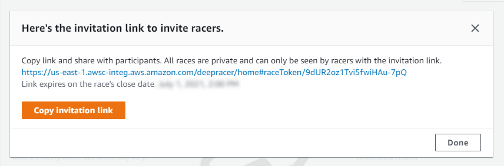
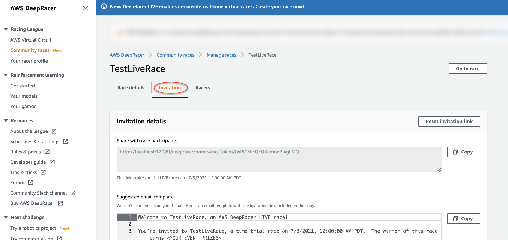

# Create a virtual community race: a quick start guide

You can set up a virtual race quickly using the default community race settings. When you're ready to learn about
all of your options, go to [Customize a race](customize-community-race.md "customize-community-race.md").

Before creating any virtual race, consider whether a _Classic_ or _LIVE_ race will be the best fit for your group and, if you choose a LIVE race, whether you are sharing it privately
or publicly?

**Classic race**

Classic races are asynchronous events that do not require real-time interaction. Participants must
receive an invitation link to submit a model to the race and view the leaderboard. Racers can submit
unlimited models any time within a date range to climb the leaderboard. Speed controls are not available.
Results and videos for classic races are viewable for submitted models on the Leaderboard page as soon as
the race is initiated. All classic races are private events.

**LIVE race**

LIVE races are synchronous events that occur at a set time and range in scope from small events with one
race organizer facilitating one private video conference to large events broadcast publicly by a small
team of organizers, commentators, and broadcasters. You can open and close the door for model submission
at any time, so let racers know the deadline. Participants can submit multiple models, but only
the last model they submit before you close the door can race during the event. During LIVE races,
queued participants have the option of using interactive speed controls to give their model a competitive
edge on their turn. Participants in LIVE races must also receive an invitation link to submit a model to
the race, but you can choose to broadcast the event privately to invited participants only or publicly
using a LIVE streaming service like Twitch. See [Broadcast a LIVE community race using AWS DeepRacer League production
playbooks](deepracer-broadcast-live-community-race.md "deepracer-broadcast-live-community-race.md")
to learn more.

###### To begin creating a community race

1. Open the [AWS DeepRacer console](https://console.aws.amazon.com/deepracer "https://console.aws.amazon.com/deepracer").
2. Choose **Community races**.
3. On the **Community races** page, choose **Create race**.

 4. On the **Race details** page, choose a competition format: a **Classic
race**, which your guests can participate on their own schedule within the time frame you
set, or a **LIVE race**, which can be broadcast privately or publicly as a real-time
event.

1. Choose a race type. Race types increase in complexity from **Time trial** to
   **Object avoidance** to **Head-to-bot**. For first time racers,
   we recommend **Time trial**. Time trial races require only one camera, so the sensor
   configuration is simpler, and reinforcement learning (RL) models trained for this type of race
   converge faster. For more information about race types, see [Tailor AWS DeepRacer Training for Time Trials,
   Object Avoidance, and Head-to-Bot Races](deepracer-choose-race-type.md#deepracer-get-started-training-simple-time-trial "deepracer-choose-race-type.md#deepracer-get-started-training-simple-time-trial").
2. Enter an original, descriptive name for the race.
3. Specify the start date and time of the event in 24-hour format. The AWS DeepRacer console automatically
   recognizes your time zone. For classic races, also enter an end date and time. LIVE races have a
   default duration of four hours. Contact customer support to schedule a longer race. There is no action
   to take if your race LIVE ends early.
4. To use the default race settings, choose **Next**.
5. On the **Review race details** page, check the race specifications. To make
   changes, choose **Edit** or **Previous** to return to the
   **Race details** page. When you're ready to get the invitation link, choose
   **Submit**.
6. To share your race, choose **Copy invitation link** on the modal and paste it into
   emails, text messages, and your favourite social media applications. All classic races are private and
   can be seen only by racers with the invitation link. The link expires on the race's close date.

 7. Choose **Done**. The **Manage races** page is displayed. 8. As your classic race time-frame comes to a close, take note of who has entered a model and who still
needs to do so under **Racers** on the **Leaderboard details**
page.

1. Choose a race type. Race types increase in complexity from **Time trial** to
   **Object avoidance** to **Head-to-bot**. For first time racers,
   we recommend **Time trial**. Time trial races require only one camera, so the sensor
   configuration is simpler, and reinforcement learning (RL) models trained for this type of race
   converge faster. For more information about race types, see [Tailor AWS DeepRacer Training for Time
   Trials, Object Avoidance, and Head-to-Bot Races](deepracer-choose-race-type.md#deepracer-get-started-training-simple-time-trial "deepracer-choose-race-type.md#deepracer-get-started-training-simple-time-trial").
2. Enter an original, descriptive name for the race.
3. Specify the start date and time of the event in 24-hour format. The AWS DeepRacer console automatically
   recognizes your time zone. For classic races, also enter an end date and time. LIVE races have a
   default duration of four hours. Contact customer support to schedule a longer race. There is no action
   to take if your race LIVE ends early.
4. To use the default race settings, choose **Next**.
5. On the **Review race details** page, check the race specifications. To make
   changes, choose **Edit** or **Previous** to return to the
   **Race details** page. When you're ready to get the invitation link, choose
   **Submit**.
6. On the **<Your Race Name>** page, choose the **Invitation
   tab** to share your race.

 7. Under **Invitation details**, choose **Copy** to paste the
invitation link into emails, text messages, and your favorite social media applications. 8. Optionally, choose **Copy** next to the suggested email template and fill in your
prizes, model submission time frame and the conference bridge link where your racers will meet to
queue up and prepare for the race.

LIVE races are private and can be seen only by racers with the invitation link unless you choose to
broadcast publicly. See [Broadcast a LIVE community race using AWS DeepRacer League production
playbooks](deepracer-broadcast-live-community-race.md "deepracer-broadcast-live-community-race.md") to learn more. The
link expires at 12:00 AM PDT on the race's close date. 9. Choose the **Race details** tab. 10. Under **Race details**, note the options for broadcasting your LIVE race. Once
you've decided whether to broadcast your race publicly or privately, use playbooks created by the
AWS DeepRacer League team to get started. The **View broadcast mode** button allows you to see the
LIVE race event page formatted so that it can be used with branded graphic overlays that include cut
outs for commentator streams. 11. As your LIVE race date approaches, take note of who has entered a model and who still needs to do so
under the **Invitation** tab on the **<Your Race Name>**
page.
To change the race track selected, add a race description, pick a ranking method, decide how many resets racers are
allowed, determine the minimum number of laps an RL model must complete to qualify for your race, set the off-track
penalty, and customize other race details, choose **Edit race details** in [Manage Community Races](deepracer-manage-community-races.md "deepracer-manage-community-races.md").
