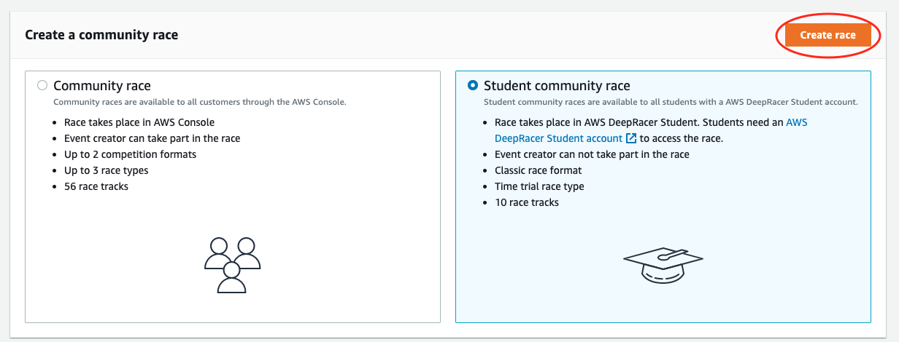
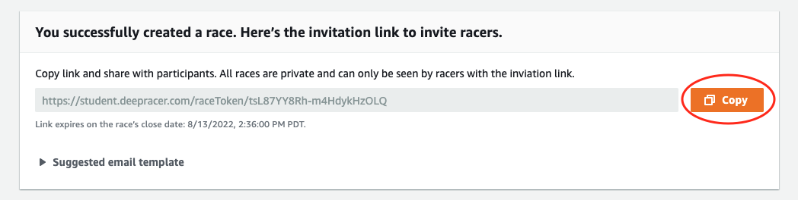

# Create an AWS DeepRacer Student

community race

You can set up a virtual race quickly using the default student community race settings.

Student community races are asynchronous events that do not require
real-time interaction. Participants must receive an invitation link to submit a model to
the race and view the leaderboard. Racers can submit unlimited models at any time within
a date range to climb the leaderboard. Results and videos for classic races are viewable
for submitted models on the leaderboard page as soon as the race is initiated.

###### To begin creating a student community race

1. Open the [AWS DeepRacer console](https://console.aws.amazon.com/deepracer "https://console.aws.amazon.com/deepracer").
2. On the **Community races** page, choose **Student community race**.
3. Select **Create race**.

 4. Enter an original, descriptive name for the race. 5. Specify the start date and time of the event in 24-hour format. The AWS DeepRacer console automatically
recognizes your time zone. Also enter an end date and time. 6. To use the default race settings, choose **Next**. When you're ready to learn about
all of your options, go to [Customize an AWS DeepRacer Student community
race](customize-student-community-race.md "customize-student-community-race.md"). 7. On the **Review race details** page, check the race specifications. To make
changes, choose **Edit** or **Previous** to return to the
**Race details** page. When you're ready to get the invitation link, choose
**Submit**. 8. To share your race, choose **Copy** and paste the
link into the suggested email template, text messages, and your favorite social
media applications. All races can be seen only by Only racers with an invitation
link can see a race. The link expires on the race's close date.

 9. As your student race time frame comes to a close, take note of who has
entered a model and who still needs to do so under **Racers**
on the **Manage races** page.
Choose [Manage races](deepracer-manage-student-community-races.md "deepracer-manage-student-community-races.md") to
change the race track selected, add a race description, pick a ranking method, decide
how many resets racers are allowed, determine the minimum number of laps an RL model
must complete to qualify for your race, set the off-track penalty, and customize other
race details.

###### Note

You will only see your students' aliases
in the **Racers** tab and on the **Leaderboard**, so
make note of which alias is associated with which student.
