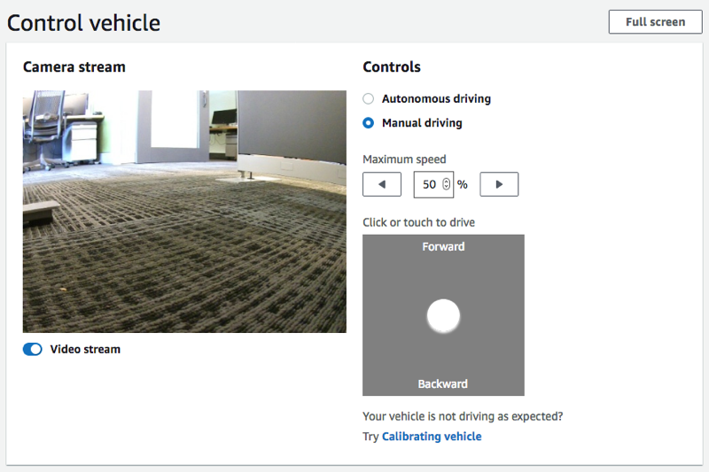
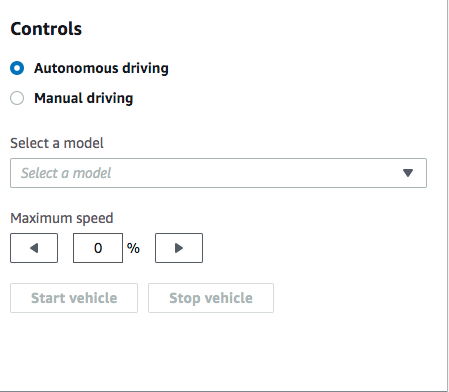
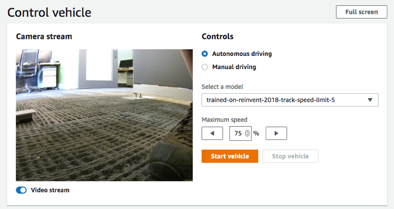

#

Drive your AWS DeepRacer vehicle

After [setting up your AWS DeepRacer vehicle](deepracer-set-up-vehicle.md "deepracer-set-up-vehicle.md"), you can start to
drive your vehicle manually or let it drive autonomously, using the vehicle's device console.

For autonomous driving, you must have trained an AWS DeepRacer model and have the trained model artifacts
deployed to the vehicle. In the autonomous racing mode, the model running in the inference engine
controls the vehicle's driving directions and speed. Without a trained model downloaded to the vehicle,
you can use the vehicle's device console to drive the vehicle manually.

Many factors affect the vehicle's performance in autonomous driving. They include the trained model,
vehicle calibration, track conditions, such as surface frictions, color contrasts and light reflections,
etc. For your vehicle to achieve an optimal performance, you must make sure that the model transfer from
the simulation to the real world is as accurate, relevant and meaningful. For more information, see
[Optimize training AWS DeepRacer
models for real environments](deepracer-console-train-evaluate-models.md#deepracer-evaluate-model-test-approaches "deepracer-console-train-evaluate-models.md#deepracer-evaluate-model-test-approaches").

##

Drive your AWS DeepRacer vehicle manually

If you have not trained any model or have not deployed any trained model to your AWS DeepRacer vehicle, you
can't let it drive itself. But you can drive it manually.

To drive a AWS DeepRacer vehicle manually, follow the steps below.

######

To drive your AWS DeepRacer vehicle manually

1. With your AWS DeepRacer vehicle connected to the Wi-Fi network, follow [the instructions](deepracer-set-up-vehicle-test-drive.md "deepracer-set-up-vehicle-test-drive.md") to sign in to
   the vehicle's device control console.
2. On the **Control vehicle** page, choose **Manual driving**
   under **Controls**.

 3. Under **Click or touch to drive**, click or touch a position within the
driving pad to drive the vehicle. Images captured from the vehicle's front camera are
displayed in the video player under **Camera stream**. 4. To turn video stream on or off on the device console while you drive the vehicle, toggle the
**Video stream** option under the **Camera stream** display. 5. Repeat from **Step 3** to drive the vehicle to different locations.

##

Drive your AWS DeepRacer vehicle autonomously

To start autonomous driving, place the vehicle on a physical track and do the following:

######

To drive your AWS DeepRacer vehicle autonomously

1. Follow [the instructions](deepracer-set-up-vehicle-test-drive.md "deepracer-set-up-vehicle-test-drive.md")
   to sign in to the vehicle's device console, and then do the following for autonomous driving:
2. On the **Control vehicle** page, choose **Autonomous driving**
   under **Controls**.

 3. From the **Select a model** drop-down list, choose an uploaded model. Then
choose **Load model**. This will start loading the model into the inference
engine. The process takes about 10 seconds to complete. 4. Adjust the **Maximum speed** setting of the vehicle to be a percentage of
the maximum speed used in training the model.

Certain factors, such as surface friction of the real track, can reduce the maximum speed of
the vehicle from the maximum speed used in the training. You'll need to experiment to find
the optimal setting.

 5. Choose **Start vehicle** to set the vehicle to drive autonomously. 6. To turn video stream on or off on the device console while you drive the vehicle, toggle the
**Video stream** option under the **Camera stream** display. 7. Watch the vehicle drive on the physical track or the streaming video player on the device
console. 8. To stop the vehicle, choose **Stop vehicle**.

Repeat from Step 3 for another run with the same or a different model.
