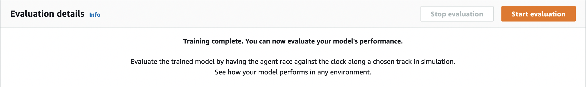
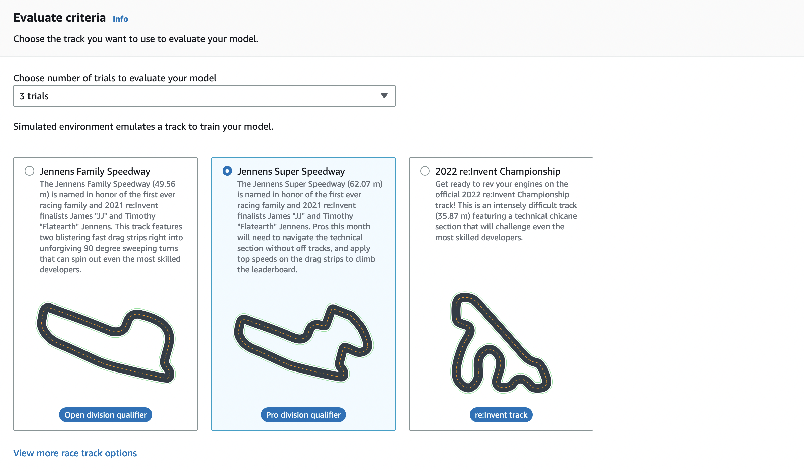
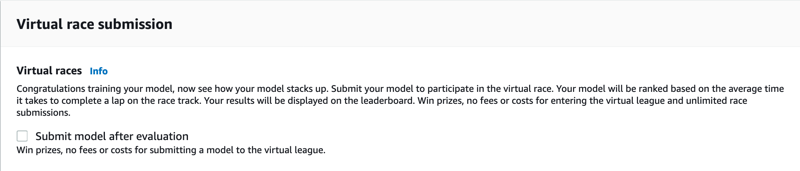
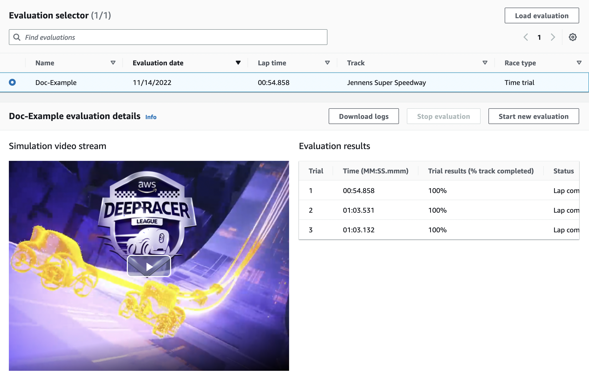

# Evaluate your AWS DeepRacer models in

simulation

After your training job is complete, you should evaluate the trained model to assess its
convergency behavior. The evaluation proceeds by completing a number of trials on a chosen
track and having the agent move on the track according to likely actions inferred by the
trained model. The performance metrics include a percentage of track completion and the time
running on each track from start to finish or going off-track.

To evaluate your trained model, you can use the AWS DeepRacer console. To do so, follow the steps
in this topic.

###### To evaluate a trained model in the AWS DeepRacer console

1. Open the AWS DeepRacer console at https://console.aws.amazon.com/deepracer.
2. From the main navigation pane, choose **Models** and then choose
   the model you just trained from the **Models** list to open the
   model details page.
3. Select the **Evaluation** tab.
4. In **Evaluation details**, choose **Start evaluation**.

You can start an evaluation after your training job status changes to
**Completed** or the model's status changes to
**Ready** if the training job wasn't completed.

A model is ready when the training job is complete. If the training wasn't
completed, the model can also be in a **Ready** state if it's
trained up to the failing point. 5. On the **Evaluate model** page, under **Race
type**, enter a name for your evaluation, then choose the racing type that you chose to train the model.

For evaluation you can choose a race type different from the race type used in
training. For example, you can train a model for head-to-bot races and then
evaluate it for time trials. In general, the model must generalize well if the
training race type differs from the evaluation race type. For your first run, you
should use the same race type for both evaluation and training. 6. On the **Evaluate model** page, under **Evaluate
criteria**, choose the number of trials you want to run, then choose a track to evaluate the
model on.

Typically, you want to choose a track that is the same as or similar to the one
you used in [training the
model](deepracer-get-started-training-model.md#deepracer-get-started-train-model-proc "deepracer-get-started-training-model.md#deepracer-get-started-train-model-proc"). You can choose any track for evaluating your model, however, you
can expect the best performance on a track most similar to the one used in training.

To see if your model generalizes well, choose an evaluation track different from
the one used in training. 7. On the **Evaluate model** page, under **Virtual Race
Submission**, for your first model, turn off the **Submit model
after evaluation** option. Later, if you want to participate in a
racing event, leave this option turned on.

 8. On the **Evaluate model** page, choose **Start
evaluation** to start creating and initializing the evaluation job.

This initialization process takes about 3 minutes to complete. 9. As the evaluation progresses, the evaluation results, including the trial time and
track completion rate, are displayed under **evaluation details** after
each trial. In the **Simulation video stream** window, you can
watch how the agent performs on the chosen track.

You can stop an evaluation job before it completes. To stop the evaluation job,
choose **Stop evaluation** on the upper-right corner of the
**Evaluation** card and then confirm to stop the evaluation. 10. After the evaluation job is complete, examine the performance metrics of all the
trials under **Evaluation results**. The accompanying simulation
video stream is no longer available.

A history of your model's evaluations is available in the **Evaluation selector**. To view the details of a specific
evaluation, select the evaluation from the **Evaluation selector** list, then choose **Load evaluation**
from the top-right corner of the **Evaluation selector** card.

For this particular evaluation job, the trained model completes the trials with a significant off-track time penalty.
As a first run, this is not unusual. Possible reasons include that the training
didn't converge and the training needs more time, the action space needs to be
enlarged to give the agent more room to react, or the reward function needs to be
updated to handle varying environments.

You can continue to improve the model by cloning a previously trained one,
modifying the reward function, tuning hyperparameters, and then iterating the
process until the total reward converges and the performance metrics improve. For
more information on how to improve the training, see [Train and evaluate AWS DeepRacer models](create-deepracer-project.md "create-deepracer-project.md").
To transfer your completely trained model to your AWS DeepRacer device for driving in a
physical environment, you need to download the model artifacts. To do so, choose
**Download model** on the model's details page. If your AWS DeepRacer
physical device doesn't support new sensors and your model has been trained with the new
sensor types, you'll get an error message when you use the model on your AWS DeepRacer device in
a real-world environment. For more information about testing an AWS DeepRacer model with a
physical device, see [Operate your AWS DeepRacer vehicle](operate-deepracer-vehicle.md "operate-deepracer-vehicle.md") .

Once you've trained your model on a track identical or similar to the one specified in an
AWS DeepRacer League racing event or an AWS DeepRacer community race, you can submit the model to the
virtual races in the AWS DeepRacer console. To do this, follow **AWS
virtual circuit** or **Community races** on the main
navigation pane. For more information, see [Join an AWS DeepRacer race](deepracer-racing-series.md "deepracer-racing-series.md").

To train a model for obstacle avoidance or head-to-bot racing, you may need to add new
sensors to the model and the physical device. For more information, see [Understanding racing types and enabling sensors
supported by AWS DeepRacer](deepracer-choose-race-type.md "deepracer-choose-race-type.md").
